# 不想打字？我用这三个工具搞定了所有语音输入

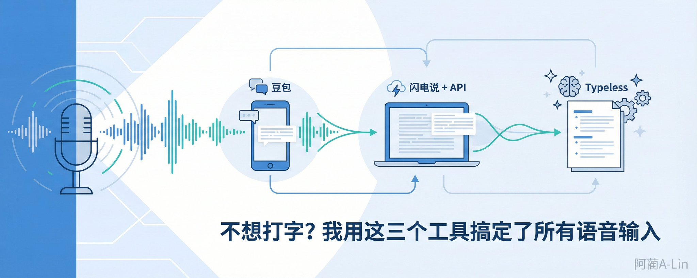

现在写代码最累的不是写代码，是跟 AI 沟通 — 一个需求要打一大段话描述清楚，打字打得手酸。

后来我就想，干嘛不直接说呢？说比打快三倍，而且边想边说比边想边打字顺畅多了。

折腾了一圈，现在手机和电脑上各有一套方案，基本不怎么打字了：

• 手机上日常打字 → 豆包输入法（免费，装上就用） • 电脑上大段口述 → 闪电说 + 豆包 API（识别最准，20 小时免费额度） • 电脑上说完要整理 → Typeless（AI 帮你把口水话变成结构化文字）

𝟭. 豆包输入法 — 手机上装了就完事

如果你只是想在手机上把打字换成语音，装个豆包输入法就够了。

App Store / 应用商店搜"豆包输入法"，装上，在系统设置里切换成默认输入法，完事。

它的语音识别就是豆包的引擎，中文准确率很高，标点也能自动加。完全免费，不用配任何东西。

聊天、短消息、随手记个东西，用它就行。

缺点也明显：没有电脑版！

𝟮. 闪电说 + 豆包 API — 电脑上大段语音转文字

这是我用得最多的方案。

闪电说是一个专门做语音转文字的 Mac APP，官网下载即可 [https://shandianshuo.cn/](https://shandianshuo.cn/)

它本身自带语音识别，但接上豆包的语音识别 API 之后，效果拉到另一个级别。新用户有 20 小时免费额度，正常用够很久。用完之后按量计费，很便宜。

写代码、文章、长笔记、口述想法，我都用它。

需要配一下，总共四步： ① 注册火山引擎 — 3 分钟 ② 创建一个应用 — 1 分钟 ③ 拿到密钥 — 30 秒 ④ 填进闪电说 — 1 分钟

先看一眼闪电说里长什么样 — 打开闪电说，点左侧「模型」，在「语音识别服务商」里找到「火山引擎」，点进去：

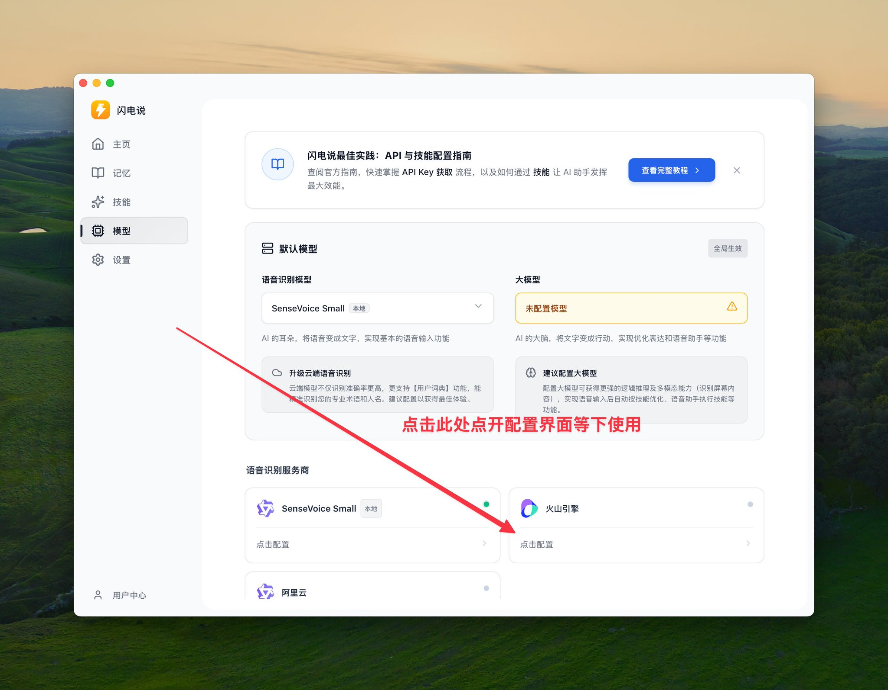

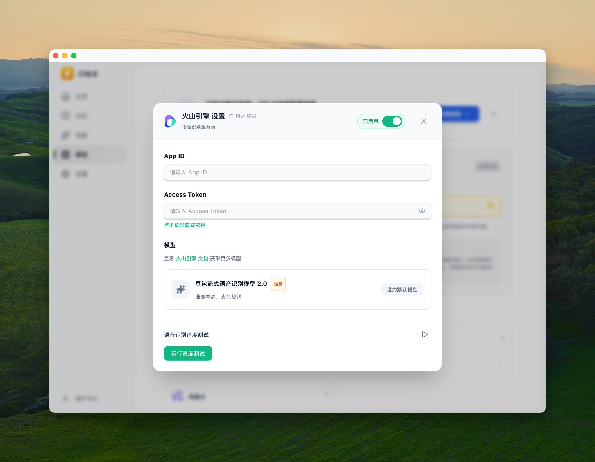

看到 App ID 和 Access Token 两个空要填了吧？下面就去拿。

第一步：先去火山引擎注册

火山引擎是字节跳动的云服务平台，豆包的语音识别 API 就在上面。

打开 [https://volcengine.com](https://volcengine.com/) ，右上角用手机号注册登录。

进去之后会让你实名认证 — 别慌，点"微信/抖音扫脸认证"，刷一下脸就过了。字节的所有 API 都要过这一步，认证一次以后就不用管了。

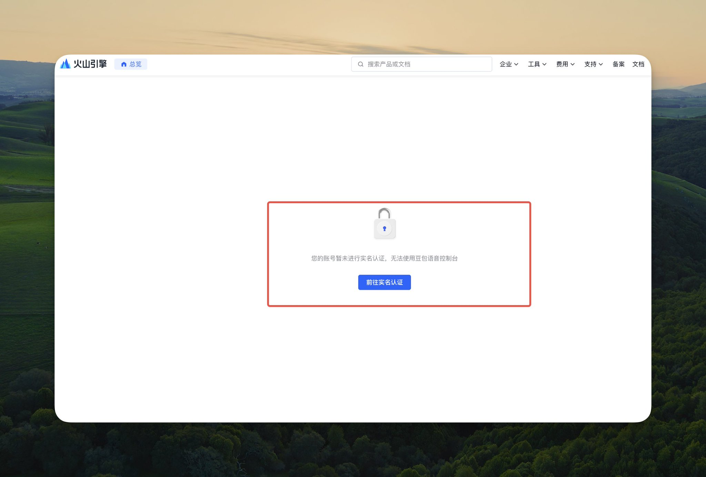

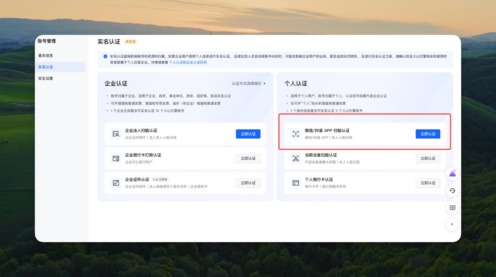

第二步：创建语音识别应用

认证完之后，打开豆包语音的控制台： [https://console.volcengine.com/speech/app](https://console.volcengine.com/speech/app)

点"创建应用"，三个东西要填： ❶ 应用名称：doubaoyuyin（只能英文，随便填） ❷ 应用简介：豆包语音（随意即可） ❸ 接入能力：选「豆包流式语音识别模型2.0 小时版」

"小时版"就是按使用时长计费的意思，个人用选这个就对了。

点确定，搞定。

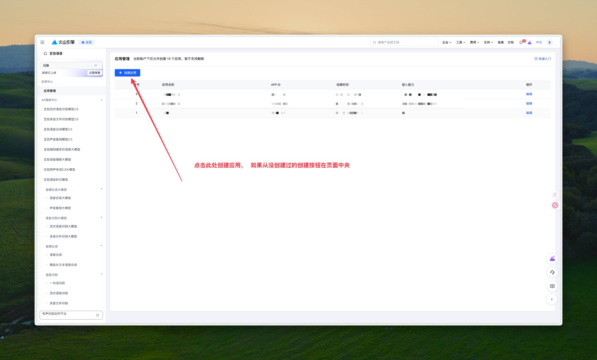

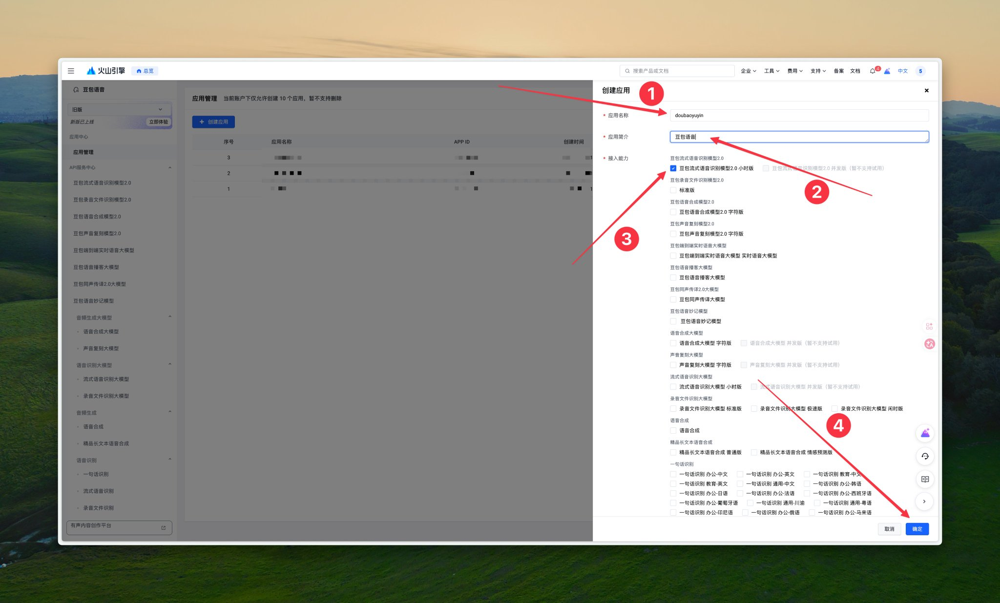

第三步：拿到你的 App ID 和 Access Token

创建完之后，在左侧菜单找到「API 服务中心」，点第一个「豆包流式语音识别模型 2.0」。

页面拉到底部，你会看到两个东西：

❶ App ID — 直接复制 ❷ Access Token — 点旁边的小眼睛，显示出来再复制

Access Token 就是你的密码，别发给别人。

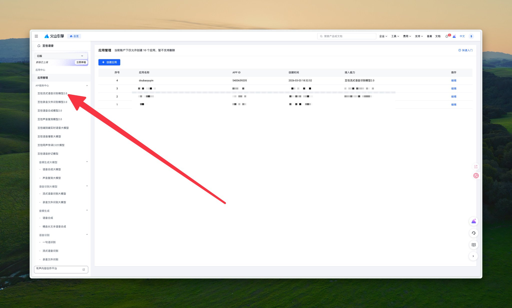

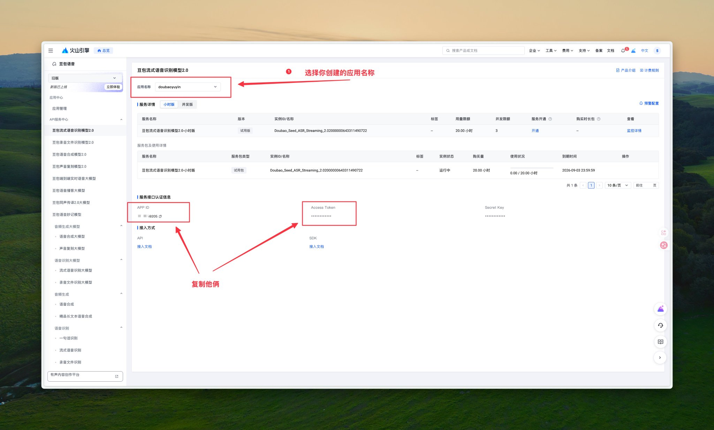

第四步：填进闪电说

回到刚才闪电说的火山引擎配置页面，把 App ID 和 Access Token 分别填进去。

填完之后点下面的「运行速度测试」，如果出了结果，说明通了。偶尔网络不稳可以多试两次。

然后点「设为默认模型」。

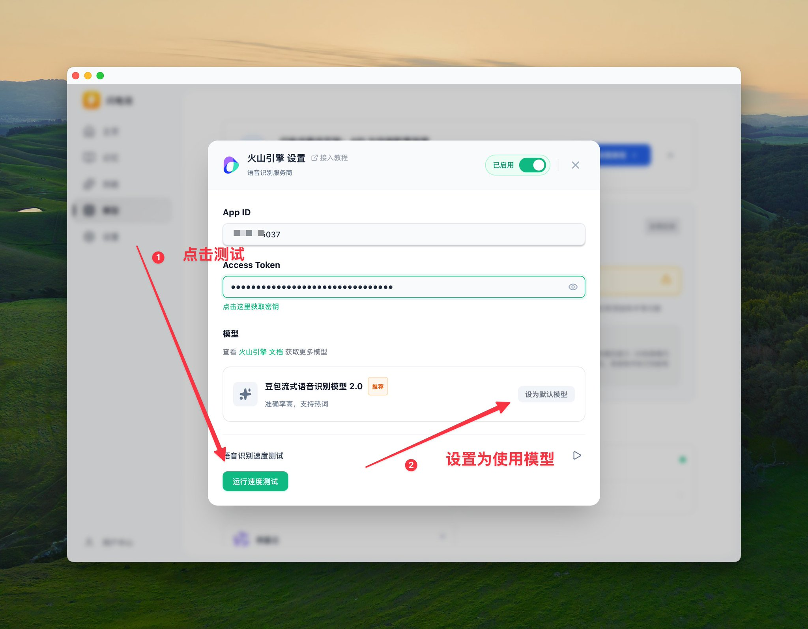

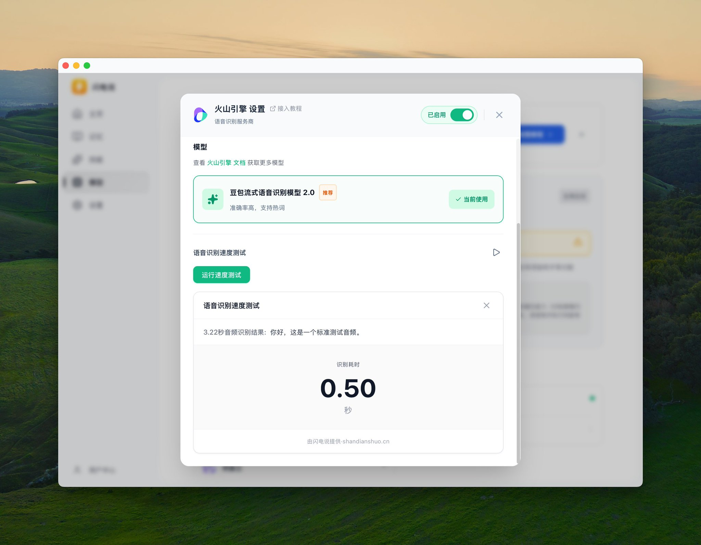

检查一下：回到闪电说的模型页面，看两个地方：

❶ 默认语音识别模型显示「豆包流式语音识别模型2.0」 ❷ 火山引擎旁边有个绿色小点

都对了就配好了。

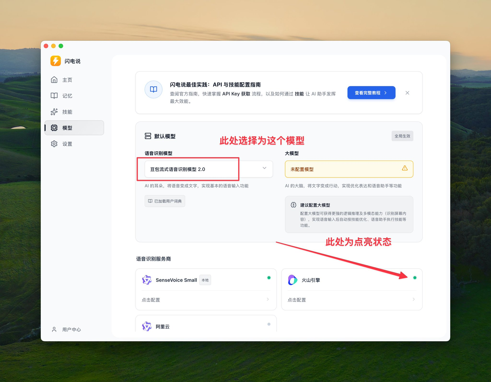

配置过程中卡住了，也可以看闪电说官方的保姆级教程：[https://shandianshuo.featurebase.app/help/articles/2168891-shan-dian-shuo-v06-zui-jia-shi-jianhan-bao-mu](https://shandianshuo.featurebase.app/help/articles/2168891-shan-dian-shuo-v06-zui-jia-shi-jianhan-bao-mu)

𝟯. Typeless — 说完帮你整理

前面两个工具都是"你说什么就转什么"，逐字转录。

但有时候你不需要逐字稿 — 你需要的是把脑子里乱七八糟的想法，说出来之后变成一段整理好的文字。

Typeless 干的就是这个事。Mac 和 iOS 都能下载使用。

你对着它说一堆，它不光转成文字，还会用 AI 帮你整理：去掉口水话，理清逻辑，变成结构化的段落。

我写代码的时候经常用它：口述一个需求，说完它直接给我一段整理好的描述，比自己打字写快多了。

官网 [https://www.typeless.com/](https://www.typeless.com/) 下载。新用户免费用一个月，之后每周有 4000 字的免费额度，日常够用。

编码口述需求、把零散想法整理成段落、写邮件草稿，都很合适。

避坑：用 AirPods 的注意

因为我的 macmini 没有麦克风，所以我就使用我的 AirPods pro 做了麦克风，但是我发现一个问题：开始录音后前几秒说的话识别不上，得等一会儿才正常。

我查询了西安这不是 APP 的 bug，是蓝牙协议的问题。蓝牙耳机有两种模式：听音乐走一个协议（音质好，没有麦克风），通话走另一个协议（音质差，能用麦克风）。你点开录音的那一瞬间，耳机要从"听"切到"说"，这个切换需要几秒钟，前几句话就丢了

三个解决办法：

• 有实力者，直接买个麦克风，花钱解君愁 • 点了录音之后，等两三秒再开口说 • 用有线耳机，没有切换延迟

我在闪电说和 Typeless 都遇到了这个问题。

就这样，手机装个豆包输入法，电脑装个闪电说配上豆包 API，想整理就用 Typeless。

全场景完结。

---

> 来源：飞书 · AI Spark 知识库 ｜ 原文（最新版）：<https://lcnniolukk80.feishu.cn/wiki/AEnfwRvyfiGRrmkeJJBccb4un3d> ｜ 归档：2026-06-04
