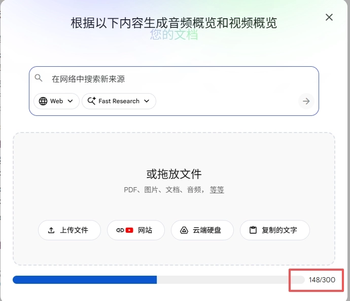
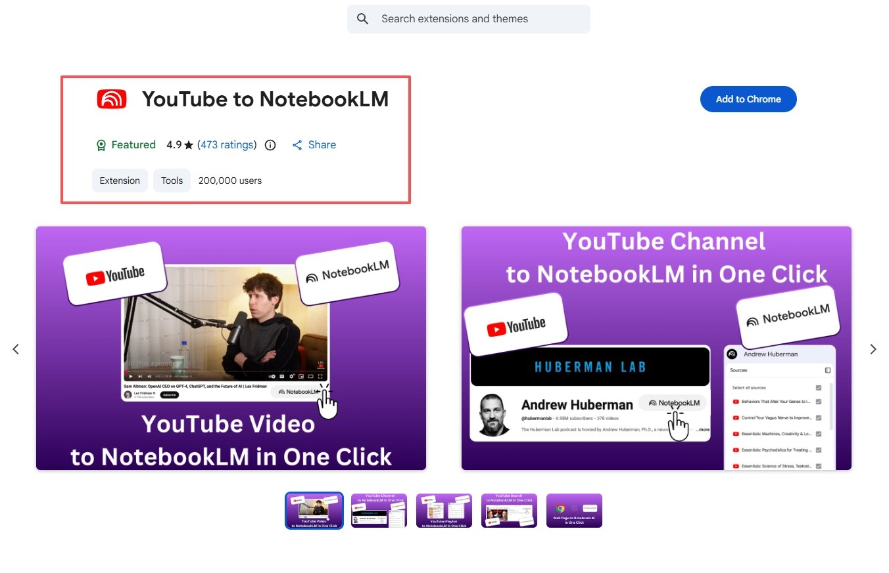
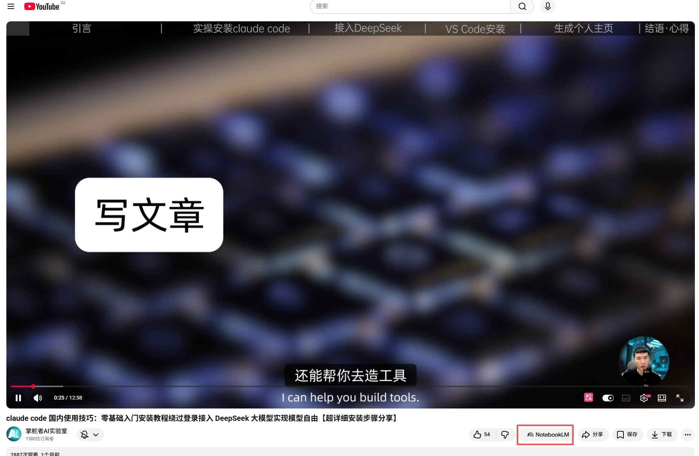
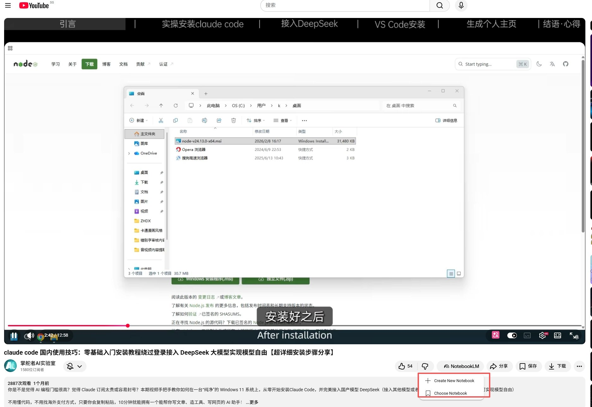
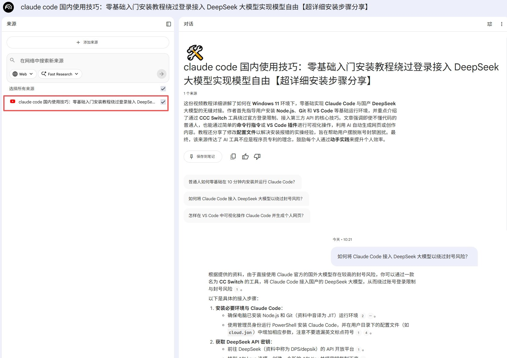
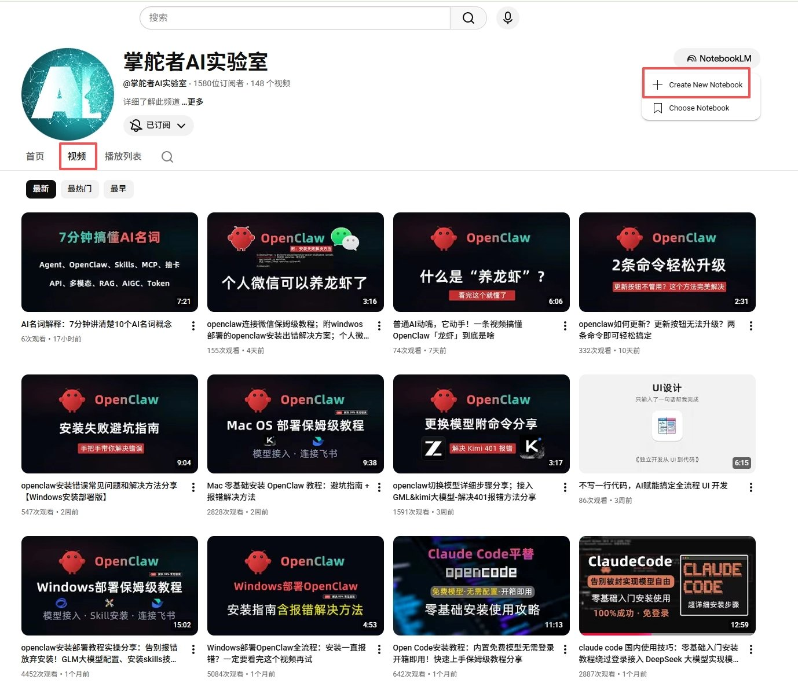
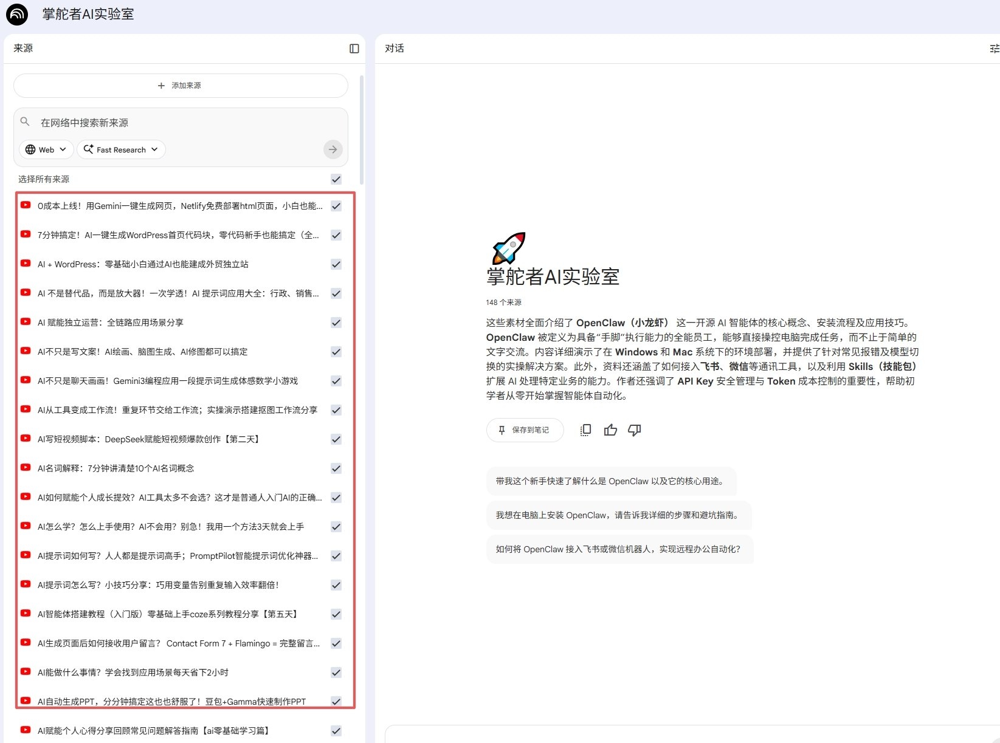
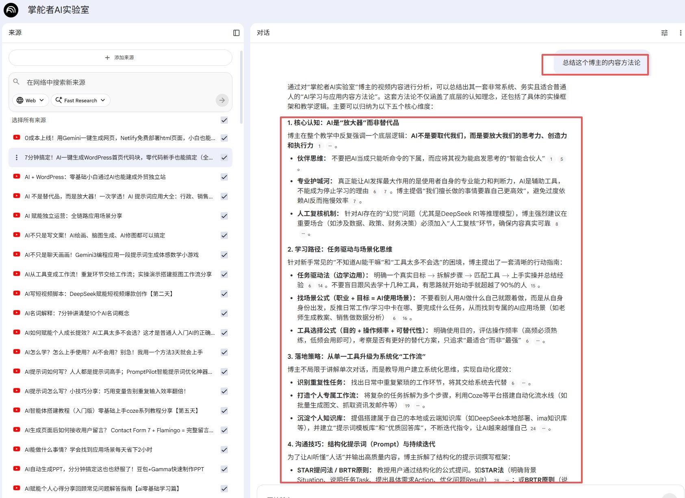

# 10分钟拆解148条视频,用 NotebookLM "榨干"油管博主的插件实战

**你有没有过这种卑微的时刻：**看到一个油管博主的内容体系牛逼到令人窒息，你琢磨着想把他所有视频的核心观点系统性地拆解个底朝天——然后发现人家 300 多条视频，你要一条一条点进去抄笔记，光是想想就已经放弃了。

**告别苦力，有一款 Chrome 插件能让你一键把整个频道的逐字稿全部灌进 Google NotebookLM 知识库。**灌进去之后，你可以像盘问一个活人一样，对着这个知识库随意提问："他的核心方法论是什么？""他在哪几期视频里讲过定价策略？""他的叙事风格有什么规律？"

这就是今天要介绍的"YouTube to NotebookLM"系列插件。

## 它到底解决了什么痛点？

传统的学习路径是：看视频 → 记笔记 → 整理归纳 → 建立知识体系。这个流程的瓶颈在于**人肉搬运**——你的时间和精力永远是最贵的资源。

而这类插件做的事情很暴力很直接：

1. **批量抓取：**一键抓取整个频道/播放列表/搜索结果下所有视频的逐字稿
2. **自动灌入：**把抓到的逐字稿直接塞进 NotebookLM 作为知识源
3. **AI 深挖：**在 NotebookLM 内对这些内容进行无限次的 AI 提问和分析

**简单说就是把油管变成了一个可搜索、可提问、可交叉分析的知识库。**

## 用它来干嘛最香？3 个杀手级场景

场景一：拆解对标博主的整套内容体系

这是最暴力的用法。直接把竞品博主整个频道灌进去，然后问 NotebookLM：

- "总结他所有视频的核心选题方向"
- "他最受欢迎的 10 个视频有什么共同规律？"
- "他的内容结构有哪些固定套路？"

**半小时顶你看三天。**

场景二：按关键词深挖某个领域

搜索"AI Agent 开发"，然后把搜索结果页的所有视频逐字稿一锅端导入。你不是在看某一个人的观点，你是在**横扫整个领域最近的讨论热点**。

场景三：加速学习系列课程

很多油管上的免费课程质量极高，但动辄几十集。把整个播放列表导入后，你可以让 NotebookLM 帮你做课程大纲、知识点索引、甚至生成复习题。

## 极简上手：3 分钟从安装到开查

**第一步：安装插件**

1. 打开 Chrome 浏览器，进入 [Chrome 网上应用店](https://chromewebstore.google.com/)
2. 搜索 **"YouTube to NotebookLM"**
3. 点击 **添加到 Chrome** → 弹窗中确认添加
4. 安装完成后，建议将插件图标**固定到工具栏**（点击拼图图标 → 找到插件 → 点固定）

**第二步：导入单个视频（试水）**

1.打开任意一个 YouTube 视频页面

2.你会在视频下方/右侧看到一个新增的 **NotebookLM 按钮**

3.点击它 → 选择新建笔记本或加入已有笔记本

4.插件会自动抓取该视频的逐字稿并送入 NotebookLM

**第三步：批量导入频道/播放列表（真正的大杀器）**

1.进入你想要研究的油管博主的 **频道主页 → 视频标签页**

2.点击插件在页面上注入的 **导入按钮**

3.选择目标笔记本，等待自动批量抓取和导入

4.完成后，打开 NotebookLM 即可看到所有来源已就绪

**第四步：对知识库开炮**

打开你的 NotebookLM 笔记本，在聊天区输入任何你想知道的问题。NotebookLM 会基于你导入的所有逐字稿，给出带引用的精准回答。

## 一些体验上的注意事项

- **逐字稿质量取决于原始视频：**如果博主说话含糊或者口音重，YouTube 自动生成的字幕质量会参差不齐，最终分析的质量也会受到影响
- **注意 NotebookLM 的容量限制：**目前单个笔记本最多 50 个来源（免费版），pro用户是300个来源，每个来源有字符上限。超大频道可能需要拆成多个笔记本
- **自动翻译字幕的坑：**如果视频是英文的，NotebookLM 有时会调用 YouTube 的自动翻译字幕，准确度在部分视频上会出逻辑偏差。建议尽量用原始语言逐字稿
- **导入不是秒完成：**批量导入几十上百个视频时需要一点耐心，插件会排队处理

## 写在最后：信息过载时代的"知识抽水机"

我们每天被海量的碎片化内容轰炸，但真正的高手不是看得多，而是**能把看到的东西迅速结构化、变成可调用的知识**。

YouTube to NotebookLM 这类插件的本质，就是在你和海量视频信息之间架了一台"知识抽水机"。它把原本你需要花几天时间人肉搬运的工作量，压缩到了几分钟。

如果你是做内容创作的，用它来拆对标账号；如果你在研究某个领域的前沿动态，用它来横扫头部博主；如果你只是纯粹想学习，用它来加速消化课程——它都是一把好用的效率武器。

> 💡 **互动时间：**你平时研究油管博主有什么绝活？有没有更好用的 YouTube × AI 联动玩法？评论区见！

---

> 来源：飞书 · AI Spark 知识库 ｜ 原文（最新版）：<https://lcnniolukk80.feishu.cn/wiki/Pi2mwOtlTiTiAgkx4NscGrJZnMf> ｜ 归档：2026-06-04
