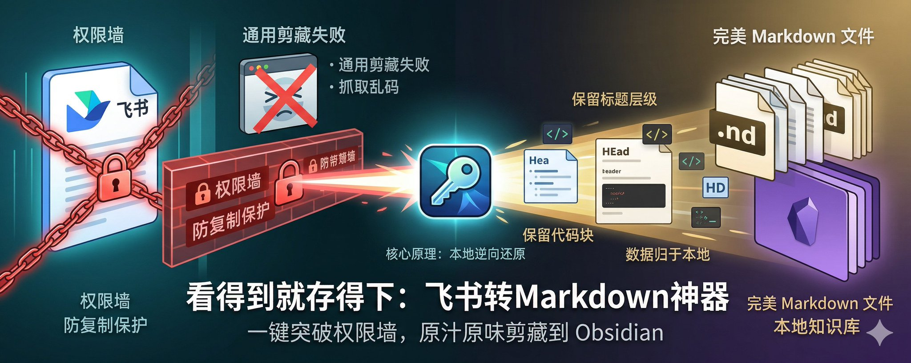
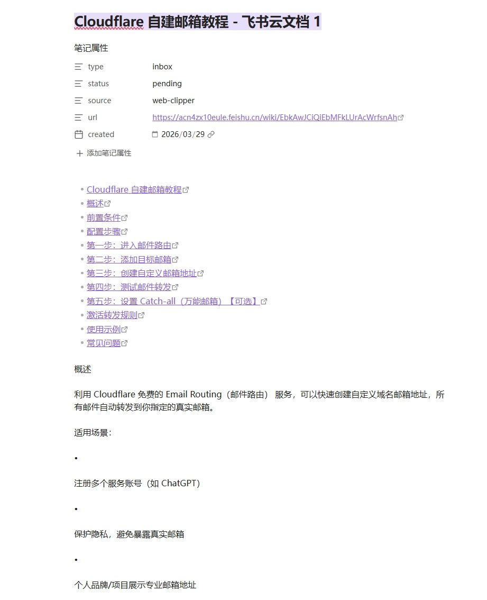
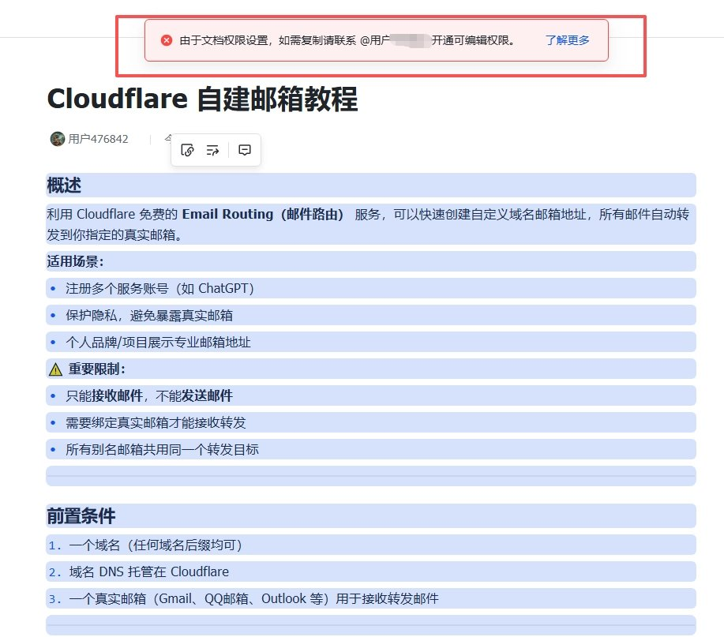
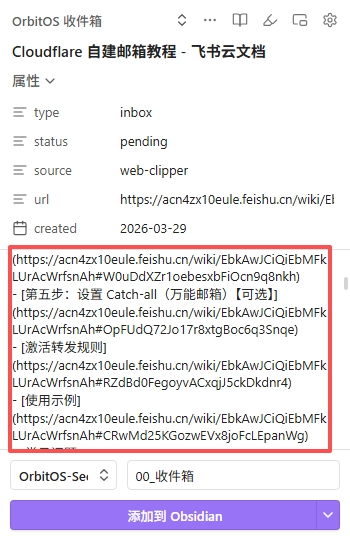
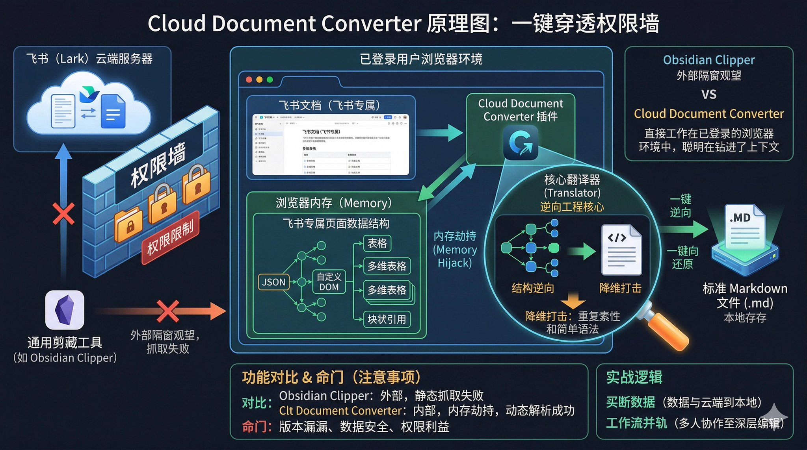
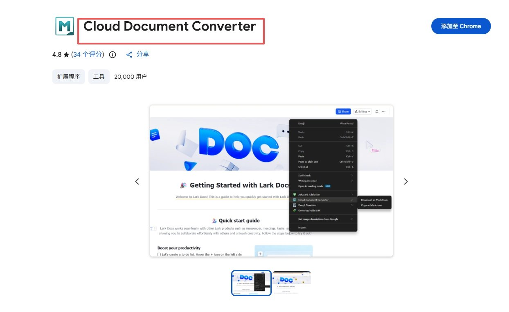
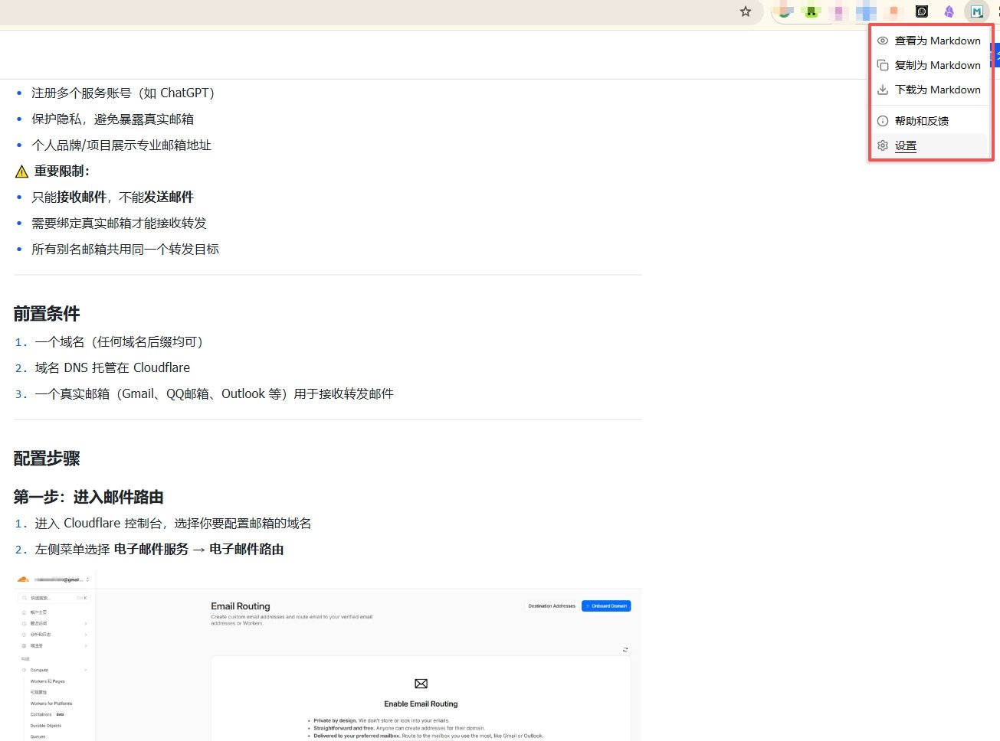
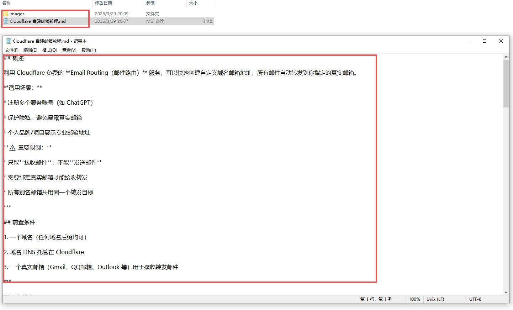
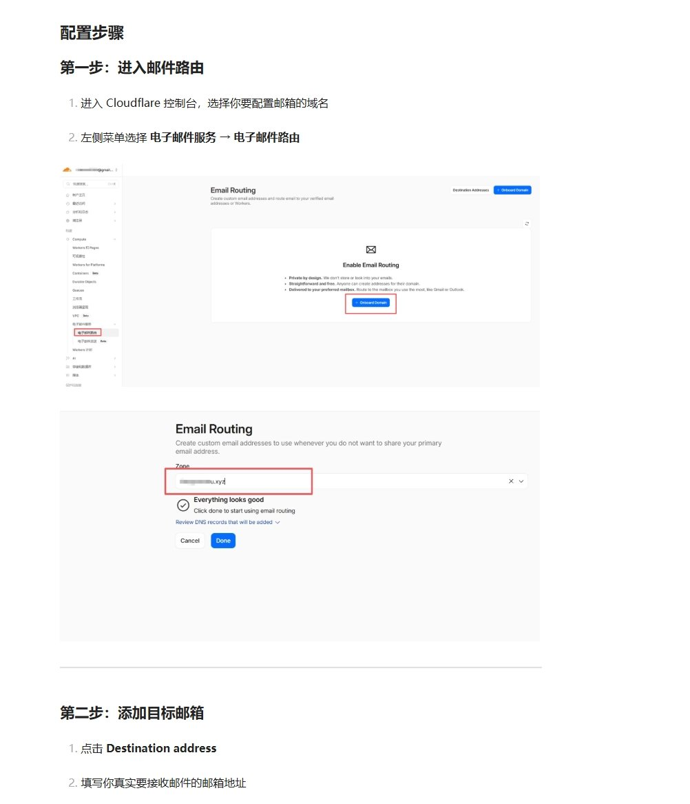
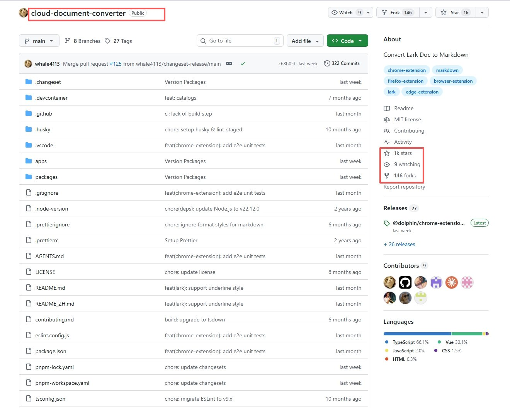

# 3分钟突破飞书权限墙：把"看得到存不下"的知识装进 Obsidian

不知道你有没有遇到过这种让人抓狂的场景：

你在一个技术群或者内网里，看到了一篇极具价值的飞书文章——可能是某位技术大佬的深度复盘，也可能是你即将离职前需要备份的个人知识库。你习惯性地打开了 Obsidian Web Clipper 或者其他网页剪藏插件，满心欢喜地点击了"保存为 Markdown"……

然后，你撞墙了。

剪藏下来的页面，要么是一堆无意义的 HTML 代码，要么提示你"无法识别正文"。你试图手动复制，却发现网页弹出了无情的提示："作者已开启防泄密保护，禁止复制"。

**内容我都能看到，甚至就在我的屏幕前，但就是存不下来。**

这大概是每一个有知识管理习惯的人，在使用飞书文档时最深切的痛点。

## 飞书权限这堵墙，到底挡住了什么？

飞书作为协作工具，体验确实是一流的，但这建立在它的"强管控体系"之上。

为了企业数据的安全，飞书给予了文档创建者极高颗粒度的权限设置能力。比如"仅特定人查看"、"禁止复制"、"禁止下载/导出"以及"禁止外部访问"。

**这就给我们的个人知识管理（PKM）带来了一个巨大的死结：**

- **Obsidian Web Clipper 等通用剪藏工具：**它们本质上是在抓取网页的公共 DOM 结构。面对飞书复杂的渲染引擎和权限拦截，它们往往抓不到真正的文本层，最后只能无功而返。

- **手动复制：**遇到"禁止复制"的文档直接歇菜。
- **官方导出：**即便你有导出权限，官方也只提供 PDF 或 Word 格式。如果你是一个 Markdown 重度依赖者，这种格式转换简直是灾难，尤其是代码块和嵌套列表。
- **截图配合 OCR：**纯属妥协，不仅效率极低，而且所有结构化格式（标题层级、链接、加粗）全部丢失。

这就导致了一个尴尬的局面：优质的知识资产，被迫变成了困在平台里的信息孤岛。

## Cloud Document Converter：一键穿透权限墙

直到最近，我在 GitHub 上淘到了一个只在小圈子里流传的"救星"——**Cloud Document Converter**。

一言以蔽之：**这是一个专为飞书文档设计的浏览器开源插件，能一键将飞书文档完美转化为 Markdown 格式，并且能突破常见的权限限制。**

> 💡 **核心原理揭秘：为什么它能搞定 Obsidian 做不到的事？它和 Obsidian Clipper 有着本质的区别。通用剪藏工具是在"外部"抓取，而 Cloud Document Converter 是直接工作在你已登录的浏览器环境**中的。只要你的账号拥有在这台电脑上"阅读"这篇飞书文档的权限，这个插件就能劫持并在本地解析飞书专属的页面的数据结构，直接将其逆向还原为标准的 Markdown 语法。

这就意味着，**只要你能看得到，它就能帮你原汁原味地存下来。**

## 三分钟实操：体验"破墙"的快感

这个插件完全免费开源，核心开发者来自社区（非飞书官方）。以下是极简上手指南。

第一步：安装插件

它支持 Chromium 内核的全家桶，你可以直接在 Chrome 应用商店 或 Edge 扩展商店 搜索"Cloud Document Converter"进行安装。

第二步：打开目标飞书文档

在浏览器中打开那篇你想存却存不下来的长文。

⚠️ **关键避坑动作：因为飞书文档是动态懒加载的，请务必先将网页滚动到底部**，让所有文字、代码块和图片都完全加载出来。

第三步：一键提取

点击浏览器右上角的插件图标。你会看到两个选项：

- **下载为 Markdown （强烈推荐）：**它会把文档存为 .md 文件，并将里面的所有图片打包成一个 .zip 压缩包同步下载下来。
- **复制为 Markdown：**直接将转换好的纯文本拷入剪贴板。

(注：由于飞书的安全机制，如果选择"复制"，其中的图片链接会在2小时后失效，所以老老实实选"下载"最稳妥)

## 构建 Obsidian 的最强闭环

把文件下载下来只是第一步。当我拿着它配合 Obsidian 使用时，才真正体会到了什么叫"数据自由"。

1. **拖拽入库：**把下载好的 .md 文件直接丢进你的 Obsidian Vault 中。
2. **附件归档：**解压打包好的图片文件夹，将其扔进 Obsidian 的默认附件目录下，Obsidian 通常会自动对齐本地路径。
3. **沉淀与链接：**此时，这篇原本设了权限的飞书长文，已经彻底变成了你本地知识图谱中的一个纯净节点。你可以在里面自由地做双链、打标签，再也不用担心原作者突然修改权限或者把页面删除了。

对于程序员归档技术文档、创作者收集爆款素材，或是打工人离职前的知识盘点，这简直是堪称"核武器"级别的神器。

## 坦诚地说，它也有局限

当然，由于是社区用爱发电的开源产品，我们对它也要有一定的预期管理：

1. **仅限飞书：**它不是通用的网页剪藏工具，不支持语雀、腾讯文档或 Notion。它专一，但也仅限于这一隅。
2. **偶尔抽风：**飞书的前端框架一旦升级，插件可能就会短暂报错（常见的如 TypeError）。不过项目在 GitHub 上有 1k+ 的 Star，开发者维护还算积极。
3. **单篇战神：**它只适合遇到一篇好文章时单点突破。如果你需要把公司成百上千个库批量迁移到 Markdown，建议去 GitHub 搜索 feishu2md 这类基于开发平台 API 的命令行工具。
4. **复杂排版：**对于飞书中特有的"多维表格"或特殊块，Markdown 很难 100% 还原，可能还需要后期微微手动调优。

## 结语：你的知识，不该被锁死

"互联网是有记忆的"，这大概是当代最大的谎言。

一篇对你犹如醍醐灌顶的文章，可能明天就会因为权限调整、链接失效而彻底在你的世界里消失。平台天然倾向于建立隔离墙，把用户和数据锁在自己的生态里。

但在个人知识管理的哲学里：**你能看到的知识，就应该能带走。能掌握在自己硬盘里的数据，才真正属于你。**

所以，趁着这个插件还在正常服役，赶紧把你飞书里那些收藏已久的宝贝，变成实实在在的 Markdown 资产吧。

> 💡 **互动时间：**你平时在做知识梳理时，用的是飞书、Notion 还是 Obsidian？在数据的"云端便利"和"本地安全"之间，你是怎么平衡的？欢迎在评论区聊聊你的看法！

---

> 来源：飞书 · AI Spark 知识库 ｜ 原文（最新版）：<https://lcnniolukk80.feishu.cn/wiki/WdE6wPTRgi9RZyk7Gi9ccVArnBd> ｜ 归档：2026-06-04
