# Karpathy 5000 星方案落地：1个开源小软件，让你的10类文档秒变私人维基百科

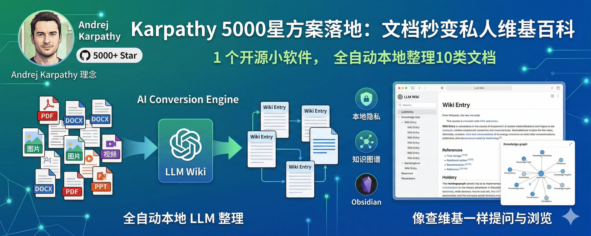

不知道你有没有这种感觉：

下载夹里躺着上百份 PDF，有行业报告、课程讲义、截图笔记、从公众号保存下来的文章……每一份当时看的时候都觉得"有用，存一下"，但过几个月再想翻出来，完全记不清是在哪份文件里看过那段话。

用搜索？文件名乱七八糟，搜不到。用 ChatGPT？每次只能丢一两份上去，下次聊天又忘了。用 NotebookLM？不错，但资料都在 Google 那边，还得联网。

最近我试了一个开源的桌面软件叫 **LLM Wiki**。它干的事很简单：**你把资料丢给它，它在本地慢慢读完，然后整理成一本属于你自己的"维基百科"**。词条之间自动互相链接，想查什么，既可以直接问它，也可以像翻维基一样点进去看。

跑了几天下来，我觉得这东西对手上资料多、又懒得手动整理的人来说，是真的好用。这篇文章我就把从下载到跑起来的全过程写一遍，尽量让没接触过这类工具的朋友也能照着做。

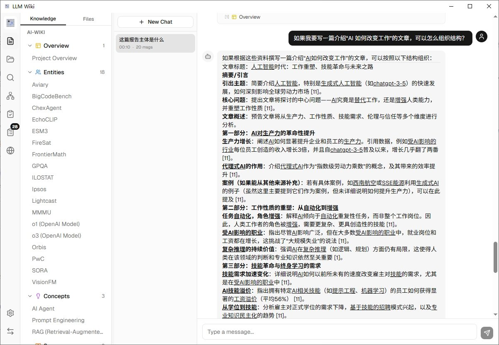

## 这套思路是谁提出来的

> 4月3日

> LLM Knowledge Bases Something I'm finding very useful recently: using LLMs to build personal knowledge bases for various topics of research interest. In this way, a large fraction of my recent token throughput is going less into manipulating code, and more into manipulating

在聊软件之前，先花一分钟讲讲这个想法从哪来的。

今年 4 月，前 OpenAI 联合创始人、Tesla AI 负责人 **Andrej Karpathy** 在 GitHub 上发了一篇叫 llm-wiki 的文档（Star 数已经破 5000），提出了一个很简洁的理念：

> **别让 AI 每次都临时翻书找答案，让它先帮你整理成一本维基，以后直接查维基。**

他把这套体系分成三层：

1. **原始资料层**（Raw Sources）—— 你的 PDF、文章、笔记，原封不动地存着，AI 只读不改
2. **Wiki 层** —— AI 读完资料后生成的一组 Markdown 文件，包含词条、摘要、交叉链接，AI 全权维护
3. **规则层**（Schema）—— 一份配置文档，告诉 AI 这个知识库怎么组织、什么格式、什么流程

Karpathy 自己的用法是：一边开着 AI Agent，一边开着 Obsidian，AI 负责写和更新词条，他负责浏览、提问、决定方向。用他的话说：**"Obsidian 是 IDE，LLM 是程序员，Wiki 是代码库。"**

他还指出了这种方式为什么比传统 RAG（检索增强生成）好：

- **知识是积累的**，不是每次重新推导的
- **交叉引用已经建好了**，不用临时去找
- **矛盾已经被标记了**，不会每次答得不一样
- **维护成本几乎为零** —— 人类放弃维基是因为维护太烦，AI 不会烦

不过 Karpathy 只发了一份理念文档，没有做成现成的软件。而 **LLM Wiki** 这个开源项目，就是有团队把他的理念做成了一个开箱即用的桌面应用。

## 它和 ChatGPT、NotebookLM 有什么不一样

一句话解释它的思路：

> **ChatGPT 是每次你问它问题，它才临时去翻资料；LLM Wiki 是资料进来的那一刻，它就先帮你整理好，以后直接查整理好的东西。**

打个比方。ChatGPT 那种"把资料丢给 AI 再提问"的做法，更像是你每次考试前临时抱佛脚，翻书找答案。而 LLM Wiki 的思路更像是你请了一个私人助理，资料一拿到就让他先通读一遍、做好笔记、建立索引，以后你问什么，他直接翻笔记给你答。

这么做的好处：

- **答得快**：不用每次都重新翻一遍全部资料
- **答得稳**：整理好的词条是稳定的，不会今天这样答明天那样答
- **能看全貌**：你可以直接浏览整个知识库长什么样，而不是只能被动提问
- **词条互相链接**：看一个概念的时候，相关的内容自动挂在旁边，像真的维基一样

当然，它也有代价 —— 资料第一次进来的时候，AI 要逐份读一遍再生成词条，这个过程是要花点时间和 API 额度的（后面会讲怎么控制成本）。

另一个很重要的区别：**它是本地桌面软件，资料不走云**。你的 PDF、笔记都留在自己电脑上，只有需要时才把内容片段发给大模型去处理。对于敏感资料、工作文件来说，这点挺关键。

## 先把软件装上

这一步对普通人友好，**不用装 Rust、不用敲命令**，直接去 GitHub Release 页面下现成的安装包就行。

打开这个地址：

> [https://github.com/nashsu/llm_wiki/releases](https://github.com/nashsu/llm_wiki/releases)

找到最新版本，根据你的系统下载对应的文件：

- **Windows**：下载 .msi 结尾的那个
- **Mac（M 系列芯片）**：下载名字里带 aarch64 或 arm64 的 .dmg
- **Mac（Intel 芯片）**：下载名字里带 x64 的 .dmg
- **Linux**：下载 .deb 或 .AppImage

Windows 双击安装一路下一步就行。Mac 第一次打开可能会提示"无法验证开发者"，这时候去**系统设置 → 隐私与安全性**，在最底下找到"仍然打开"就能放行。

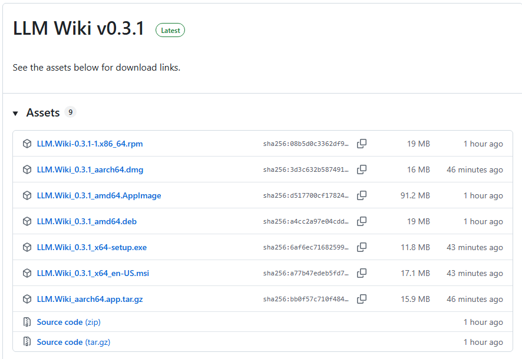

装完打开，你会看到一个空荡荡的界面，左边是项目列表，中间是欢迎页。先别急着导入资料，我们要先干一件最重要的事：**告诉它用哪个 AI 模型来干活**。

## 配一个"大脑"给它

LLM Wiki 本身不带 AI 模型，它需要你接一个大模型给它用。就像买了个空的音响，还得插张 CD。

它支持的选项挺全：OpenAI（ChatGPT 系列）、Anthropic（Claude 系列）、Google Gemini，还有各种第三方兼容的服务。

**我自己用的是 Google Gemini，有免费额度、配置最省事，推荐新手直接走这条路：**

1. 打开 [https://aistudio.google.com/apikey](https://aistudio.google.com/apikey)
2. 用 Google 账号登录（国内网络访问不了，这一步需要你自己解决）
3. 点 **Create API Key**，复制那串以 AIza 开头的字符
4. 回到 LLM Wiki，点左下角齿轮进**设置 → LLM Provider**
5. 选 Google，把 Key 粘进去，模型选 gemini-2.5-flash（够快够便宜）或者 gemini-2.5-pro（更聪明但慢一些）

Gemini 免费额度对个人用户基本够用。整理一份 300 页的 PDF，大概在免费额度内可以跑完。如果你已经有 OpenAI 或 Claude 的 API Key，当然也可以直接用，在设置里选对应的 Provider 填进去就行，然后点保存设置就可以了。

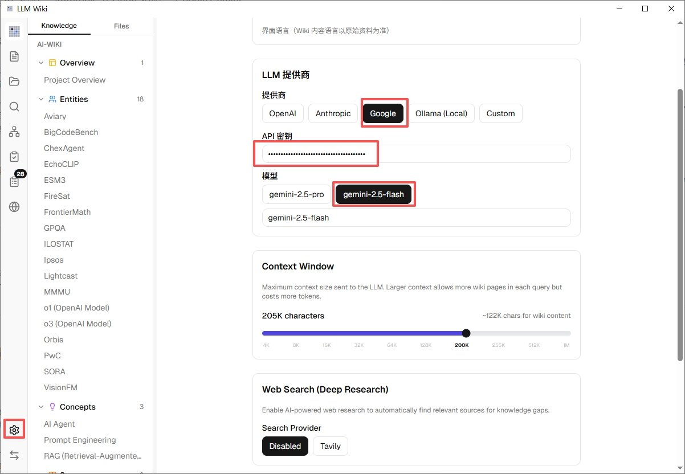

配完之后，可以试着导入一份小文件看看能不能正常跑通。如果报错，基本就三个原因：Key 错了、模型名字写错了、或者网络到不了对应的 API 服务。

## 建一个项目，丢第一份资料进去

**新建项目**

回到主界面，点左上角的 **New Project**（新建项目）。它会让你选一个位置来放这个知识库 —— 这其实就是一个普通的文件夹，以后所有整理出来的词条、原始资料都会放在里面。

我的建议：**在你自己的文档目录下建一个叫 LLM-Wiki-工作 或者 LLM-Wiki-学习 的文件夹**。按主题分项目，不要把所有资料塞进一个项目里。比如一个项目放工作相关的行业报告，另一个放正在学的课程资料，这样知识不会互相污染。

创建时可能会让你选模板，选最基础的那个General模板就行。

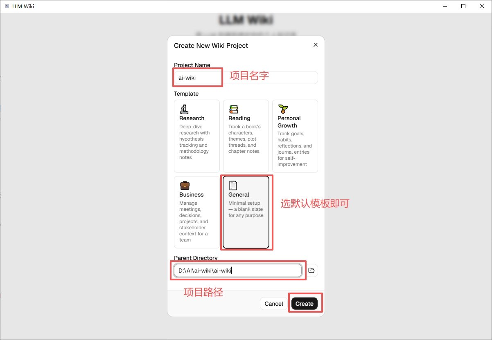

**导入资料**

项目建好之后，左边会出现几个区域，找到 **Sources（资料源）** 那一栏，点上面的"+"或者"导入"按钮。

支持10类文件导入：PDF、DOCX、PPT、Excel、XLSX/XLS/ODS、图片、视频/音频、Markdown、纯文本都能导。

**第一次用强烈建议只导一份资料**，别一上来就拖进去 50 份 PDF。原因有二：

1. 你需要先看看它整理出来的词条是不是你想要的样子
2. 大模型调用是要钱的，万一参数没调好，大量资料进去白花钱

挑一份你熟悉内容的 PDF 丢进去（比如你之前看过的一份行业报告），看看它理解得对不对。

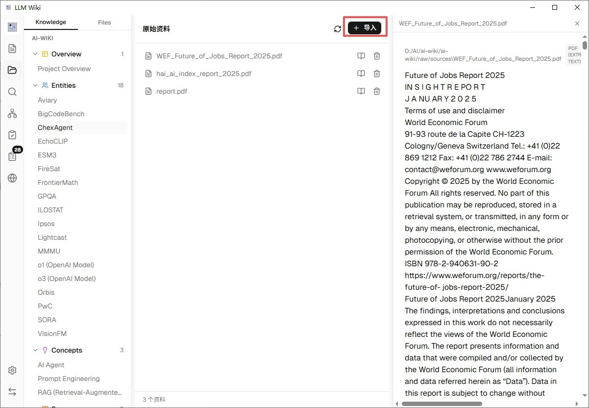

**看它怎么把资料变成词条**

导入之后，界面右侧或底部会出现一个**活动面板（Activity）**，实时显示当前在处理哪一份资料、到哪一步了。整个过程大致是：

1. 先把 PDF 里的文字提出来
2. 让 AI 通读一遍，分析里面有哪些重要的"概念"和"实体"（比如公司、产品、术语、人名）
3. 针对每个概念生成一个 Wiki 词条，互相之间加上链接
4. 整理好之后，词条会出现在左边的知识树里

一份 50 页的文档，用 Gemini Flash 大概几分钟就能跑完。跑的时候你可以去干别的，不用一直盯着。

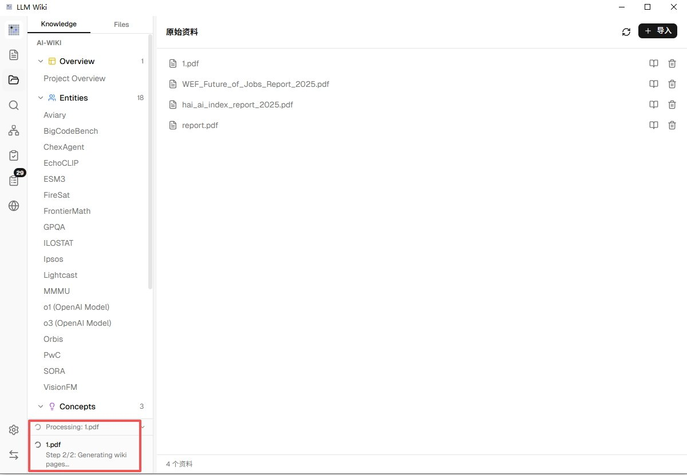

跑完之后，点左边知识树里的任意一个词条，右边的预览窗口就会显示整理好的内容，里面会有从原文抽出的关键信息、引用出处的行号、以及指向其他相关词条的蓝色链接。

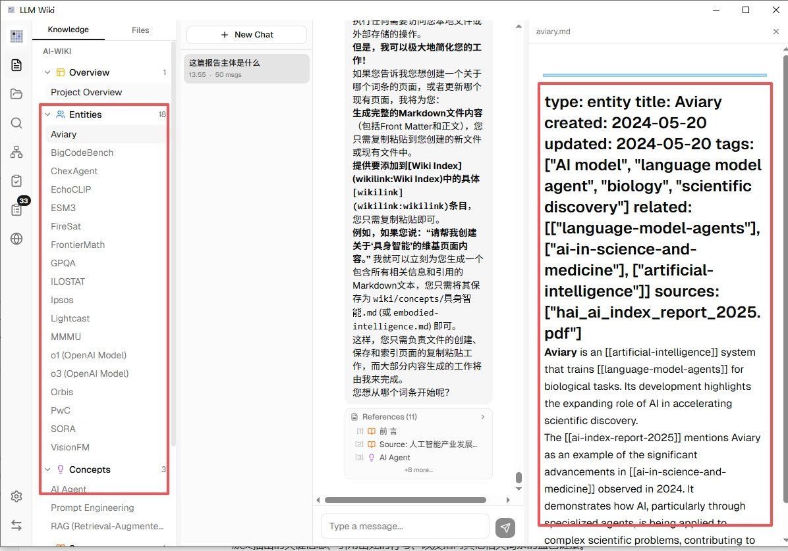

## 三个让它真正好用的功能

跑完第一份资料只是起步。接下来介绍三个让这个工具区别于普通"AI 问答"的功能，也是我觉得最值得花时间去用的部分。

**一、直接跟它对话**

界面中间那一栏就是聊天框，你可以像用 ChatGPT 一样提问。

区别在于，它的回答完全基于你导入的资料，并且**每一句结论后面都会带出处** —— 点一下小角标就能跳到原文对应的那段话。再也不会出现 AI 一本正经胡说八道然后你找不到源头的情况。

适合问的问题比如：

- “这份报告里关于 xxx 的核心观点是什么？”
- “A 文件和 B 文件关于同一个话题的观点有什么不同？”
- “我之前看过一段讲 xxx 的内容，帮我找到它在哪”

聊天历史会自动保存，你可以随时回来接着聊，也可以开新话题。

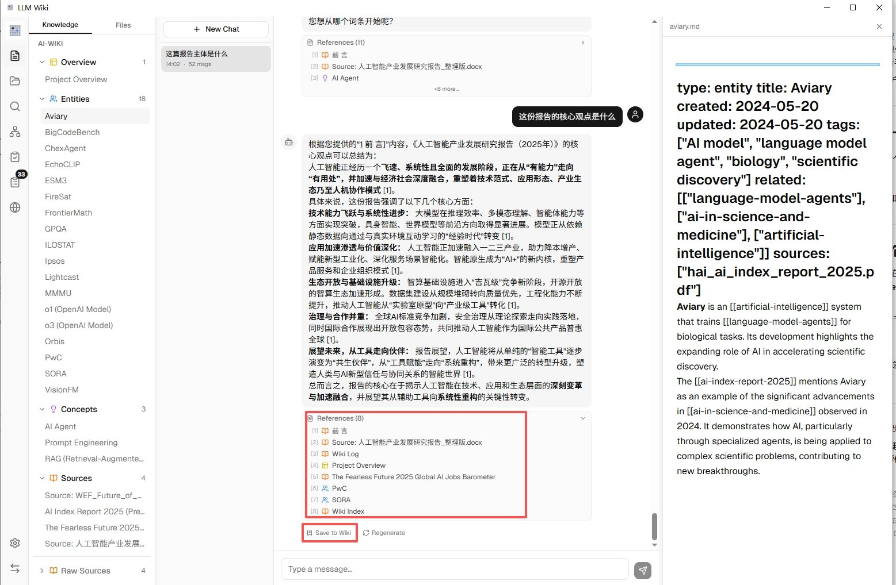

**二、看你的知识长什么样（知识图谱）**

左边侧栏里有个图谱图标，点进去你会看到一张**知识图谱** —— 你导入的所有内容被画成了一张网，每个圆点是一个词条，线条表示它们之间的关联。

这个功能的妙处在于：它会用一种叫 Louvain 的算法自动**把相关的词条聚成一团一团的**，不同的"团"用不同颜色区分。你一眼就能看出：我这个知识库里大概在讲哪几个主题，哪些是核心、哪些是边缘。

更有意思的是里面有个 **Graph Insights（图谱洞察）** 功能，它会主动告诉你：

- 哪些词条之间有"意外的关联"（你没想到的连接）
- 哪些地方有"知识缺口"（资料里提到了但没展开的概念）

对于做研究、写文章的人来说，这个功能经常能给你意想不到的灵感。

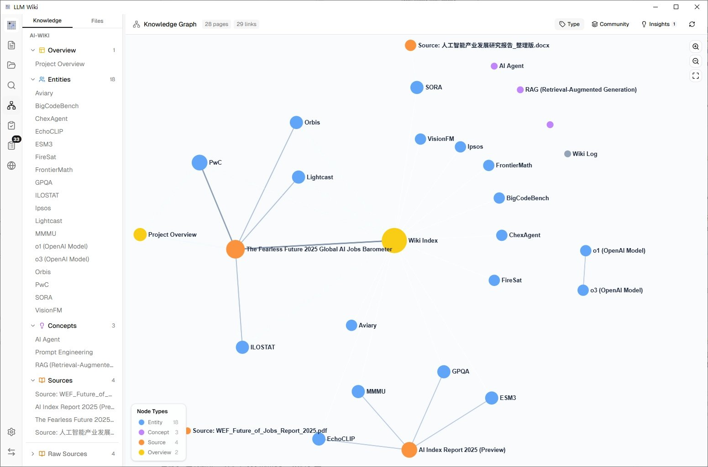

**三、让 AI 自己上网补充资料（Deep Research）**

这个功能我第一次用的时候有点震撼。当然前提得需要提前配置好对应的api，申请地址在这里[https://chat-research.tavily.com/](https://chat-research.tavily.com/)，配置好api保存设置即可。

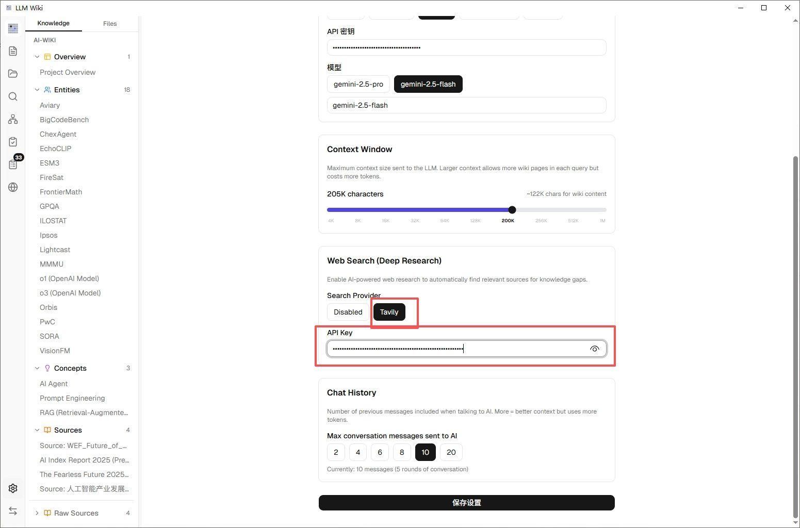

场景是这样的：你的知识库里对某个话题讲得不够完整，你点一下 **Deep Research（深度研究）**，告诉它"帮我补充一下关于 xxx 的资料"。然后它会：

1. 自己生成几个搜索关键词
2. 上网搜索、抓取文章
3. 筛选有价值的内容
4. **自动整理成词条加进你的知识库**

相当于你雇了个研究助理，让他帮你围绕某个主题做文献补全。用这个功能需要额外配一个搜索 API 的 Key（Tavily 的，有免费额度），在设置里填一下就行。

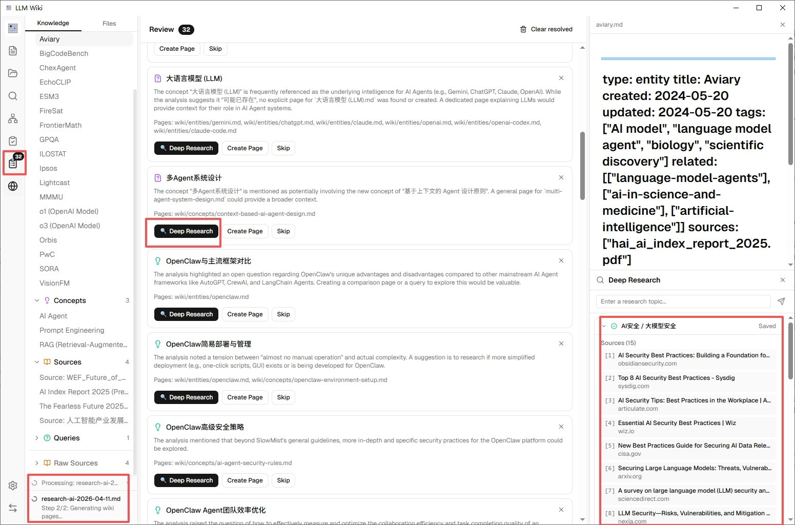

## 几个少走弯路的小建议

用了一阵之后，我踩过几个坑，写出来给你避一下：

**1. 别一次性导入太多**

我一开始图省事，一次丢进去 60 份 PDF，结果 AI 跑了一整晚、词条质量参差不齐，而且有些是重复主题互相污染。后来我改成**按主题分批导入，每批十份以内**，跑完检查一下再导下一批，效果好很多。**有的PDF文档因为有特殊格式会导入无效，可以提前转换成word或者md文档效果会更好。**

**2. 项目分开建**

工作资料、学习资料、个人兴趣，分三个项目建。一个项目塞太杂，AI 整理出来的词条会很乱，知识图谱也看不出重点。

**3. 便宜的模型先跑一遍，贵的模型再精修**

整理初稿用 Gemini Flash 或者 GPT-4o-mini 这类便宜模型；如果某些词条质量不满意，再用 Claude Sonnet 或 GPT-5 这类更强的模型让它重新整理。别一上来就拿最贵的模型跑全量，心疼钱。

**4. 重要资料原文别删**

LLM Wiki 整理好之后会把原文放在项目的 raw/sources/ 目录下，别手动去删那个文件夹，不然词条的引用就断了。

**5. 定期跑一下 Lint**

侧栏里有个 Lint 功能，会检查你知识库里有没有冗余词条、失效链接、格式问题，相当于给你的"维基百科"做体检。建议每隔一两周跑一次。

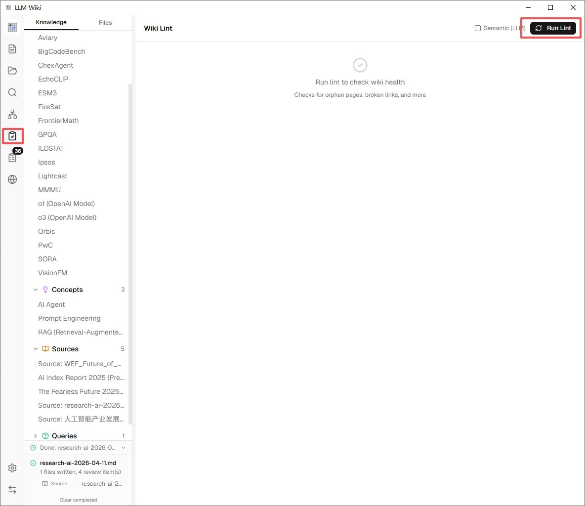

**6. 试试它自带的 Chrome 浏览器扩展**

LLM Wiki 还有个 Chrome 扩展，装上之后在任何网页上点一下就能把文章自动剪进知识库，不用手动复制粘贴。扩展没有上架 Chrome 商店，需要从项目仓库下载源码后手动加载（在 extension/ 文件夹里），适合有一定动手能力的用户。详细步骤可以看项目 README 里的 Chrome Extension 部分。

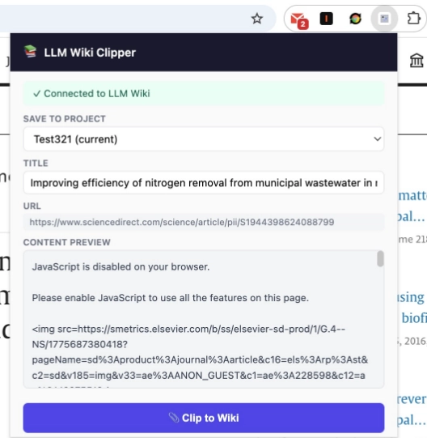

## 谁适合用它，谁别浪费时间

**我觉得很适合：**

- **手上资料多、经常需要回头查的人**：研究员、做行业分析的、律师、长期学某个领域的学生
- **靠写东西吃饭的内容创作者**：经常要翻自己之前的素材、笔记、看过的文章
- **想要隐私的人**：资料不想上传到 OpenAI、Google 的云端
- **已经在用 Obsidian 但嫌手动建链接太累的人**：LLM Wiki 的项目文件夹和 Obsidian 兼容，你可以两边一起用

**这些人暂时别碰：**

- 手上就几份资料、偶尔查一下的人 —— 直接丢给 ChatGPT 就够了，没必要上这套
- 完全不想碰任何"设置"的人 —— 哪怕再简单，配 API Key 这一步多少还是要一点耐心
- 电脑配置特别差的人 —— Tauri 应用本身挺轻量，但 AI 处理资料时的内存和网络占用不低

## 最后

这篇写得挺长，但其实真正动手的步骤就四步：**下载安装 → 配一个 AI 模型 → 建项目 → 导入资料**。第一次从零走到生成出第一个 Wiki 词条，快的话半小时之内就能完成。

建议你挑一个周末下午，泡杯咖啡，先把手头最想整理的那份资料导进去试试。等你第一次看到那些散落的 PDF 变成一条条互相链接的词条、能直接对话查询的时候，你会理解我为什么愿意花一篇文章来介绍它。

项目主页在这里，顺手给作者点个 Star：

> [https://github.com/nashsu/llm_wiki](https://github.com/nashsu/llm_wiki)

最后想问一句：**你手头最想整理的是哪类资料？** 行业报告、课程笔记、还是收藏夹里攒了几百篇的公众号文章？评论区聊聊，说不定我可以帮你出个针对性的整理方案。

文章同步公众号：**雨哥聊AI**

---

> 来源：飞书 · AI Spark 知识库 ｜ 原文（最新版）：<https://lcnniolukk80.feishu.cn/wiki/JZ2sw4nTJiF2XJk68k0cVPyTnxd> ｜ 归档：2026-06-04
