# Karpathy 的知识库方案，差一个能搜全网的工具

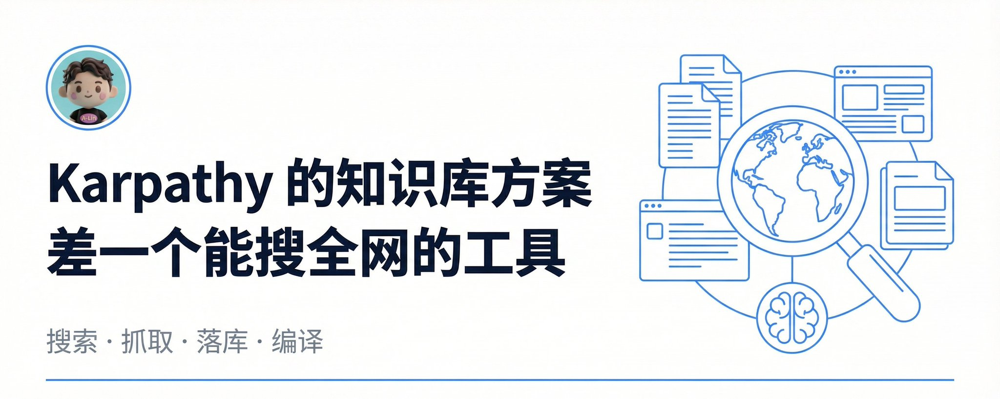

Karpathy 前几天发了个知识库方案，架构很漂亮：文档丢进去，LLM 自动编译成 wiki，查东西直接查 wiki，不用每次从头翻原文。

但有一个问题他没解决：信息从哪来？

他的方案里，数据输入靠 Web Clipper 手动剪。一篇一篇剪，研究一个新话题得花半小时搜集素材。架构再好，喂不进料也白搭。

我试了一个工具，把这一环补上了。

## 我的知识库系统

我之前基于一个叫 OrbitOS 的开源项目，用 Obsidian 搭了一套自己的知识系统，干的就是这件事。有需要的可以看下面的教程 👇

> 2月10日

00收件箱/ 放原始素材，AI 自动编译成 40知识库/ 里的知识条目，写文章的时候直接从知识库调用。和 Karpathy 描述的架构一模一样。

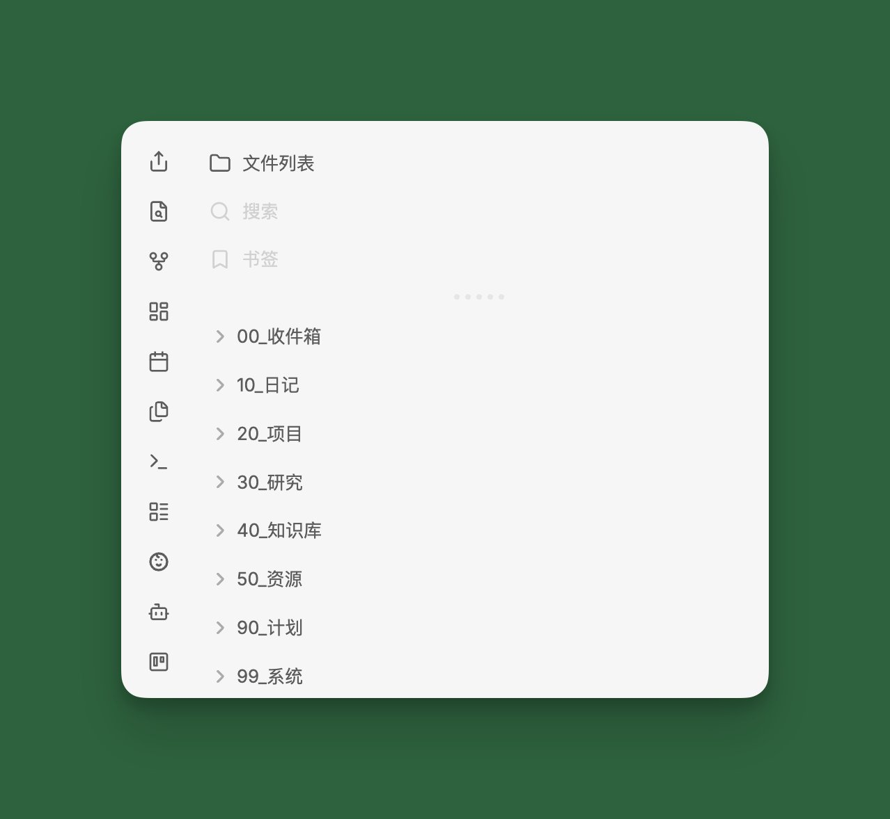

## 卡点：搜索不够用

但有一个环节一直不够好：信息输入。

Claude Code 自带的 WebSearch 能搜，但返回的结果有限，摘要也很短。碰到一个新话题想系统性地搜集资料，WebSearch 的覆盖面和深度都不够用。

知识库的瓶颈不是整理，AI 整理得比我好。瓶颈是**喂料**，喂进来的量和质都受限于搜索工具本身。

## XCrawl：给 Claude Code 装上全网搜索

最近试了一下 XCrawl，这个环节可以自动化了。

它给 Claude Code 提供了一组 Skills，装上之后 Claude Code 就能搜网页、抓全文。你不用敲命令，直接说你想搜什么、抓什么，它自动执行。

## 准备工作

手动操作只有两步：

1️⃣ 去 [xcrawl](https://xcrawl.com/?keyword=dcjjy5qc) 注册，拿到 API Key（新账号送 1000 免费积分，不用绑卡）

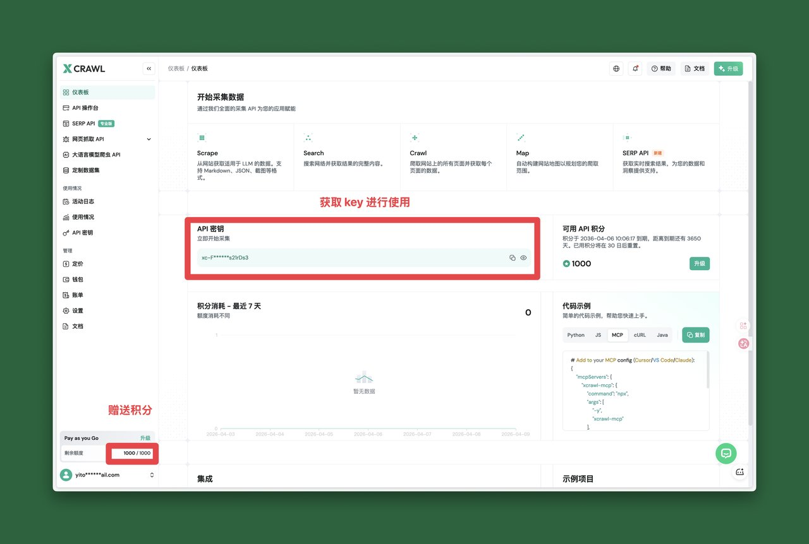

2️⃣ 装 CLI

```Bash
npm install -g @xcrawl/cli

```

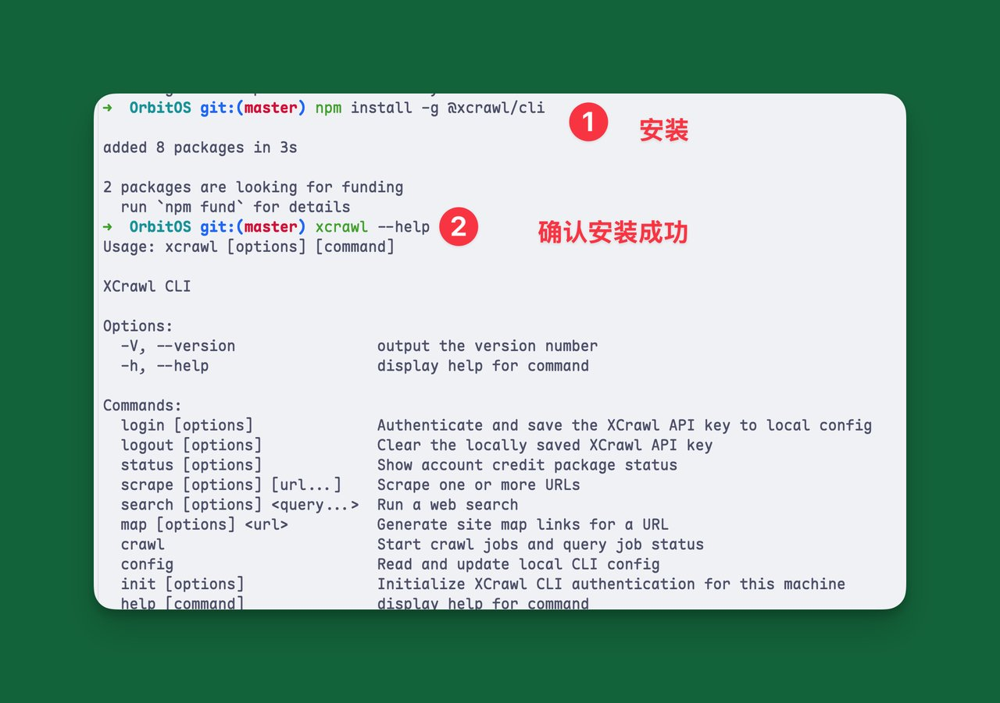

剩下的交给 Claude Code。打开 Claude Code，说一句：

```Plain Text
帮我把 XCrawl 的 Skills 安装到 Claude Code 里，GitHub 地址是 https://github.com/xcrawl-api/xcrawl-skills ，顺便帮我配置 API Key：xxx

```

Claude Code 会自动 clone 仓库、装好 Skills、配好 Key。

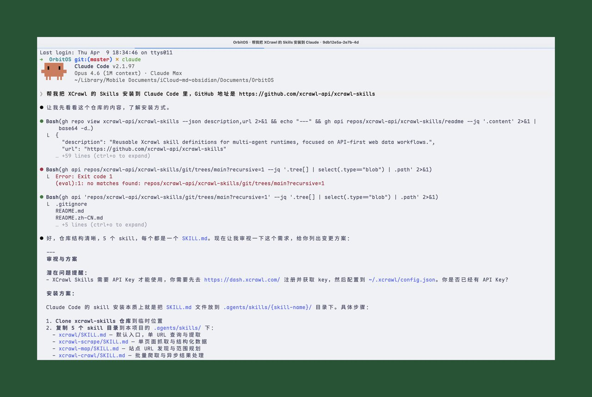

## 实测：搜索

装好之后跑个真实场景。

我在 Claude Code 里说了一句：

```Plain Text
帮我用 XCrawl 搜索一下 Karpathy LLM Knowledge Base 相关的最新文章和讨论，搜 20 条

```

几秒钟返回了 20 条结果，Claude Code 还自动帮我分成了「核心源头」和「深度解读文章」两类。Karpathy 本人的 GitHub Gist、VentureBeat 的报道、社区讨论都搜到了。

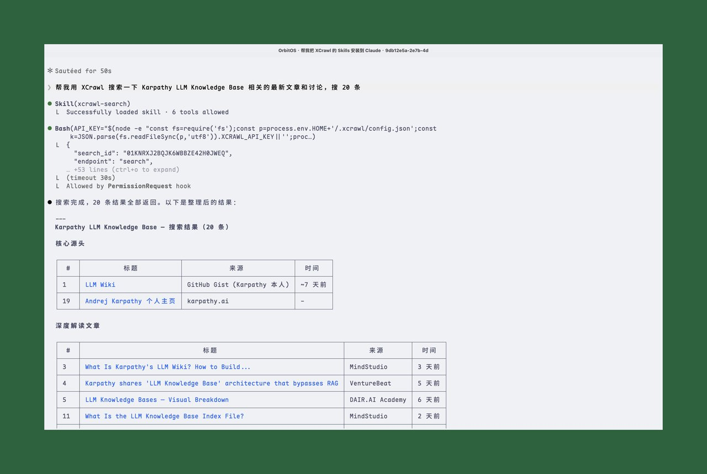

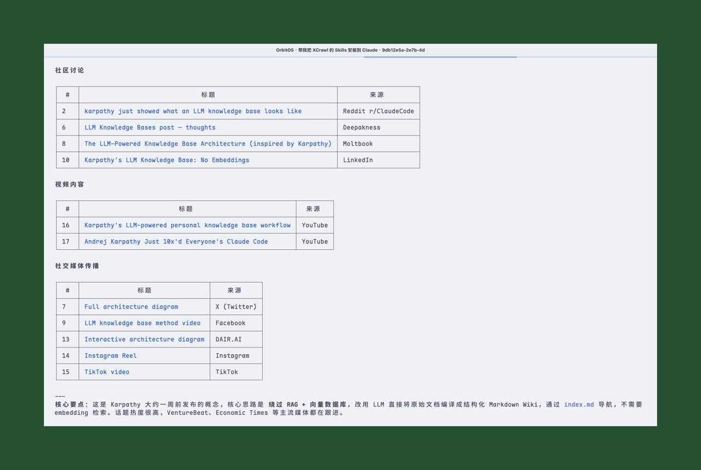

## 实测：抓取全文

接着我说：「帮我把排名前 5 的文章全文抓取下来」

Claude Code 调用 xcrawl-scrape 逐个抓取，返回干净的 Markdown 正文，自动保存到 00_收件箱/Karpathy-LLM-Knowledge-Base/ 目录下。

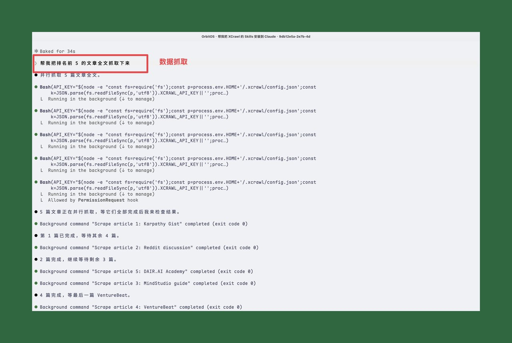

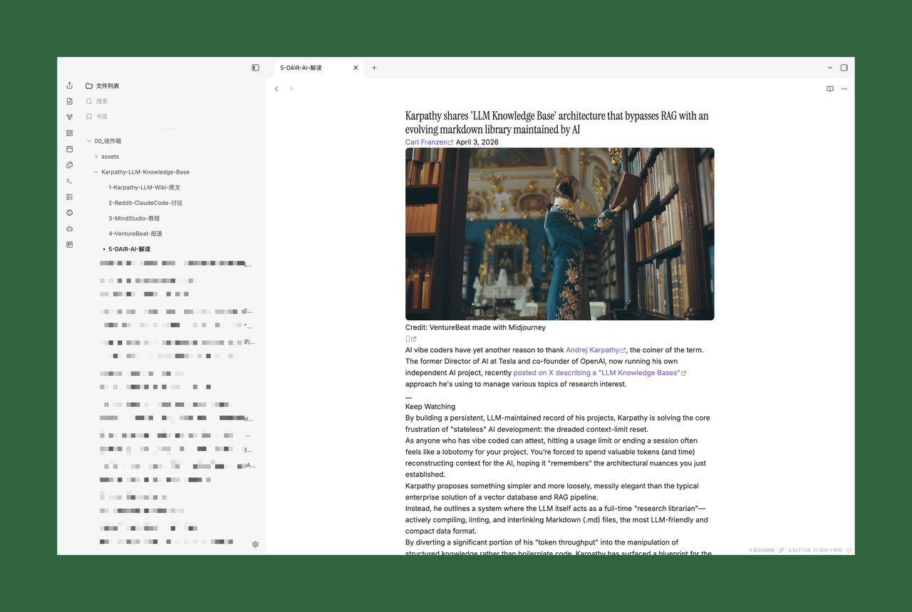

## 实测：编译进知识库

最后一步：「把刚才抓回来的文章整理成知识笔记，编译到知识库里」

Claude Code 自动读取 5 篇原始素材，提取核心概念，生成了 5 篇结构化的知识笔记：

- LLM Knowledge Base.md，核心概念、角色分工、适用场景
- LLM Wiki 架构.md，三层架构（Raw/Wiki/Schema）+ index 设计
- LLM Wiki 操作模式.md，Ingest → Query → Lint 操作闭环
- RAG vs LLM Knowledge Base.md，两种范式的对比和选型
- File-over-App.md，技术哲学、AI 时代意义

5 篇笔记之间用 wikilink 互相引用，在 Obsidian 里自动形成知识图谱。

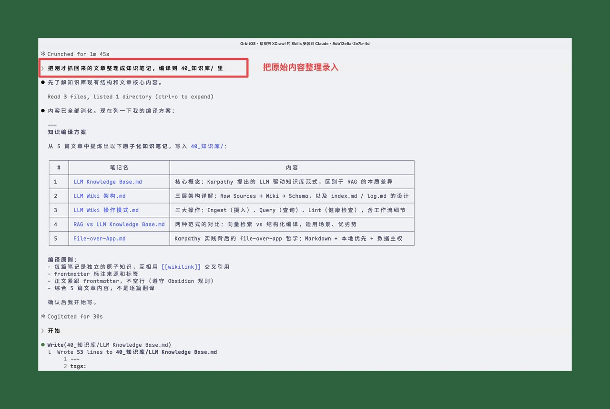

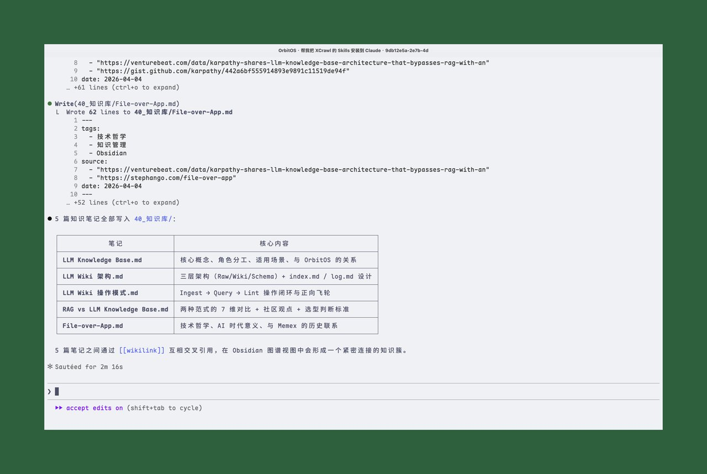

## 完整流程回顾

```Plain Text
帮我搜 Karpathy LLM Knowledge Base 的最新讨论」
    ↓
xcrawl-search 返回 20 条结果
    ↓
「帮我把前 5 篇全文抓下来」
    ↓
xcrawl-scrape 抓取，自动保存到收件箱
    ↓
「整理成知识笔记，编译到知识库」
    ↓
5 篇结构化知识笔记写入 40_知识库/

```

**三句话**，从「我想了解这个话题」到「知识库里多了一组结构化笔记」。全程自然语言，没敲一条命令。

## 使用体感

搜索结果覆盖面比 WebSearch 广不少，基本上主流媒体、GitHub、Reddit、YouTube 都能搜到。抓取回来的内容是干净的 Markdown，不用再手动清理 HTML 标签。积分消耗也比我预想的低，搜索 + 抓取 5 篇全文，整套流程跑下来才用了**二十多积分**，送的 1000 积分够折腾很久。

Karpathy 说他的 data ingest 靠 Web Clipper 手动剪。

当然这个也是一种方式，我也写过 Obsidian Web Clipper 插件的使用教程，可以看下面的文章，但是这个方式只适合平时看到一些好的信息的时候剪藏使用，不适合批量去检索和使用

> 2月28日

不过现在不用了。搜索、抓取、落库、编译，一条龙自动化。第二大脑的「喂料」问题，算是有解了。

如果你也有类似的信息采集需求，可以试试这套组合。装好 XCrawl，让 Claude Code 带着跑一遍「搜索 → 抓取 → 整理」，你会发现比手动搜集快太多了。

---

> 来源：飞书 · AI Spark 知识库 ｜ 原文（最新版）：<https://lcnniolukk80.feishu.cn/wiki/DbMswt2JwiYlhAkPA2ic5792nuh> ｜ 归档：2026-06-04
