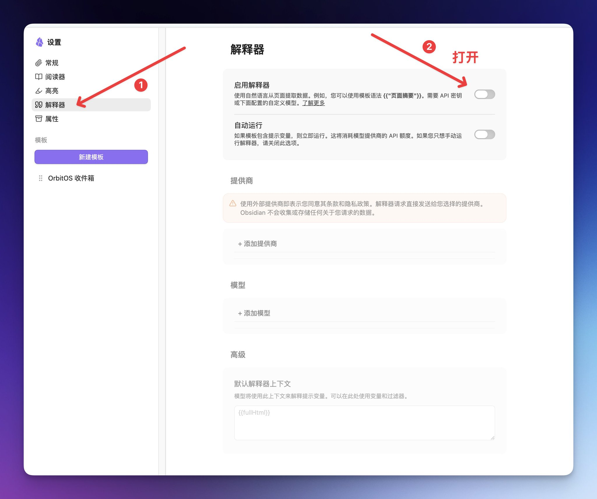
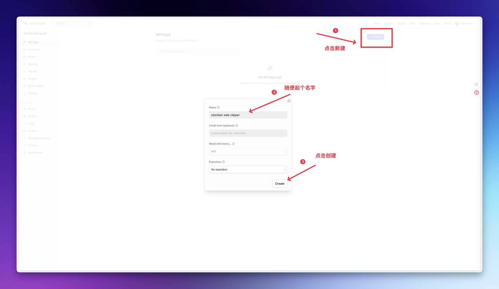
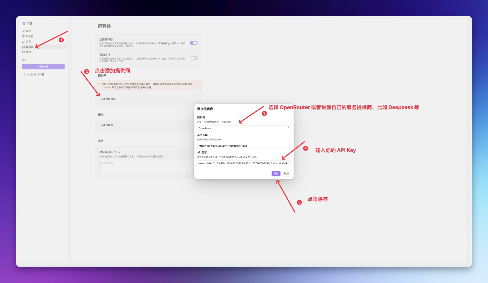
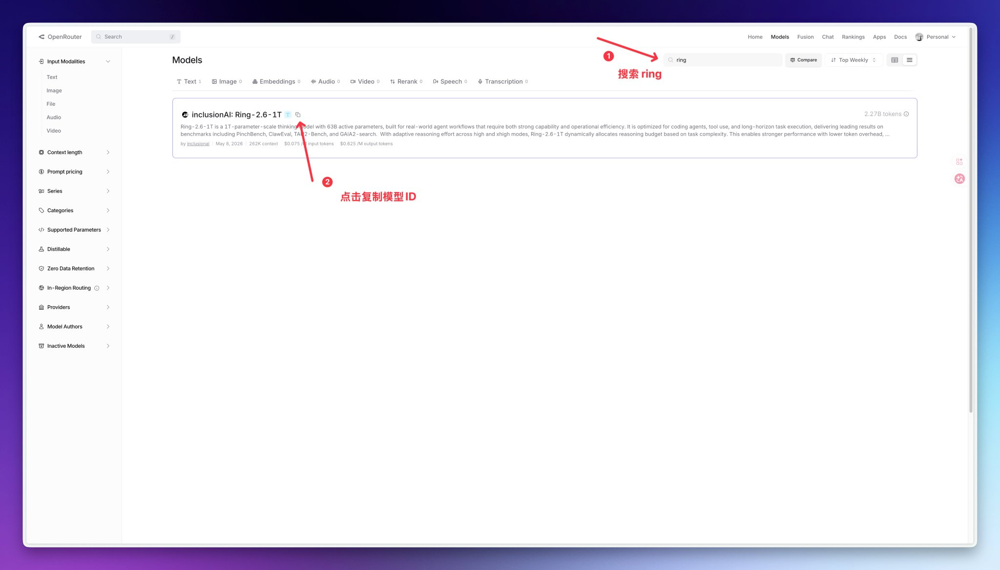
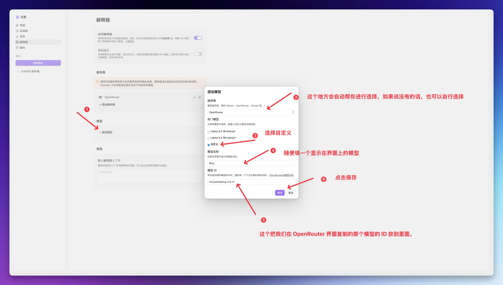
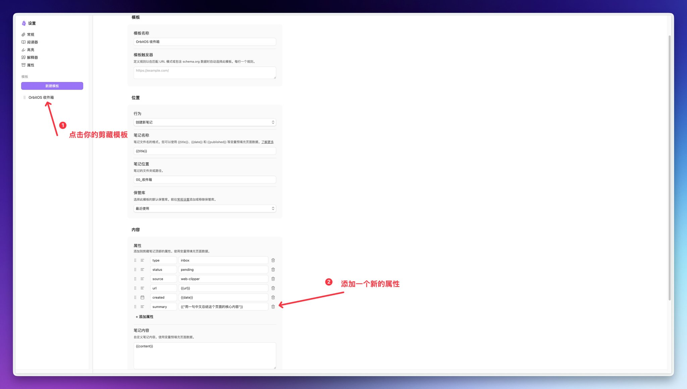
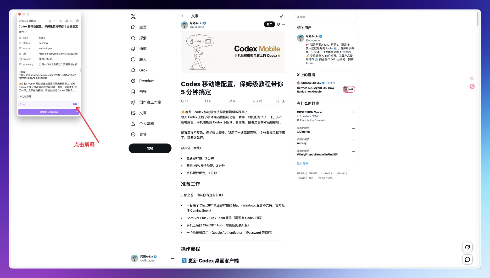
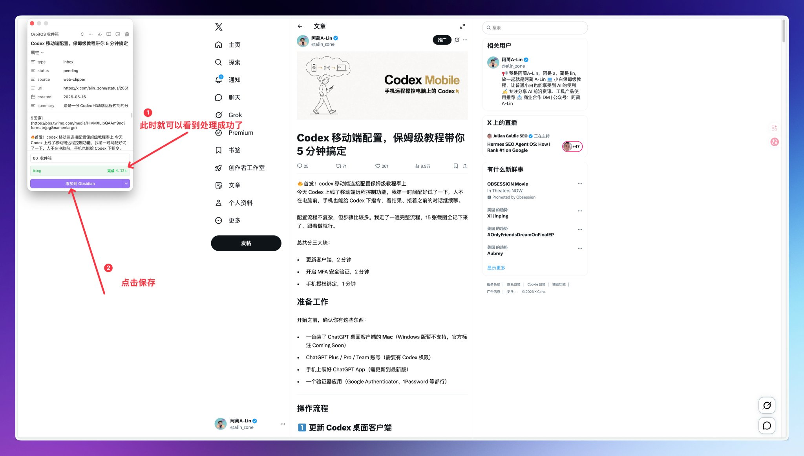
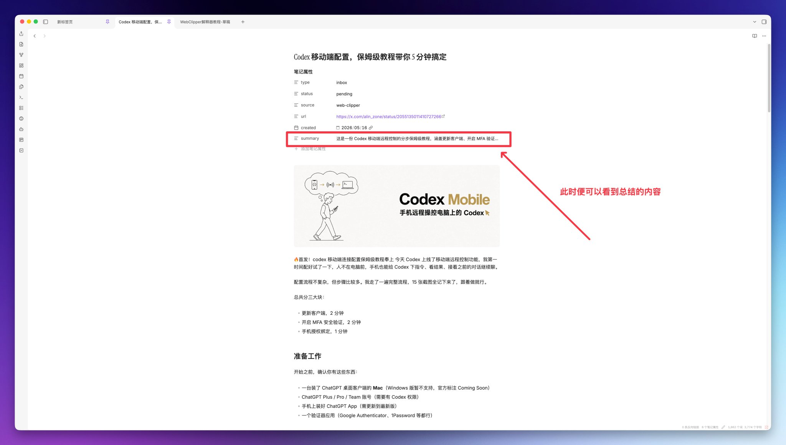
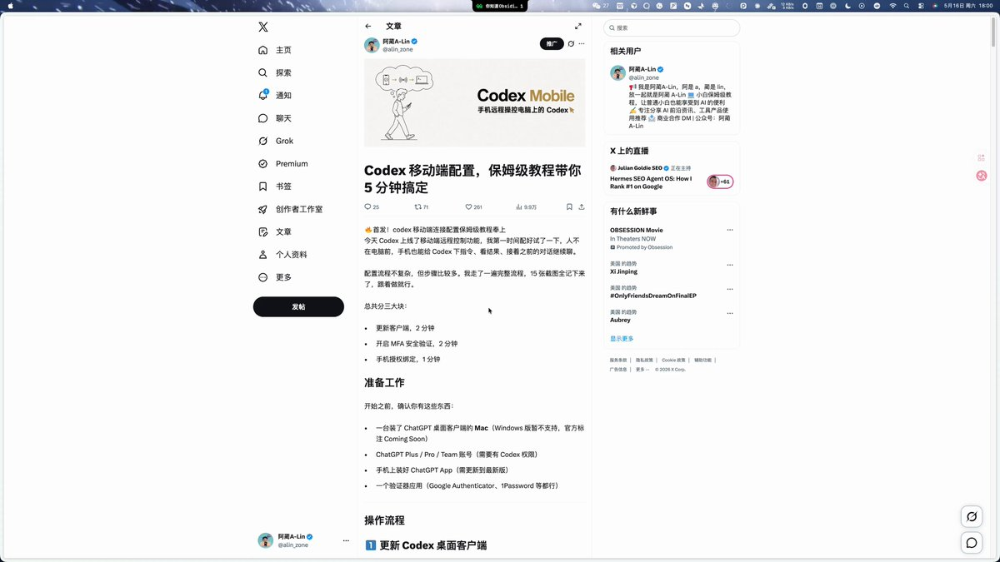

# Obsidian Web Clipper 也能接入 AI？5 分钟搞定，剪藏时笔记自动处理好

能。而且只要加一行配置，以后每次剪藏，AI 自动帮你生成摘要等信息。

之前那篇 Obsidian Web Clipper 安装教程有十万人看过，很多人跟着装好了插件、配好了剪藏模板。看到好文章点一下就存进 Obsidian，很方便。但用了一段时间你会发现一个问题：存进去的东西，90% 再也没打开过。

因为剪藏只是「搬运」，不是「加工」。一篇 3000 字的文章原封不动躺在 vault 里，跟没存一样。

如果剪藏的那一刻，AI 就帮你把要点提好、摘要写好、标签打好呢？

今天讲的就是这个：**Obsidian** **Web Clipper 的解释器功能**。它能在你剪藏网页的同时，自动调用 AI 处理内容。剪完就是一篇整理好的笔记，不用再手动加工。

💡 还没装 Web Clipper 的，先看这篇把插件装好：【上一篇 Web Clipper 教程链接】

> 2月28日

**全文 3 节，跟着做大概 5 分钟：**

- 1️⃣ 开启解释器 + 配置模型（2 分钟）
- 2️⃣ 改造你的剪藏模板（2 分钟）
- 3️⃣ 进阶玩法

## 1️⃣ 开启解释器 + 配置模型

打开 Web Clipper 设置（点剪藏面板底部的齿轮图标）→ 滚到「**解释器**」部分。

**打开解释器**

把「启用解释器」开关打开。

「自动运行」先别开。配置没跑通之前开了它，每次打开剪藏面板都会自动请求 AI，Key 填错或者模型没配对就会反复报错，白耗额度。等下面全部验证通过再回来开就行。

**拿到 API Key**

本期演示用的模型是 Ring-2.6-1T，百灵大模型Ring-2.6-1T 目前正式开源，文章通过 OpenRouter 接入，如果已经有 OpenRouter 的 Key 了或者自己的大模型，可以直接跳到下一步。

没有的话，现在注册一个：访问 [openrouter.ai](https://openrouter.ai/) → 注册 → 进入 [openrouter.ai/keys](https://openrouter.ai/keys) → 点「Create Key」→ 复制。

⚠️ Key 只显示一次，复制好存安全的地方。

**添加提供商**

回到 Web Clipper 解释器设置页面，往下滚到「提供商」，点「+ 添加提供商」：

- **名称**：OpenRouter（我用的是 OpenRouter，你用别的服务商按实际情况选）
- **Base URL**：[https://openrouter.ai/api/v1/chat/completions](https://openrouter.ai/api/v1/chat/completions)
- **API Key**：粘贴刚才复制的 Key

**添加 Ring 模型**

点「+ 添加模型」：

- **模型显示名称**：Ring（随便起，方便识别）
- **模型 ID**：去 OpenRouter 的 Models 页面搜 ring，找到 inclusionAI 出品的，复制模型 ID（下面第一个图）
- **提供商**：选刚才添加的 OpenRouter

填完保存。搞定，解释器配好了。下一步才是重点，改模板。

## 2️⃣ 改造你的剪藏模板

你之前已经有一个剪藏模板了（跟着上一篇教程配的那个）。现在要做的就是往里面加 AI 指令。

回到 Web Clipper 设置 → 找到你的模板 → 进入编辑页面。

你会看到两个关键区域：**属性**和**笔记内容**。这两个地方都能写 AI 指令。

语法很简单：双大括号 + 双引号包裹自然语言，就这样。

下面先演示最简单的一招，跑通之后再告诉你进阶玩法。

**实操：属性区加一句话摘要**

在属性区域点「+ 添加属性」，加一行：

- **字段名**：summary
- **值**：{{"用一句中文总结这个页面的核心内容"}}

其他属性（type、status、url、created）都不用动。

保存模板。然后随便打开一篇文章，点浏览器右上角的 Web Clipper 图标：

你会看到 summary 那行还是原始的指令。点一下面板上的「解释」按钮，Ring 开始处理。

几秒之后，摘要自动填好了：

确认没问题，点「添加到 Obsidian」保存。打开 vault 看一眼，笔记的 frontmatter 里已经多了一行 AI 生成的摘要：

就这么简单。一行配置，每次剪藏自动生成摘要。

完整操作视频：

💡 验证没问题了，现在可以回到解释器设置把「**自动运行**」打开。以后打开 Web Clipper 就自动跑 AI，不用每次手动点「解释」了。

## 3️⃣ 进阶玩法

跑通了摘要之后，解释器还能干更多。同一个模板里可以塞多个指令，剪藏时全部自动执行。

几个方向供你探索：

- **自动打标签**：让 AI 从你预设的标签列表里选最相关的几个
- **提取要点**：AI 帮你把长文浓缩成 3-5 句话，放在原文上面
- **列行动项**：文章里藏着的可执行动作，让 AI 帮你挑出来
- **组合技**：以上全塞进一个模板，剪藏时一次全跑完

玩法就是改模板里的指令，语法都一样。自己试试，改坏了也不影响已有笔记。

## 搞定，回顾一下

今天做了两件事：

① 开启了 Web Clipper 的解释器，接上了 Ring 模型 ② 在模板里加了一行 AI 指令，跑通了自动摘要

**以后每次剪藏网页，AI 自动帮你加工。** 不用再手动提炼、不用再回头补标签。想要更多能力，往模板里加指令就行。

上一篇教你装好了 Web Clipper，这一篇让它学会了「边存边想」。

剪藏负责收，AI 负责理。这一步交给 AI，省的是你每次「剪了不看」的时间。

---

> 来源：飞书 · AI Spark 知识库 ｜ 原文（最新版）：<https://lcnniolukk80.feishu.cn/wiki/REjCwjx8Kiae2hkWPMOcbMCRn7b> ｜ 归档：2026-06-04
