# Obsidian × AI 最简方案：不碰终端，5 分钟让 AI 住进侧边栏当你的记忆外挂

这是「Obsidian + AI」系列第三篇。前两篇走的是 CLI 路线（Claude Code / Codex / opencode），门槛不低。这一篇换条路：纯插件，不碰终端。

前两篇教程发出去之后，评论区好多人问：「CLI 搞不定怎么办？终端那些命令看不懂，但我也想在 Obsidian 里用 AI。」

其实很多人的需求没那么重。不需要 AI 帮你改文件、跑命令、批量处理。就是写笔记的时候能随手问一句，或者翻翻以前写过什么，让 AI 帮忙梳理一下信息。

这种需求，根本不用折腾终端。一个插件就够了。

今天介绍的插件叫 **Copilot**。装完之后你的 Obsidian 多两个能力：一是侧边栏随时问 AI，二是**语义搜索**，不用记精确关键词，用大白话描述就能找到相关笔记。

**完全不碰终端。** 装插件 → 注册拿 Key → 填进去，5 分钟搞定。本期演示用的模型是 Ring，目前一周免费。

> 4月28日

> 4月29日

**全文 5 节，跟着做大概 5 分钟：**

- **一、装插件**（1 分钟）
- **二、拿 Key**（2 分钟）
- **三、把 Key 填进 Copilot**（1 分钟）
- **四、Chat 模式实操**（1 分钟）
- **五、Vault QA：让 AI 读懂你全部笔记**（演示）

## 一、装插件

打开 Obsidian → 设置 → 第三方插件 → 浏览社区插件 → 搜索 **Copilot**。

第一个结果就是，作者是 Logan Yang。点「安装」→ 点「启用」。

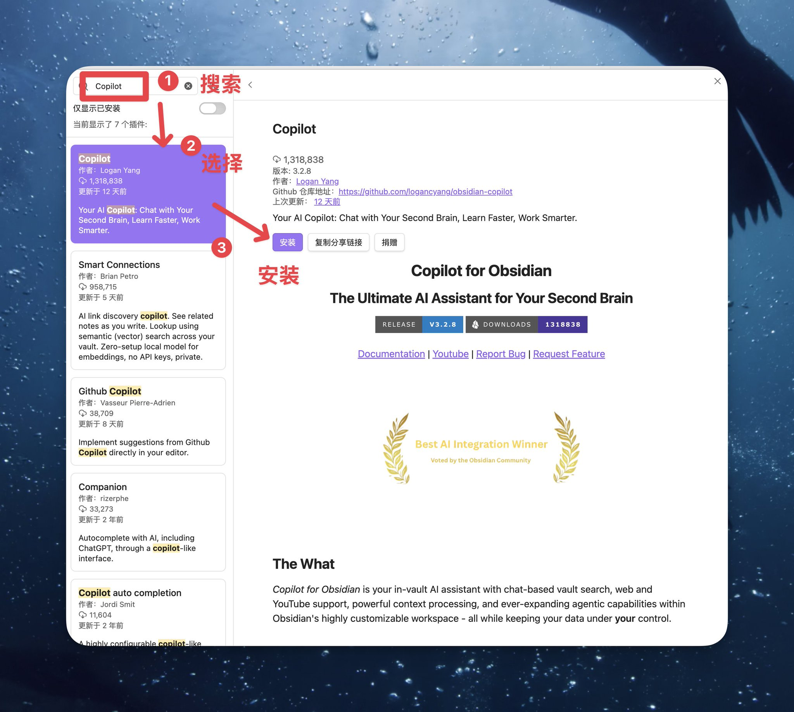

启用之后，左侧边栏会多出一个对话气泡图标。点一下，Copilot 的聊天面板就出来了。

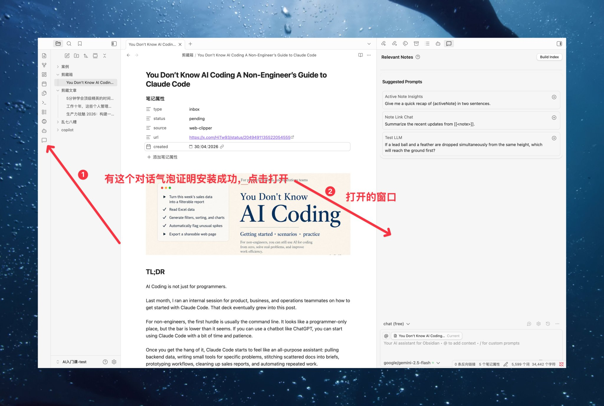

## 二、拿 Key

Copilot 支持多种 AI 来源：

- 有 Anthropic / OpenAI 官方 API Key 的，直接填就能用
- 有 Copilot Plus 订阅（$10/月）的，登录即用
- **什么都没有也行**，用 OpenRouter 上的免费模型

本期演示用 **OpenRouter + Ring**。Ring 是 inclusionAI 的新模型，目前一周免费，输入输出都不计费。跟着下面走，3 分钟拿到 Key。

💡 手头已经有 API Key 的，直接跳到第三节按各家厂商的位置填 Key 即可。

**𝟮.𝟭 注册 OpenRouter**

访问 [openrouter.ai](https://openrouter.ai/) → 用 Google 账号或邮箱注册。

**𝟮.𝟮 创建 API Key**

登录后进入 [openrouter.ai/keys](https://openrouter.ai/keys) → 点「**Create Key**」。

弹窗里只需要填 Name（随便起，比如 obsidian-copilot），其他全部留默认。点「Create」→ **完整复制生成的 Key**。

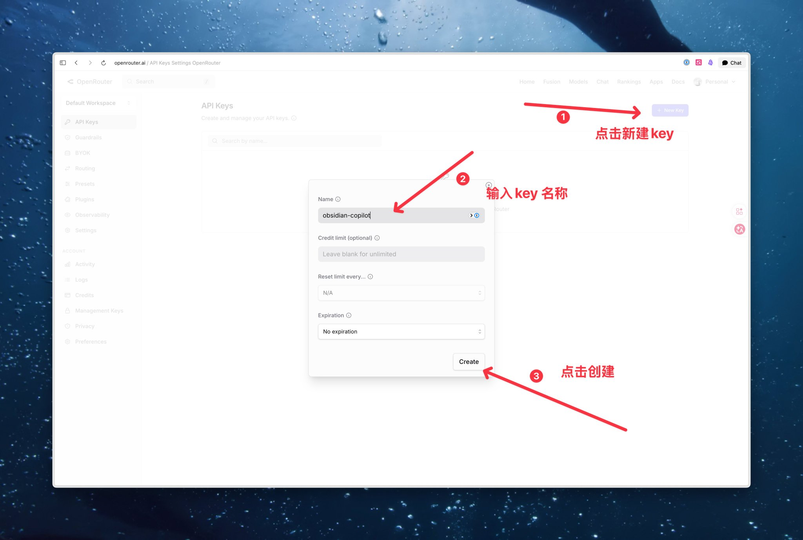

⚠️ Key 只显示一次，复制好存到安全的地方。丢了得重新生成。

**𝟮.𝟯 找到 Ring 模型 ID**

OpenRouter 顶部菜单点进 **Models** 页面 → 搜索框输入 ring。

找到 **inclusionAI** 出品的 Ring 模型（标记 Free），点模型名右边的复制图标，拿到模型 ID。

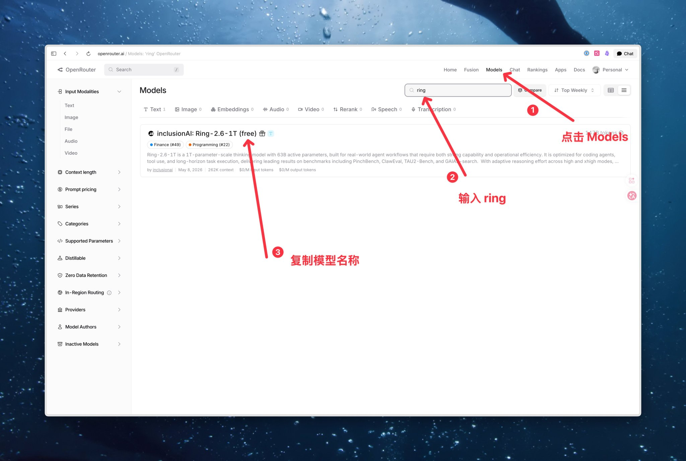

💡 模型 ID 长这样：inclusionai/ring-xxx（具体以你搜到的为准）。记下来，下一节要填。

## 三、把 Key 填进 Copilot

打开 Obsidian 设置 → 左侧找到 **Copilot** → 进入设置页面。

你会看到模型配置区域，需要填的东西：

❶ **API Provider**：选 OpenRouter（如果用 DeepSeek 或者 Gemini 等等的按需选择）

❷ **API Key**：粘贴刚才复制的 OpenRouter Key

❸ **Default Model**：填刚才复制的 Ring 模型 ID（inclusionai/ring-xxx）

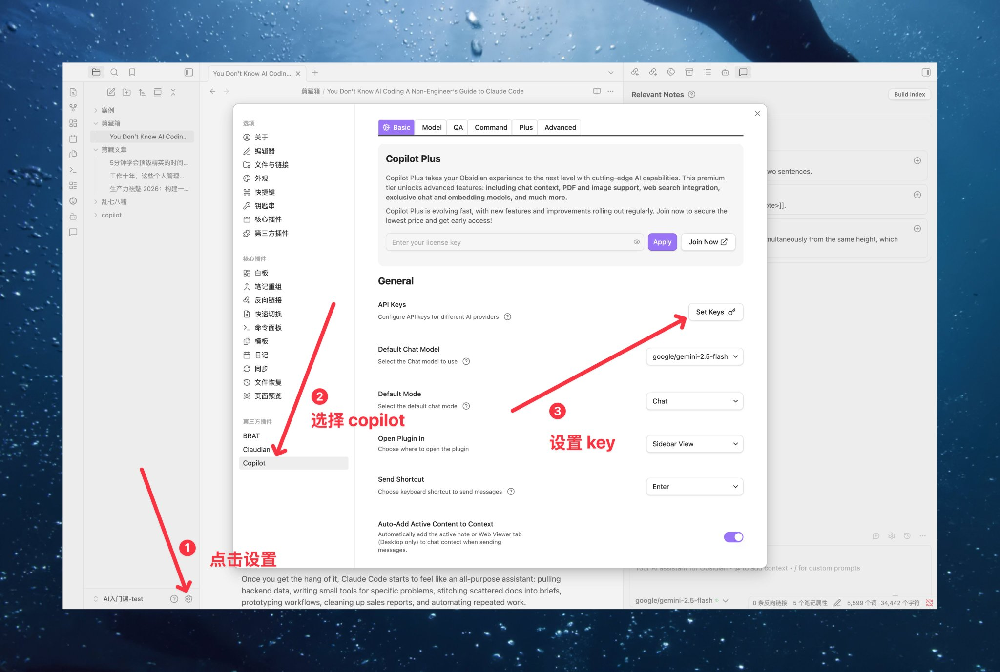

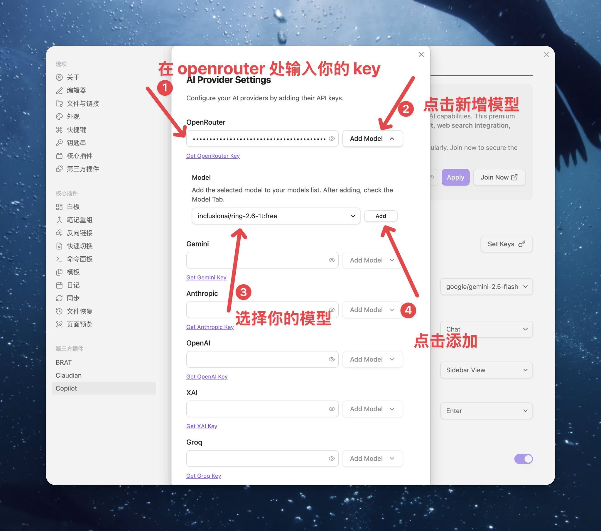

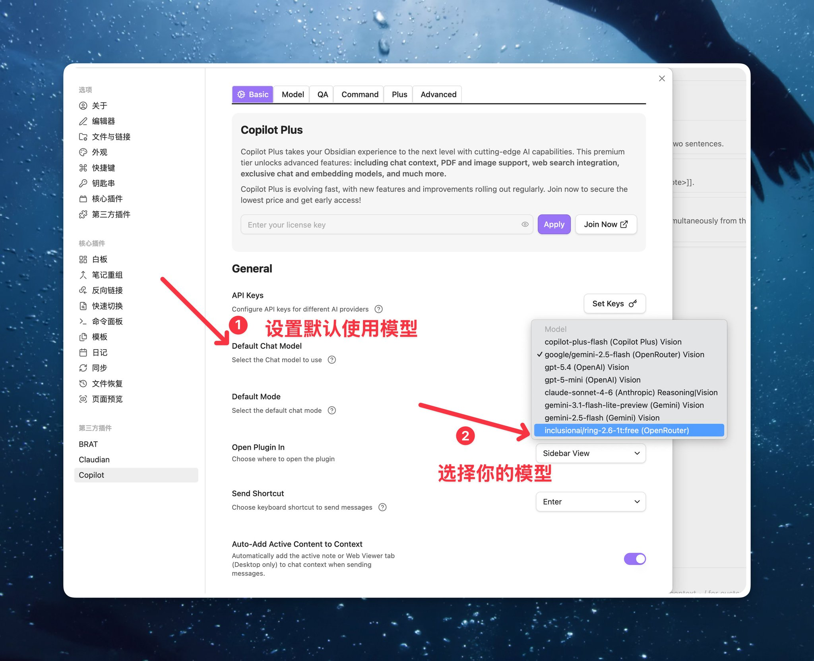

填完保存。回到 Copilot 聊天面板，发一句「你好」。

AI 回复了，说明通道打通。

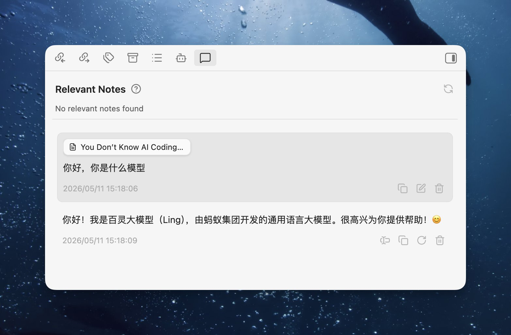

⚠️ 如果报错，检查三件事：① Key 有没有复制完整 ② 模型 ID 有没有拼错

## 四、Chat 模式实操

通道打通了，说说日常怎么用。

**场景 1：侧边栏直接问**

写笔记写到一半，右边 Copilot 面板直接问问题。比如「帮我用一句话总结这段」。AI 的回答显示在侧边栏里。

想把 AI 的回答放进笔记？点回复下方的 **Insert** 按钮，内容就落到光标位置了。

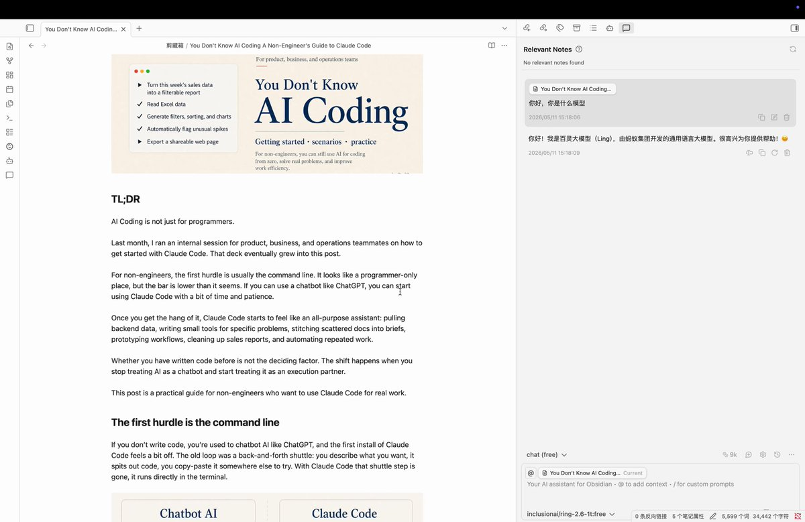

**场景 2：选中文本，右键让 AI 改**

选中一段文字 → 右键 → 你会看到 Copilot 的快捷命令：改写、翻译、总结、扩写。

点一下，AI 处理完直接添加到原文中。

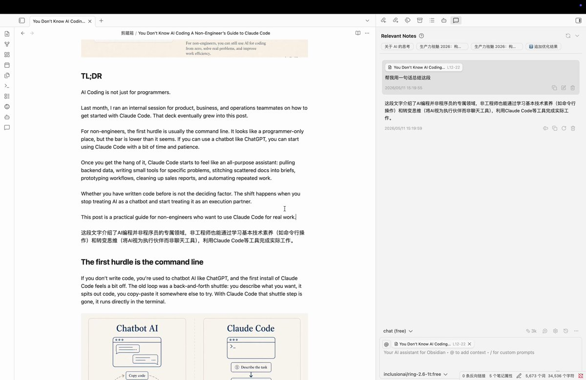

## 五、Vault QA：让 AI 读懂你全部笔记

这是 Copilot 最值得用的功能，也是 ChatGPT、Claude 网页版给不了你的东西。

**一句话解释：** AI 对你整个 vault 建一份语义索引。建完之后，它能根据你当前在看的内容，自动列出 vault 里语义相关的笔记。

**怎么开启：**

Copilot 聊天面板顶部有一个 **Relevant Notes** 区域，旁边有个 **Build Index** 按钮。点一下。

弹窗提示「Enable Semantic Search?」，说的是语义搜索需要先建索引。点 **Enable**。

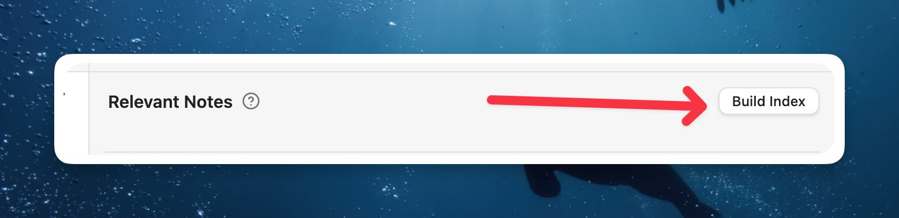

然后就开始建索引了，有进度条，能看到跑了多少文件。笔记少的话十几秒跑完，笔记多的 vault（500+）可能要几分钟。

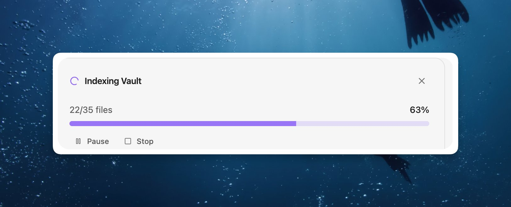

**建完之后：**

打开任意一篇笔记，Copilot 面板底部的 **Relevant Notes** 会自动列出和当前笔记语义相关的内容。不用你手动搜，打开笔记它就推。

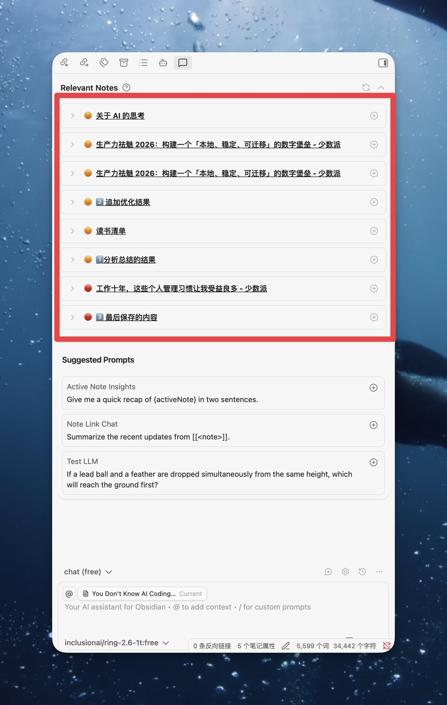

比如我打开一篇笔记，它自动找到了「关于 AI 的思考」「生产力祛魅」「读书清单」「个人管理习惯」这些相关笔记。这些笔记标题里可能根本没有我当前笔记的关键词，但内容上是相关的。**Obsidian 自带搜索做不到这件事。**

橙色圆点 = 高度相关，红色圆点 = 有一定关联。点左边箭头可以展开看匹配的具体段落。

💡 索引建一次就行，后续新增笔记会自动更新。不用每次手动重建。

**Q：我已经有 Claude Code 了，这个 Vault QA 还有必要吗？**

有。两个东西干的活不一样：

- **省 token**：Claude Code 每次帮你找笔记，都要读文件、把内容塞进上下文，几万 token 就烧出去了。Copilot 建完索引之后，每次查询只送几个相关片段给 AI，几千 token 搞定。日常翻旧笔记用 Copilot，成本低一个量级。
- **语义 vs 关键词**：Claude Code 找笔记本质是 grep，你得记得精确关键词。Copilot 是向量检索，你说"我之前写过关于拖延症的东西"，即使笔记里用的是"写不动了""卡住了"这类词，也能命中。
- **速度**：Copilot 的索引是本地持久化的，查一次几百毫秒。Claude Code 每次都要重新读文件、等 API 返回，慢得多。
- **零摩擦**：不用开终端、不用等启动。写笔记的时候侧边栏就在那，打开笔记 Relevant Notes 自动推，不打断心流。

一句话总结：**Claude Code 是干活的，Copilot 是翻记忆的。** 翻记忆这种轻活儿，没必要请施工队。

## 顺带一提：Copilot 还能干什么？

上面讲的是免费版就能用的核心功能。其实这个插件还有不少进阶玩法：

- **自定义 Prompt 模板**：你可以在设置里预设一批常用指令（比如「把这段改成推文风格」「提取关键词打 tag」），绑到命令面板，一键调用
- **多模型切换**：设置里可以配多个模型，不同场景用不同的。写作用贵的，翻译用便宜的
- **Copilot Plus（$10/月）**：付费版加了 Agent 模式（AI 能联网搜索、读 PDF、看图片、看 YouTube 视频）、长期记忆、时间窗口查询。如果你用得重，可以考虑

本篇只覆盖免费版的核心路径。够用了再往上加，不急。

## 搞定，回顾一下

今天做了三件事：

① 装了 Copilot 插件 ② 用 OpenRouter + Ring（免费）拿到了 Key 并填进去 ③ 跑通了 Chat 对话 + Vault QA 语义搜索

**5 分钟，你的 Obsidian 从一个纯本地笔记工具，变成了一个能对话、能语义搜索的 AI 笔记系统。**

## 这篇和前两篇是什么关系？

三篇文章覆盖了三种不同的 AI 接入姿势，各有各的活：

- **第一篇**（Claude Code + Codex）：AI 替你干重活，能改文件、跑命令、批量处理
- **第二篇**（opencode + 国产模型）：免费备份通道，日常杂活不花钱
- **本篇**（Copilot 插件）：AI 陪你想、帮你找，语义搜索你的全库笔记

不冲突。前两篇是「AI 施工队」，这一篇是「AI 记忆外挂」。按需选就行。

---

> 来源：飞书 · AI Spark 知识库 ｜ 原文（最新版）：<https://lcnniolukk80.feishu.cn/wiki/DJvww7W29iwYtbk0htpcscg6nHd> ｜ 归档：2026-06-04
