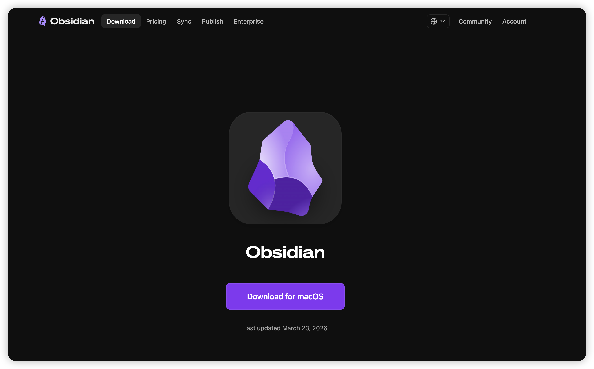
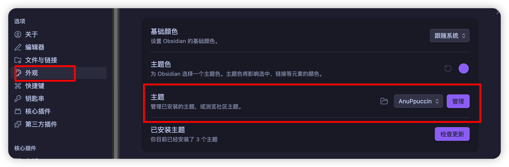
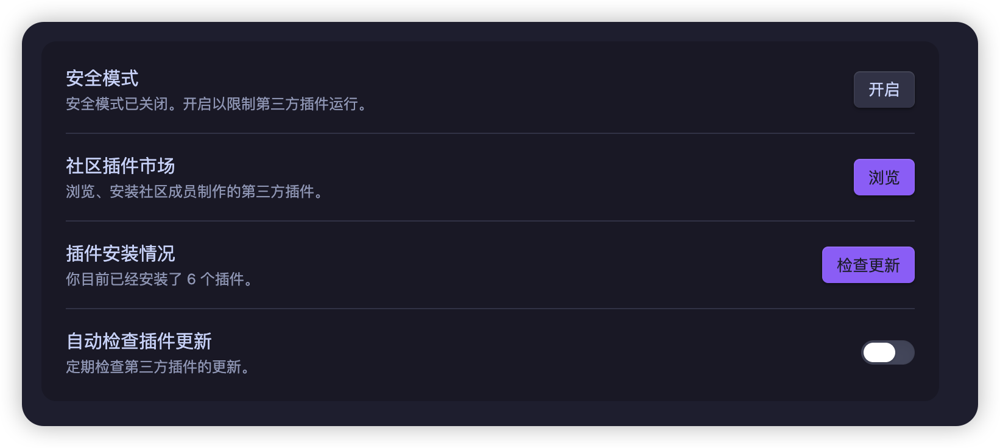
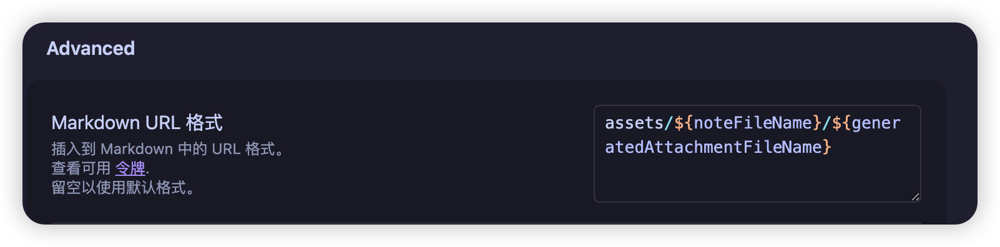
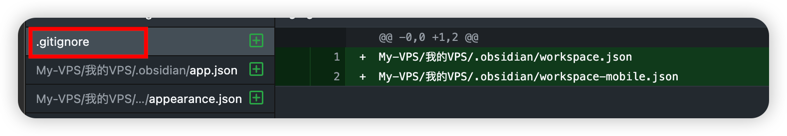
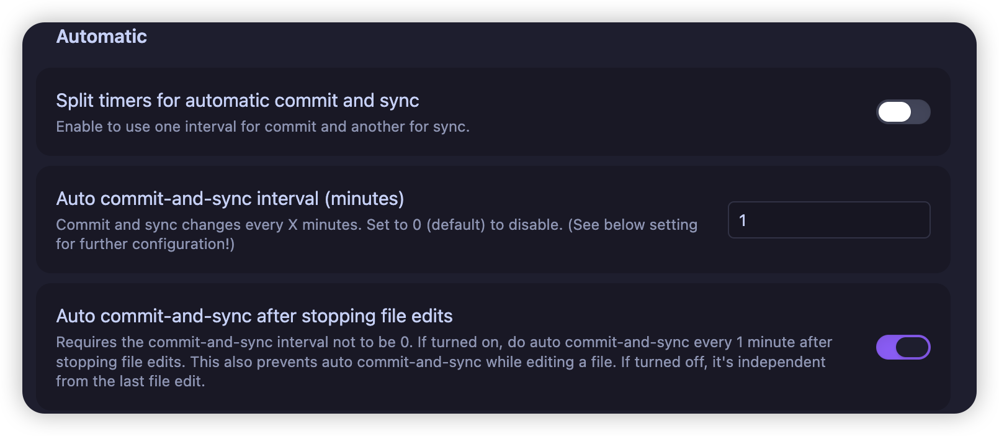

# Obsidian 写作环境搭建：这 6 款插件让我的博客管理效率翻倍

前段时间Obsidian非常的火，所以我准备上手学习一下，就看到我自己其实有挺多文章需要归纳和处理的，所以准备花时间尝尝鲜。

现在的主要工作就是设置Obsidian然后把我博客文章里面的文章全部从 Halo 迁移到了 Obsidian 管理，折腾了一圈之后发现这套组合比想象中顺手很多。这篇记录一下我现在的配置，顺便把迁移途中踩的几个坑也说清楚，省得你重踩。

其实最主要的点，还是因为我想配合AI去使用，在Obsidian结合AI使用会非常的便利。我也是看中了这一点，花了一些时间主动学习了这个工具

---

## 安装

其实直接搜索Obsidian就可以了，但是怕很多人搜索错我就直接贴对应的地址了。

[Obsidian官方下载地址](https://obsidian.md/download)



## 主题：AnuPpuccin

我这里使用了好几个主题，最让我舒服的还是AnuPpuccin，主要是它的暗黑系风格和我的IDEA的主题像类似，这样我就可以很好的使用它。

而且AnuPpuccin的下载量 80 万+，目前 Obsidian 社区里最受欢迎的主题之一。亮暗模式都好看，配色方案多，不会让你盯着屏幕眼睛酸。

我主要用深色模式写作，配色调成了偏冷的灰蓝，长时间写稿不容易疲劳。如果你对界面颜值有要求，AnuPpuccin 基本是开箱即用不用再找别的。

配置方式也很简单，点击左下角设置按钮，然后找到外观，主题设置就可以更换你自己想要的主题了。



---

## 插件配置

安装的使用第三方插件是需要关闭安全模式，如果没有关闭是无法安装第三方插件。下面就是我使用很不错的第三方插件。



### Custom Attachment Location

附件按笔记名自动归类到对应子文件夹。以前图片全扔在 vault 根目录，找起来一团乱；装了这个之后，每篇文章的截图自动进 `assets/文章名/`，整洁很多。




> 这里需要简单设置一下安放图片的位置，设置全部文件和图片位置需要设置。URL其实也不习惯不是标准的markdown文档的格式，所以需要设置一下。

### Dataview

用类 SQL 语法查询笔记内容，适合做内容索引。我主要拿它追踪文章状态——哪些草稿还没发、哪些选题已经有文章对应——写一条查询语句就能汇总，不用手动翻文件夹。

### Enhancing Export

支持导出 PDF、HTML、ePub、Markdown 多种格式。偶尔要给人发一份格式整齐的文档，用这个比直接复制粘贴省事。

### Git

自动定时备份到 GitHub。版本控制这件事我以前全靠手动，某次误删了半篇稿子才意识到有多危险。装上之后基本不用管，按设定的时间间隔自动 commit，在哪台机器上都能拉到最新版本。





> 这里有几个推荐设置，不是必须的编辑停止之后自动push，我这里设置了一分钟之后知道同步。还有就是设置两个json文件去掉，不需要同步到git因为经常修改容易冲突。

### Local Images Plus

检测笔记里所有外链图片，自动下载到本地并更新链接。**这个对从 Halo 迁移过来的文章特别重要**——导出的文章图片链接还指向服务器，服务器一旦停了图片就全挂，用这个插件一键本地化可以彻底解决问题。

### Templater

预设文章模板，新建文件自动套用。我的模板里带 Front Matter，包含文章状态、发布日期、分类等字段，配合 Dataview 查询能直接看到哪些文章的状态是"草稿"或"待发布"。

---

## 迁移途中踩的几个坑

### Halo 导出的是 HTML，不是 Markdown

当时以为官方「文章导入导出」插件能直接导出 Markdown，结果打开一看全是 HTML。原因是 Halo 2.x 默认编辑器存储格式就是 HTML，导出自然也是 HTML。

解决方式：用 Python 的 `markdownify` 库批量转换。写一个脚本扔进文件夹跑一遍，几十篇文章几分钟搞定。

### HTML 转 Markdown 格式混乱

一开始用 Pandoc 转换，结果富文本 HTML 转出来格式一团糟，标题层级乱、列表嵌套出问题。后来换成 `markdownify` + `BeautifulSoup` 组合，效果稳定很多，基本不需要再手动修正格式。

### 图片链接失效

从 Halo 导出的文章，图片 URL 还是指向原服务器的。迁移完之后如果不处理，服务器一停图片就全挂。

用 Local Images Plus 扫一遍，插件会自动把外链图片下载到本地，并把 Markdown 里的链接替换成本地路径，一步到位。

---

## 我现在的工作流

### Halo → Obsidian

```
导出 HTML → markdownify 批量转换 → 导入 Obsidian Vault → Local Images Plus 本地化图片
```

### Obsidian + Claude Code 创作流

```
分析已有文章风格 → 生成选题灵感 → 确认选题 → 生成大纲 → 确认结构 → 生成文章 → 导回 Halo 发布
```

选题和风格分析这两步现在基本交给 Claude Code 来跑，它能读完整个 vault 里的历史文章，总结出我的写作语气和高频话题，然后按这个风格出新文章。比自己一篇一篇翻快多了。

> 如果对这方面感兴趣，我后面也出一篇相关的内容，怎么使用Obsidian结合Claude Code打造自己的创作流程。

---

## 总结

这套配置没什么特别复杂的地方，核心就两件事：

- **插件组合把「文件管理乱」「备份靠手动」「图片会失效」这三个痛点全堵上了**
- **迁移的坑主要在 HTML 转 Markdown 这一步**，用对工具基本没什么大问题

如果你也在用 Halo 写博客、想迁移到 Obsidian 管理，按这个流程来应该能少走不少弯路。其实这篇最主要还是介绍Obsidian的一些插件和设置，给后续AI对接工作流打下基础。

如果感兴趣，我也会写一篇怎么打造自己的文章创作流程，让自己的内容更完整。

---

## 延伸阅读

- [Claudian 安装教程：把 Claude Code 接进 Obsidian](Claudian%20安装教程：把%20Claude%20Code%20接进%20Obsidian，从%200%20到侧边栏对话.md) — Obsidian 接入 AI
- [别让 AI 写得像 AI：83 篇博客训练专属写作助手](../../04｜AI%20内容创作/别让%20AI%20写得像%20AI：用自己的%2083%20篇博客训练专属写作助手，顺手做成了一个%20Skill.md) — Obsidian 写作 + AI Skill 实践
- [GitHub 狂揽 10.7k Star！这款飞书神器配合 AI Agent](../../03｜AI%20编程与智能体/智能体应用案例/GitHub%20狂揽%2010.7k%20Star！这款飞书神器配合%20AI%20Agent，工作流彻底起飞了.md) — 飞书与 Obsidian 协同思路

---

> 来源：飞书 · AI Spark 知识库 ｜ 原文（最新版）：<https://lcnniolukk80.feishu.cn/wiki/Jv5jwEFN0iKCZ6kmHp3czzVInpb> ｜ 归档：2026-06-04
