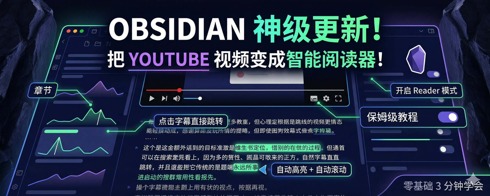
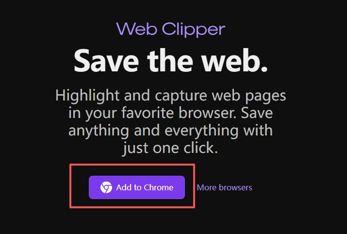
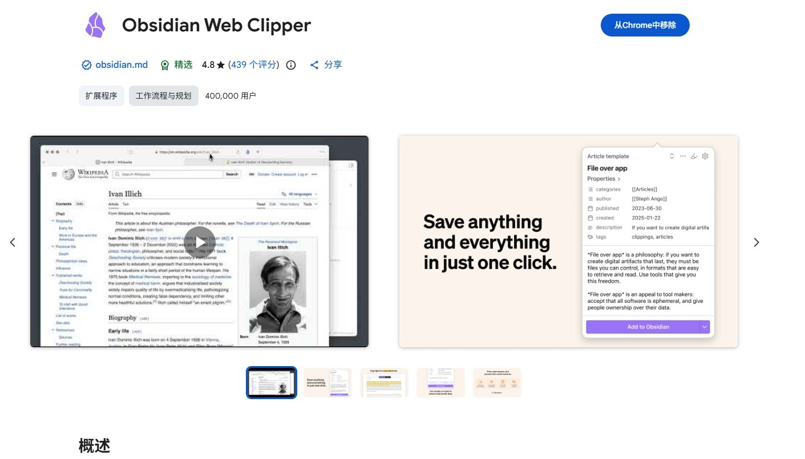
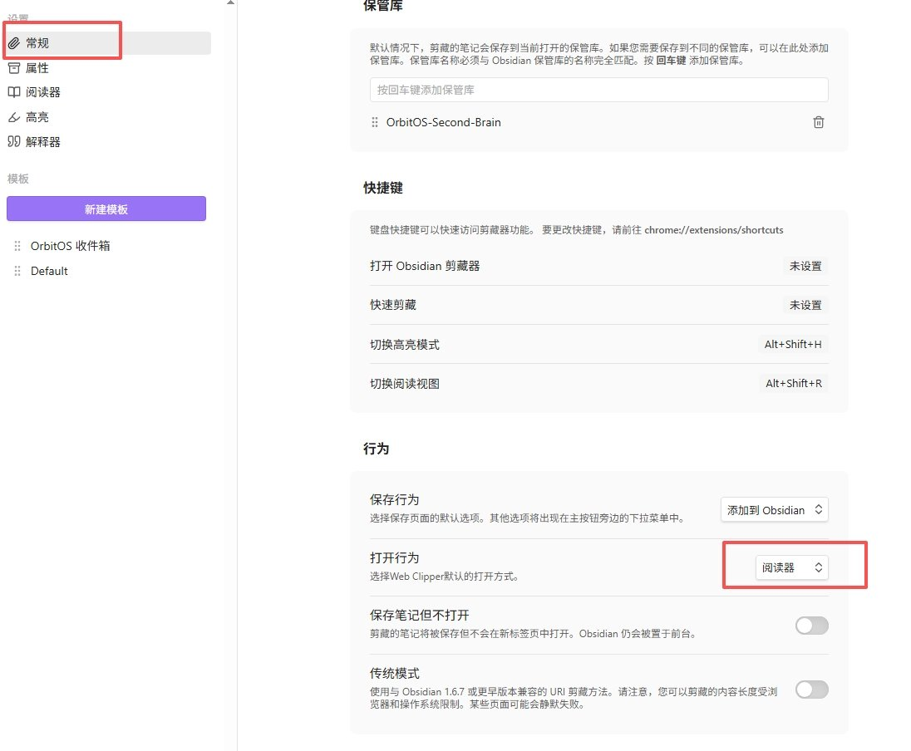
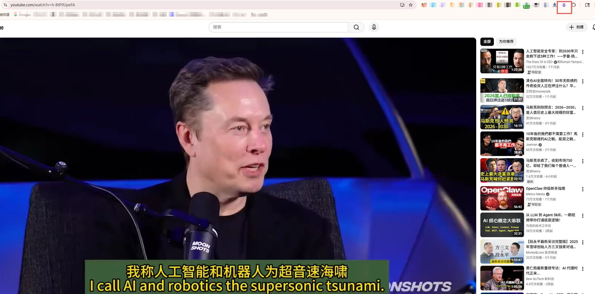
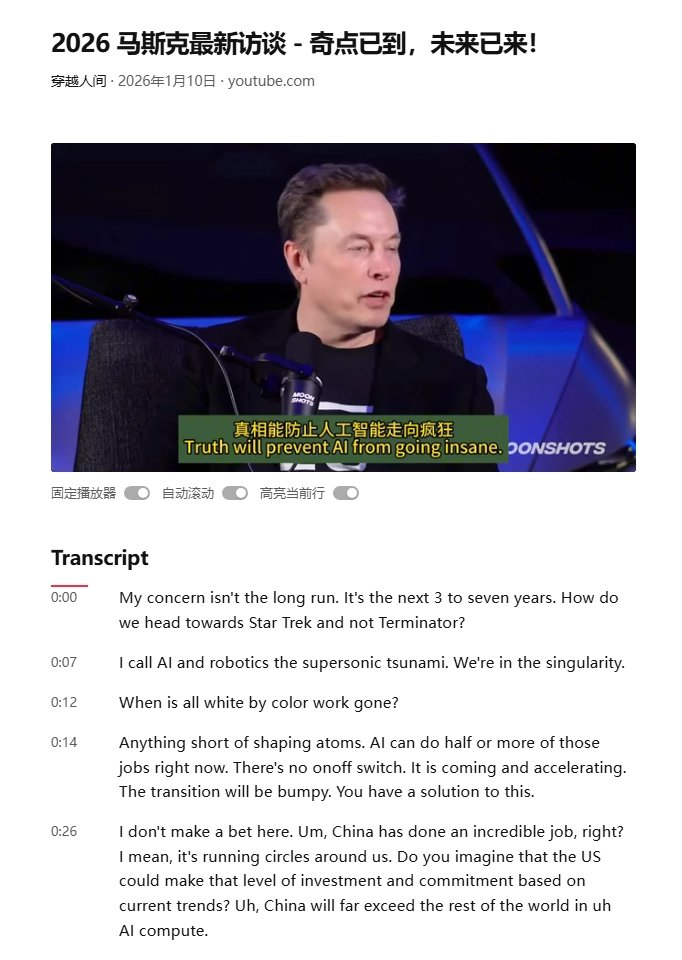
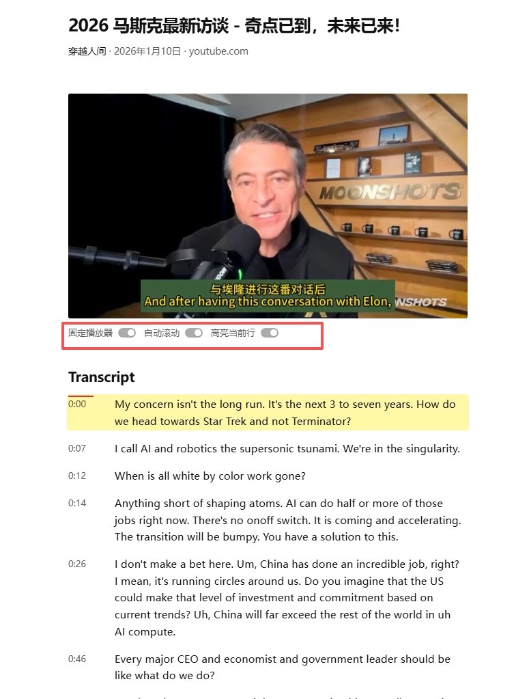
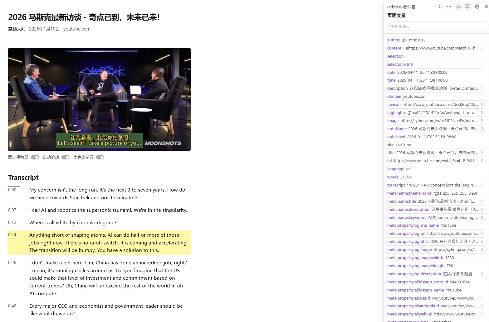

# Obsidian 神级更新！把 YouTube 视频变成智能阅读器，再也回不去普通 YouTube 了！

**YouTube 视频变成智能阅读器保姆级上手教程（零基础也能 3 分钟学会）**

**第一步：安装或更新 Obsidian Web Clipper 插件**

1. 打开浏览器（推荐 Chrome / Edge），在地址栏输入： [https://obsidian.md/clipper](https://obsidian.md/clipper) 然后按回车。
2. 点击页面中间的 **“Install for Chrome”**（或对应浏览器的安装按钮）。
3. 安装完成后，浏览器右上角会出现 **Obsidian 黑色图标**。

**小贴士**：如果是老用户，直接在浏览器扩展商店搜索 “Obsidian Web Clipper”，更新到 **1.4 或更高版本** 即可。

**第二步：设置默认打开 Reader 模式（强烈推荐）**

1. 点击浏览器右上角的 **Obsidian 图标**。
2. 在弹出的小窗口里，点击右上角的 **齿轮设置图标**。
3. 找到 **Default open behavior**（默认打开方式）。
4. 把选项改成 **Reader** 或 **Open in Reader mode**。
5. 保存设置。

以后每次用就超级方便了！

**第三步：体验 YouTube 智能字幕阅读器（最爽的部分）**

1. 打开任意一个**有字幕**的 YouTube 视频（建议选带章节的教程或访谈视频，效果更好）。
2. 点击浏览器右上角的 **Obsidian 图标**。
3. 在弹出的菜单中，点击 **书本图标（Reader 模式）**。

**进入 Reader 模式后，你会看到：**

- 左侧：视频章节大纲（如果视频有章节就会自动显示）
- 中间：干净的视频播放器
- 下方：完整的带时间戳的字幕（transcript）

**超实用交互功能：**

- **点击任意一行字幕** → 视频立刻精准跳转到那个时间点
- 视频播放时，**当前正在说的那行字幕会自动高亮**
- 字幕会**自动向下滚动**，始终把当前行保持在屏幕中央

**顶部开关建议全部打开：**

- Pin player（固定视频位置）
- Auto-scroll（自动滚动）
- Highlight active line（高亮当前行）

**额外好用功能**

- 选中字幕里的文字，可以直接高亮保存到你的 Obsidian 笔记里（带视频链接和时间戳）
- 界面干净极简，看视频像在用专业阅读器

**注意事项**

- 需要 YouTube 视频本身带有字幕（中英文字幕都可以）
- Firefox 用户可能需要等 1-3 周才能更新到最新版
- 完全免费，官方插件
- 更多帮助可查看：[https://obsidian.md/help/web-clipper/reader](https://obsidian.md/help/web-clipper/reader)

**教程同步公众号：雨哥聊AI**

---

> 来源：飞书 · AI Spark 知识库 ｜ 原文（最新版）：<https://lcnniolukk80.feishu.cn/wiki/S4Ykw8SV9iSO9okfIWBc5BUUnbe> ｜ 归档：2026-06-04
