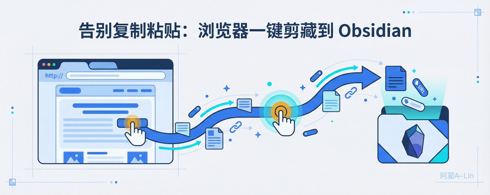
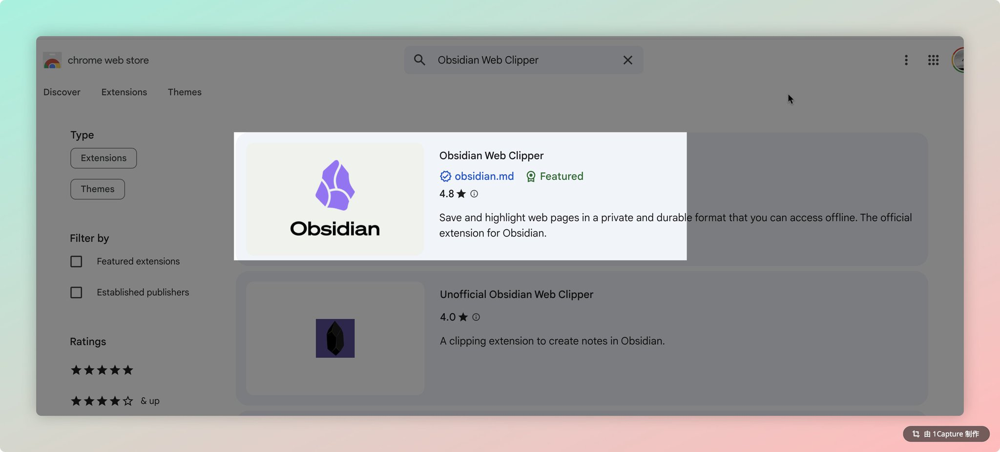
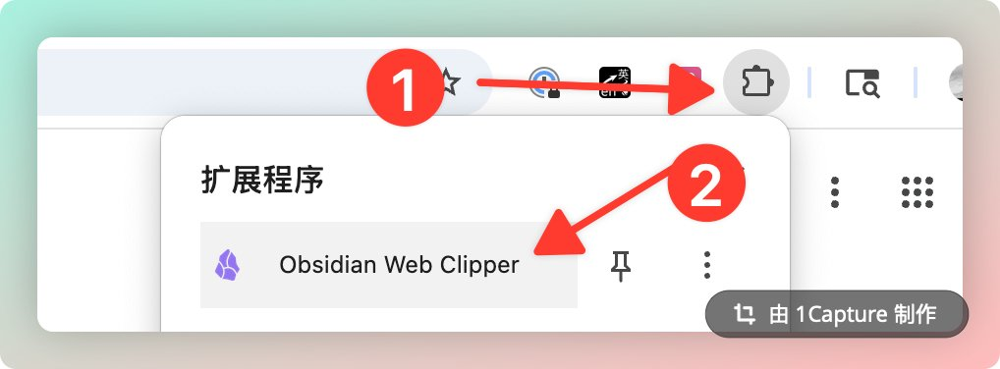
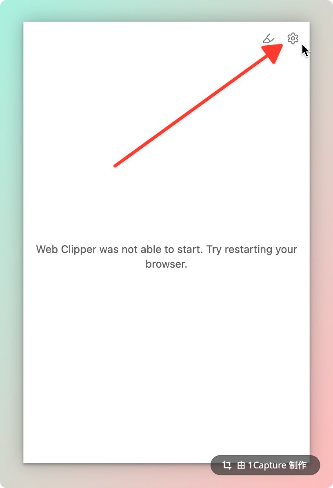
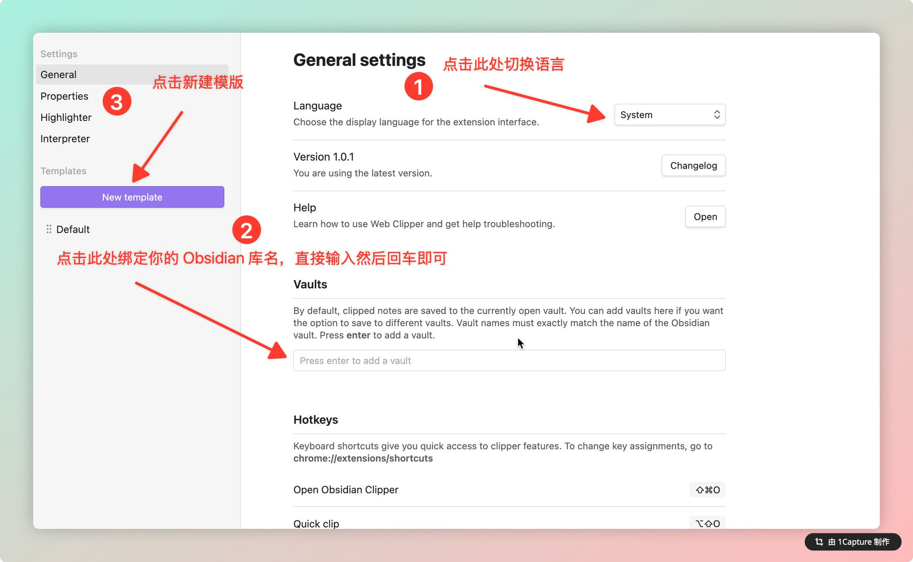
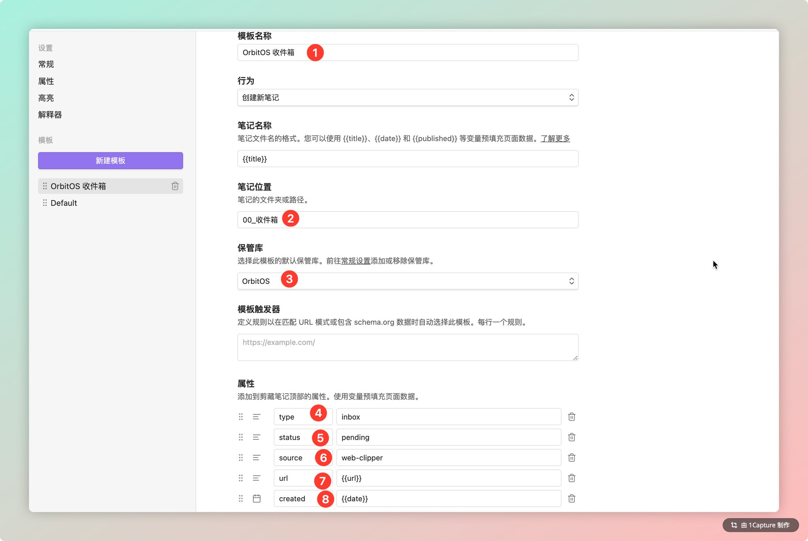
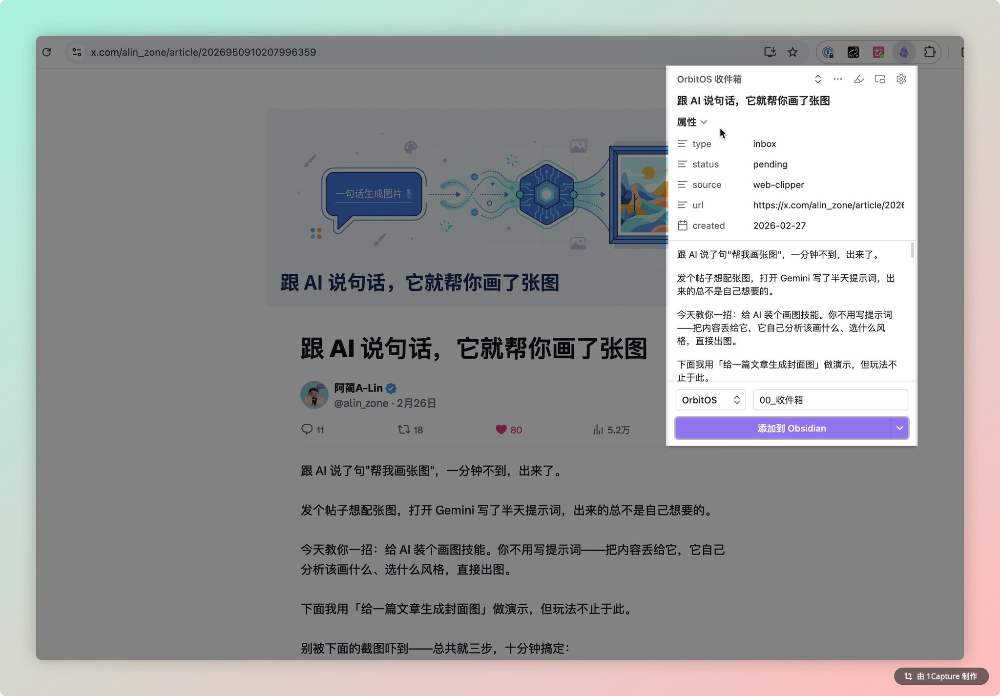
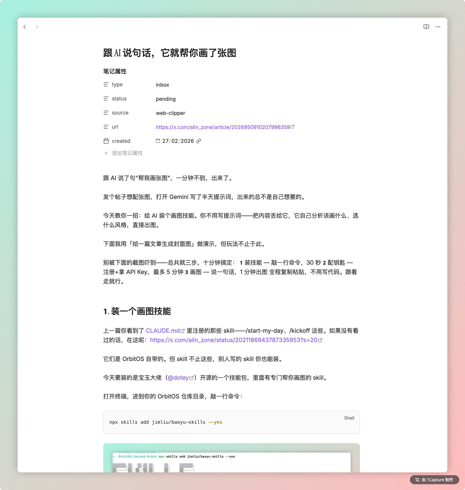

# 告别复制粘贴：浏览器一键剪藏到 Obsidian

前几篇教程教大家装好了 Obsidian，接上了 AI，笔记终于有了个家。

但用着用着你会发现一个问题：刷 Twitter 或者网站看到一篇好文章，想存到 Obsidian 里 — 怎么弄？

复制正文，打开 Obsidian，新建笔记，粘贴，调格式，图片还得一张张右键保存……

太累了。

今天教你一招：装个浏览器插件，看到好内容点一下，自动存进你的知识库，带标题、带链接、带全文。

两分钟搞定。

总共就三步： ① 装插件 — 1 分钟 ② 配模板 — 2 分钟 ③ 点一下保存 — 2 秒

跟着走就行。

𝟭. 装一个浏览器插件

这个插件叫 Web Clipper，Obsidian 官方出的，免费。

Chrome 用户打开 [chromewebstore.google.com](https://chromewebstore.google.com/)，搜 "Obsidian Web Clipper"，认准 obsidian.md 官方那个，点安装。Edge / Firefox / Safari 也都有，去各自的扩展商店搜就行。

装完记得把它钉到工具栏，方便随时用：

𝟮. 配一下

点工具栏上的 Obsidian 图标，第一次打开会提示需要配置。点右上角齿轮 ⚙️ 进设置：

进去之后三件事一次搞定（跟着截图编号来）：

❶ 语言切中文 ❷ 绑定你的 Obsidian 库名，输入后回车（如果是跟着我之前教程的朋友设置的库的话库名是：OrbitOS-Second-Brain ） ✅ 跟着系列一路走过来的朋友不用担心落下什么 — 后面每篇我都会带上前情回顾，忘了也没关系，我帮你记着。 ❸ 点「新建模板」

𝟯. 配一个收件箱模板

这步最重要 — 告诉插件存到哪、带什么信息。

跟着截图编号填：

❶ 模板名称：OrbitOS 收件箱 ❷ 笔记位置：00_收件箱（剪藏的内容会自动存到这个文件夹） ❸ 保管库：选你刚绑定的 ❹-❽ 添加 5 个属性：type → inbox、status → pending、source → web-clipper、url → {{url}}、created → {{date}}

这些属性会自动出现在笔记顶部，后面筛选、归档全靠它们。

笔记内容保持默认就行，插件会自动把网页正文转成 Markdown。保存，搞定。

𝟰. 试一下

随便打开一篇文章，点工具栏上的 Obsidian 图标。

选「OrbitOS 收件箱」模板，右边能预览标题、属性和正文，没问题就点「添加到 Obsidian」：

切回 Obsidian 看一眼 — 收件箱里多了一篇笔记。标题、原文链接、正文全都有，属性也自动带上了：

以后看到好文章，点一下就存好了。复制粘贴、手动建笔记、加标签这些事全省了。

𝟱. 存进去然后呢？

收件箱是个中转站，东西不能一直放那儿。

看到一篇值得深入的，跟 AI 说 /research，它帮你拆成知识笔记。有个想法想落地？/kickoff，AI 直接给你拆成执行计划。

剪藏负责收，AI 负责理。

就这样，两件事搞定了：

① 装了个浏览器插件，一键剪藏 ② 配了个模板，剪藏的内容自动进收件箱、带好标签

以后看到好内容，点一下就存进知识库了。

---

> 来源：飞书 · AI Spark 知识库 ｜ 原文（最新版）：<https://lcnniolukk80.feishu.cn/wiki/Dg3hwJLmti0Ukck3rFMcAljMnsn> ｜ 归档：2026-06-04
