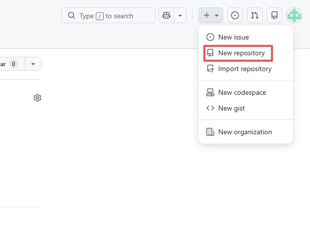
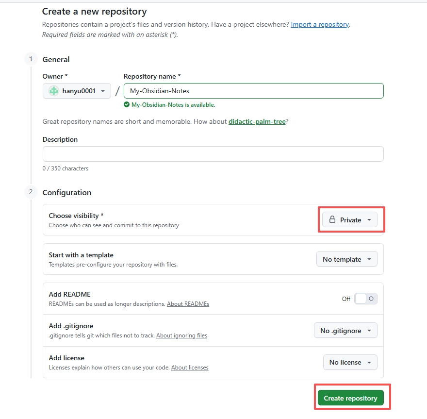
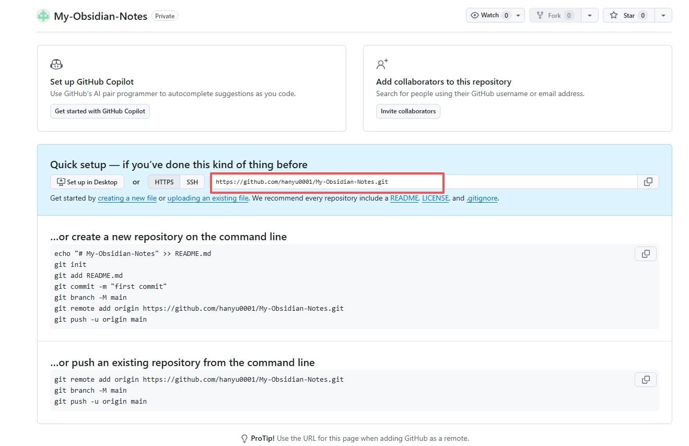
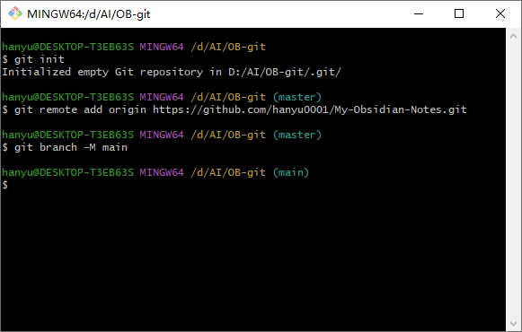
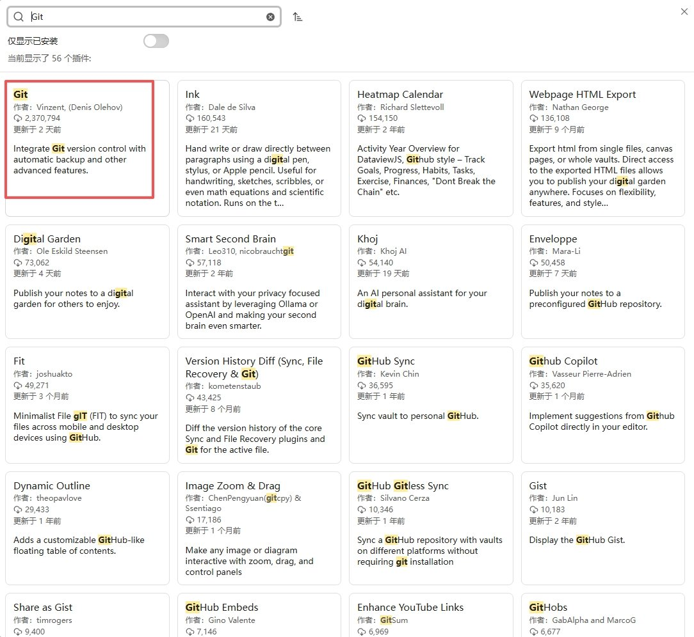
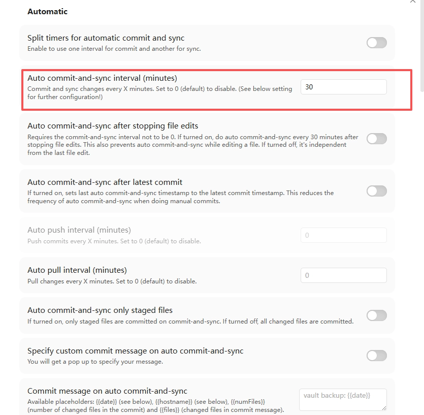
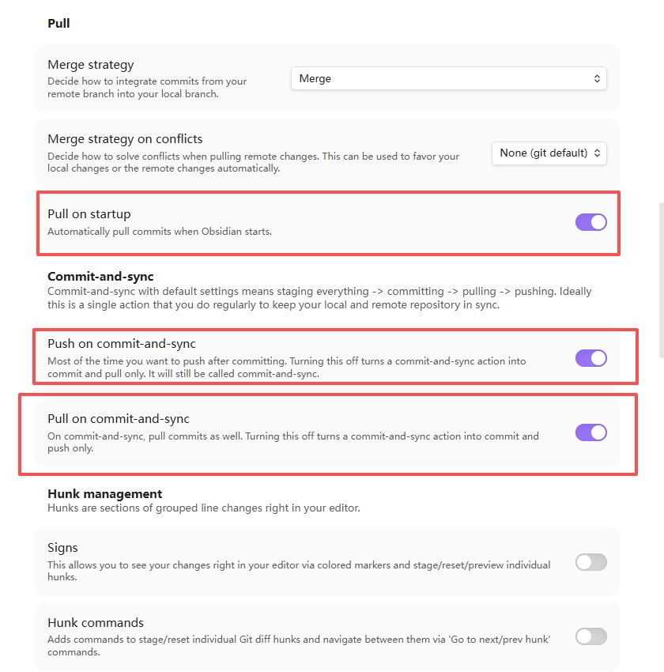
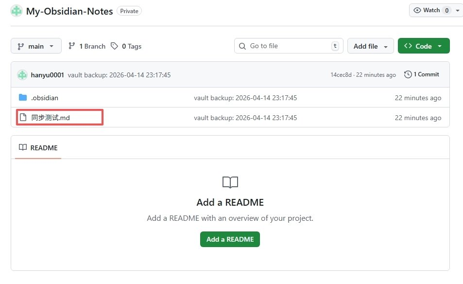
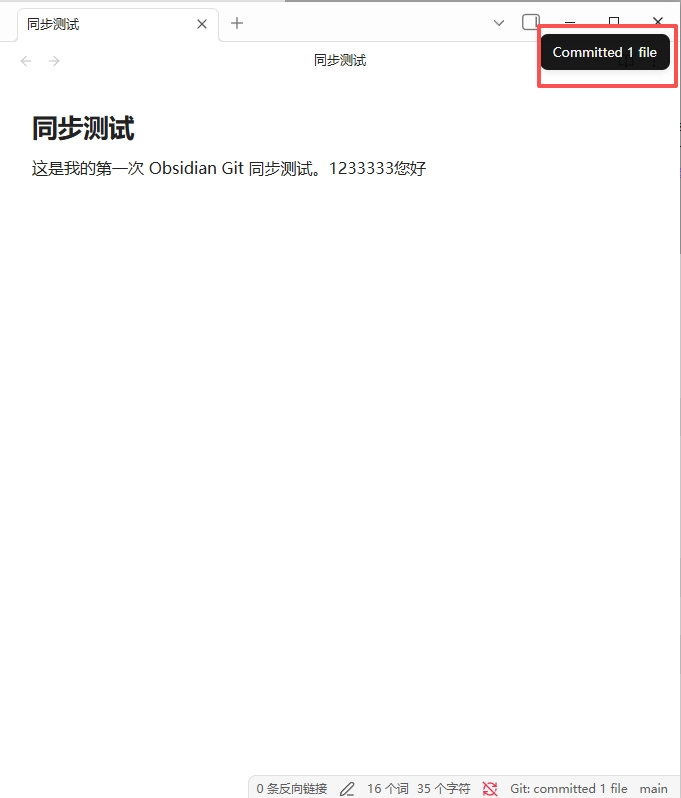

# 嫌 Obsidian 官方同步太贵？这套零成本的 GitHub 同步方案赶紧收好


很多 Obsidian 用户最大的痛点，就是**同步问题**。

官方提供的 Obsidian Sync 虽然好用，但每月几美元的门槛毕竟不是所有人都愿意承受的。退而求其次，很多人选择了 iCloud、OneDrive 或者坚果云同步，结果往往是：**偶尔卡顿、遇到冲突覆盖，甚至有些平台对文件数量也有限制。**

难道就没有一个既**免费**、又**稳定**，还能像“时光机”一样**保存笔记历史版本**的替代方案吗？

答案是有的。今天就手把手教你，如何利用开发者们常用的工具 —— **Git 和 GitHub**，配合 Obsidian 社区插件 Obsidian Git，搭建一套实用的云端同步与备份方案。

## 为什么选择 GitHub 来同步笔记？

在开始折腾之前，我们需要花一分钟了解这套方案的核心优势：

1. **免费的私有仓库**：GitHub 提供免费的私有仓库（Private Repository）。对纯文本笔记来说，容量通常已经很够用。
2. **自动化更省心**：配置好后，你可以设置比如“每 10 分钟自动备份一次”，减少手动操作。
3. **降维打击的“版本控制”功能**：这是网盘无法比拟的优势。如果不小心删错了某段文字，哪怕过了好几天，你都能通过 Git 的“历史快照”找回来。

不用担心你没写过代码，这个教程会把硬核的程序员操作，拆解成傻瓜式的“点击下一步”。我们开始吧！

## 🏃 第一步：准备工作 (只需做一次)

要完成这套方案，你的电脑需要安装基础环境。

1. **注册一个 GitHub 账号**：前往 [GitHub 官网](https://github.com/) 注册一个账号。
2. **下载安装 Git 环境**：前往 [Git 官网](https://git-scm.com/downloads) 下载对应系统（Windows / Mac）的安装包。 **安装提示**：下载后双击运行，**全程不必修改任何选项，一直点击“下一步 (Next)”直到完成即可**。

## ☁️ 第二步：在云端建个“家” (创建仓库)

我们要先在 GitHub 上申请一个保险箱，用来存放你的笔记。

1、登录 GitHub，点击右上角的 **+** 号，选择 **New repository**（新建仓库）。



2、在创建页面中，进行如下配置：

**Repository name (仓库名)**：随便起个名字，比如 My-Obsidian-Notes。 **Public / Private**：👉 **关键环节，务必选择 Private (私有)**！这样只有你自己能看得到笔记，全网不可见。 不要勾选底下的 “Add a README file” 等选项。



3、点击绿色的 **Create repository**。

4、创建成功后，复制页面上出现的仓库 HTTP(S) 地址（形如 [https://github.com/](https://github.com/)你的用户名/你的仓库名.git）备用。



## 🌉 第三步：给本地笔记连上云端

这一步涉及到一点点简单的命令行代码，也是前期最关键的一步。**不用慌，直接复制粘贴！**

1、在电脑上找到你的 **Obsidian 笔记库（Vault）所在的文件夹**。

2、打开该文件夹：

**Windows 用户**：在文件夹空白处**右键**，选择 **Open Git Bash here**（或者在地址栏输入 cmd 回车打开终端）。 **Mac 用户**：在当前文件夹上右键 -> 选择 **新建终端窗口打开**。

3、在弹出的黑框里，依次输入（或复制粘贴）以下三行祖传代码，**每粘贴一行，按一下回车键**：

```Plain Text
# 第1句：初始化本地仓库（告诉 Git 开始监控这个文件夹）
git init

# 第2句：关联云端仓库（把下面这里的 你的链接 换成你刚才复制的 GitHub 仓库链接）
git remote add origin 你的链接

# 第3句：设置主干道名称
git branch -M main

```

这里不用提前去 GitHub 网站里找什么“授权页面”。授权通常是在你第一次上传时自动出现的：可能弹出浏览器让你登录 GitHub，也可能弹出一个 Git Credential Manager 的小窗口。按提示登录并授权即可。如果一直没有弹出授权窗口，也不用慌。授权提示通常会在后面第一次执行 git push，或者第一次用插件同步时出现。



## ⚙️ 第四步：在 Obsidian 中配置自动同步神器

底座搭好了，接下来让 Obsidian 替我们自动干活！

1、打开 Obsidian，进入 **设置 -> 第三方插件 (Community plugins)**。

2、关闭“安全模式”，点击 **浏览 (Browse)**，搜索并且安装 **Git** 插件。这个插件的页面名称通常显示为 Git，也就是大家常说的 Obsidian Git。



3、安装完成后，点击**启用**，然后进入它的**选项 (Options)** 设置界面。如果你在设置页顶部看到一句 **Git is not ready. When all settings are correct you can configure commit-sync, etc.**，说明插件还没有识别到当前笔记库里的 Git 仓库。先回到第三步，确认你已经在这个 Vault 文件夹里执行过 git init，并且已经添加了 GitHub 仓库地址。完成后重启 Obsidian，或者关闭设置页再重新打开。

4、等插件识别成功后，我们再调整几个最核心的配置，让它变得真正自动化。

**Auto commit-and-sync interval (minutes)**：比如填写 10，代表每 10 分钟自动检查一次，有变化就提交并同步。如果不希望太频繁，可以填 30 甚至 60。 **Pull on startup**：✅ **建议打开**。这意味着每次打开 Obsidian 时，先从 GitHub 拉取云端最新版，减少多端内容不一致的概率。 **Push on commit-and-sync**：✅ **建议打开**。这意味着执行同步时，提交完成后会自动推送到 GitHub。否则可能只是保存在本地，并没有真正上云。 **Pull on commit-and-sync**：✅ **建议打开**。这样每次同步时会先处理云端更新，再推送本地修改，更适合多台电脑使用。 **Commit message on auto commit-and-sync**：默认不动即可，也可以自定义为你喜欢的格式。（这是给自动备份记录命名的）。





## ✅ 第五步：先做一次成功验证

配置完成后，不要急着正式使用，先跑一轮小测试。目标很简单：确认本地笔记真的能上传到 GitHub，并且 Obsidian Git 插件也能正常同步。

**1. 新建一篇测试笔记**

在 Obsidian 里新建一篇笔记，名字可以叫：

```Plain Text
同步测试.md

```

随便写一句话，比如：

```Plain Text
这是我的第一次 Obsidian Git 同步测试。

```

**2. 先用终端完成第一次上传**

第一次上传建议先用终端做，因为这一步会顺便把本地 main 分支和 GitHub 上的 main 分支绑定好。以后插件同步就不会反复问你要选哪个远程仓库、哪个分支。

在 Vault 文件夹里打开终端，依次执行：

```Plain Text
git add .
git commit -m "初始化 Obsidian 笔记库"
git push -u origin main

```

如果这时弹出 GitHub 登录或授权窗口，按提示登录即可。

如果执行 git commit 时提示 nothing to commit，说明当前没有新的改动可以提交。你可以先确认 同步测试.md 已经保存，再重新执行上面三句命令。

如果上传成功，你会看到类似这样的提示：

```Plain Text
branch 'main' set up to track 'origin/main'.

```

这就代表本地和 GitHub 已经绑定成功了。

**3. 去 GitHub 页面确认文件已经出现**

打开你的 GitHub 仓库页面并刷新。

如果能在文件列表里看到 同步测试.md，说明第一次上传已经成功。



**4. 再回到 Obsidian 测一次插件同步**

回到 Obsidian，稍微改一下 同步测试.md，比如再加一句话。

然后按下 Ctrl+P（Mac 是 Cmd+P）打开命令面板，搜索并执行：

```Plain Text
Git: Commit-and-sync

```

如果你的插件里显示的是 Git: Commit and push，选择它也可以。

等右上角出现同步成功提示后，再刷新 GitHub 页面。如果网页里的内容也更新了，就说明整套流程已经跑通。

**5. 如果中间遇到提示怎么办？**

- 看到 **origin**：直接选它。它就是你前面添加的 GitHub 仓库。
- 看到 **main** 或 **origin/main**：选择它，这是默认主分支。
- 看到 **No upstream-branch is set**：说明本地分支还没和 GitHub 分支绑定，执行一次 git push -u origin main 即可。
- 看到 **SSL/TLS connection failed**：这通常不是账号权限问题，而是当前网络连不上 GitHub。先检查浏览器能不能打开 GitHub；如果你在使用代理或加速工具，确认 Git 也走了同一个网络。必要时可以重新设置仓库地址：

```Plain Text
git remote set-url origin https://github.com/你的用户名/你的仓库名.git
git push -u origin main

```

如果 GitHub 页面里始终看不到测试笔记，先不要继续写大量内容，优先检查三件事：仓库地址有没有填错、GitHub 是否已经完成登录授权、插件里的同步设置是否已经打开。

## 🎉 第六步：享受云端同步

完成！你现在已经拥有了一套电脑端可用的云端同步与备份方案。

**日常如何使用？** 正常使用时，不需要频繁手动操作。只要你一直开着 Obsidian，它每隔一段时间就会自动在右上角弹出一个小提示：Committed and pushed XX files。这就代表你的内容已经同步到 GitHub 的私有仓库里。

**去公司想用另一台电脑怎么办？** 在另一台电脑上安装 Git 环境。通过终端找到一个空文件夹，输入 git clone 你复制的GitHub仓库链接，把云端笔记拉下来。然后用 Obsidian 打开这个文件夹，再次安装和配置一遍 Obsidian Git 插件。之后每次开始写之前，先确认插件已经拉取到最新内容，再继续编辑，会更稳。

**想更快速手动同步？** 你可以按下 Ctrl+P (Mac 则是 Cmd+P) 唤出命令面板，输入 Git: Commit-and-sync，敲回车即可直接手动给你的所有笔记内容“拍个照”并扔上云端。如果你的插件版本里显示的是 Git: Commit and push，选择它也可以。



## 🚫 补充提醒与避坑指

1. **不要放敏感资料**：即使你选择了 Private 私有仓库，也不要把它当成密码保险箱。密码、密钥、身份信息、公司内部不能外传的资料，都不建议放进这个笔记库。
2. **大文件不要放太多**：GitHub 会限制单文件大小，超过 100MB 的文件不能直接上传。更重要的是，就算没有超过限制，太多图片、PDF、录音、视频也会让整个笔记库越来越重，同步越来越慢。这套方案最适合文字笔记和少量截图，不适合把 Obsidian 库当网盘用。
3. **手机端同步呢？**：本教程先把电脑端跑通。手机端能做，但会多一层工具和设置，不建议一开始就混在一起配置。
4. **冲突处理**：这套方案最怕的就是你“家里电脑没关 Obsidian 没同步上去，到了公司又强行改了同一处文字”。遇到冲突时不要慌，在 GitHub 网页上可以查看每个版本的差异。

如果你是第一次配置，建议先别急着把整个笔记库都搬进去，先完成一件小事：

> 让 同步测试.md 成功出现在 GitHub 仓库里。

只要这一步跑通，后面无非就是把它变成日常习惯：写之前先同步，写完之后再确认上传。

如果你已经照着这篇跑通了电脑端同步，可以先收藏备用。后面如果你还想把 iPhone、iPad 或安卓手机也接进来，欢迎留言告诉我，我可以再单独写一篇移动端同步教程。

**文章同步公众号：雨哥聊AI**

---

> 来源：飞书 · AI Spark 知识库 ｜ 原文（最新版）：<https://lcnniolukk80.feishu.cn/wiki/WbkKwwc7Mi3OSdkDaQOczP6Inpe> ｜ 归档：2026-06-04
