# 手机也能一键剪藏：移动端 Obsidian Web Clipper 配置指南


上一篇教你在电脑浏览器上装了 Web Clipper 看到好文章点一下就存进 Obsidian 了。

但你肯定遇到过这种情况：躺床上刷手机，看到一篇好文章，想存 — 翻到电脑前？算了。截图？过两天找不到了。微信收藏？半年后石沉大海。

今天教你在手机上也装一个 Web Clipper。不管你用 iPhone 还是 Android，看到好内容，点一下，直接进 Obsidian 收件箱。跟电脑版一样丝滑。

💡 不只是网页文章 — 只要能在浏览器里打开的内容都能存。比如微信公众号文章，复制链接到 Safari / Firefox 里打开，照样一键剪藏。

⚠️ 开始之前，确保手机上已经装好 Obsidian App 并能正常打开你的库。还没装？先看系列第二篇。

iPhone 和 Android 走的路不一样，但都不难： 📱 iPhone: Safari 扩展 — 3 分钟 🤖 Android: Firefox 扩展 — 5 分钟

哪个手机就看哪段，跟着走就行。

## 📱 iPhone 用户

𝟭. 装扩展

打开 App Store，搜 "Obsidian Web Clipper"，认准 Obsidian 官方出品（Dynalist Inc.），点安装。

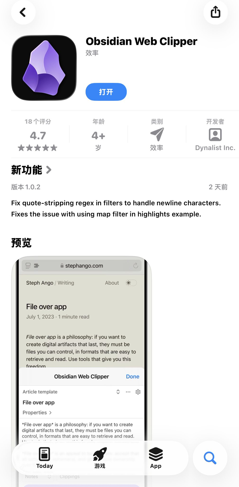

装完打开 App，它会告诉你：去 Safari 里找拼图图标 🧩 就能用了。

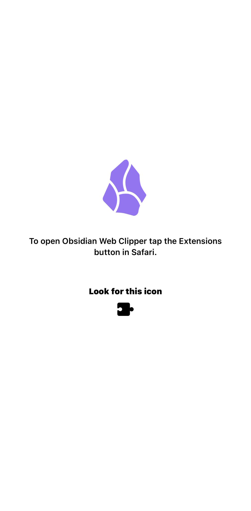

但装完还不能直接用 — 需要先在 Safari 里把它开启。

打开 Safari，随便进个网页（比如 [google.com](https://google.com/)），点底部工具栏左边的拼图图标 🧩：

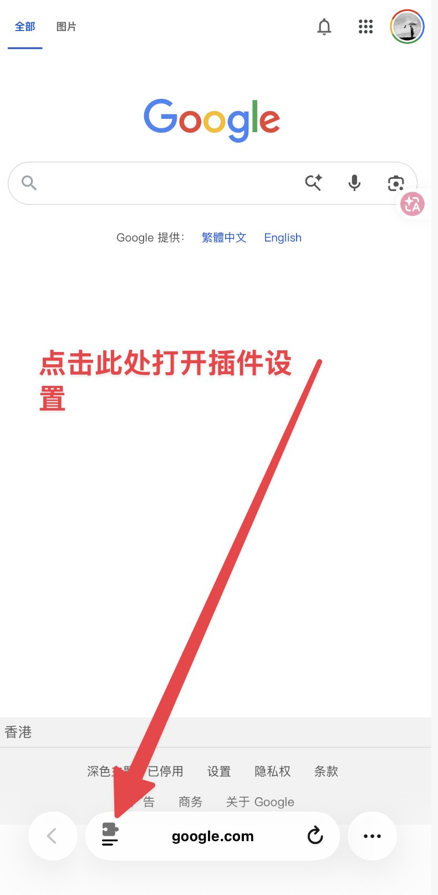

找到 Obsidian Web Clipper，把开关打开：

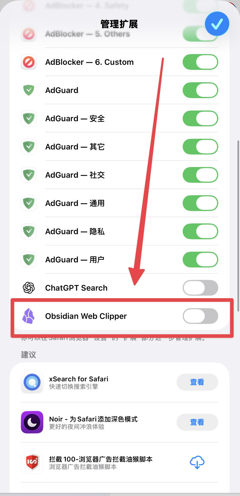

打开后 Safari 会弹权限提示。❶ 顶部如果有「检查」按钮可以点一下看详情，❷ 然后点「始终允许」— 它需要读网页内容才能帮你剪藏。

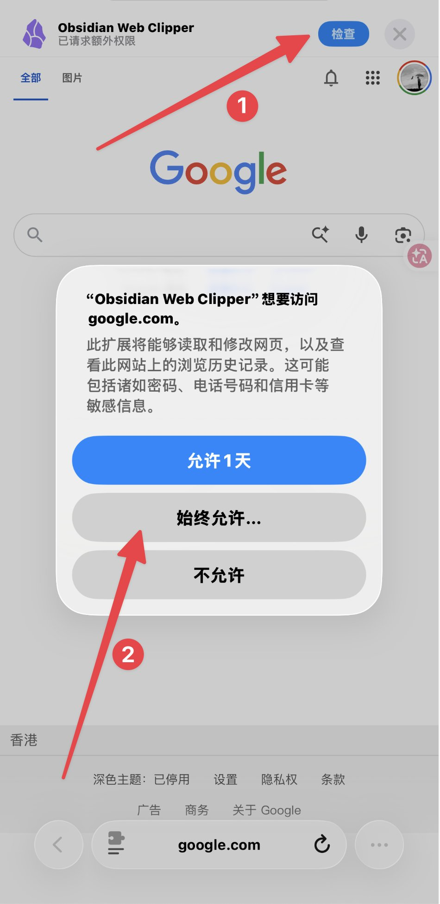

搞定，扩展装好了。

𝟮. 配模板

先打开 Web Clipper 的设置 — 还是点底部拼图图标 🧩，在扩展列表里选 Obsidian Web Clipper：

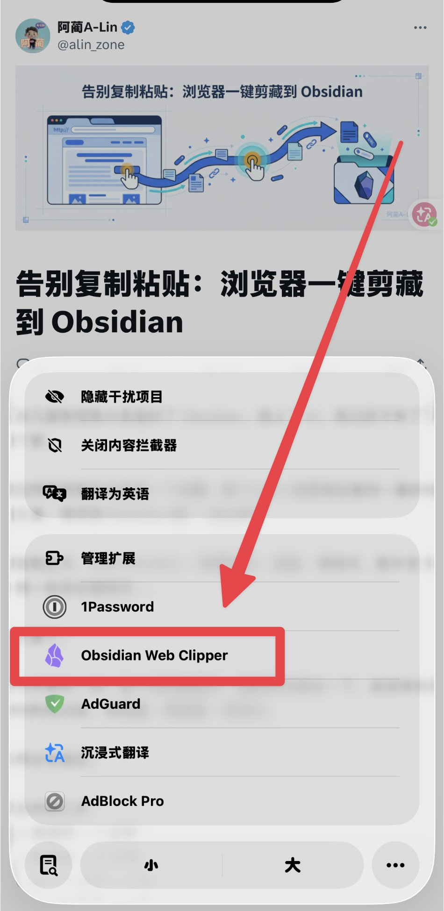

进入设置页面，三件事跟着编号来：

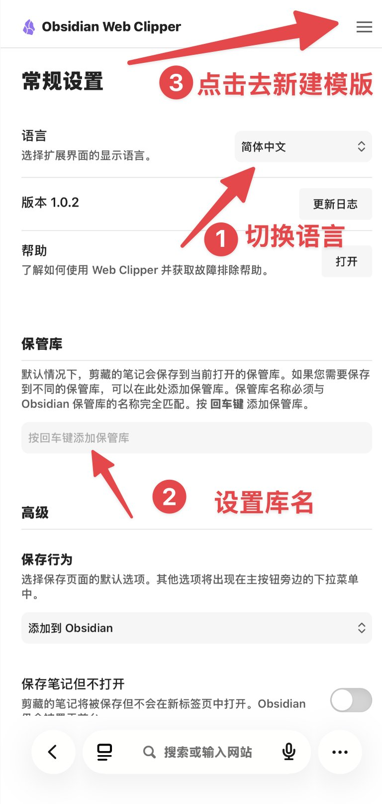

❶ **语言切成「简体中文」** — 点语言下拉框选就行。

❷ **设置库名** — 往下滑到「保管库」，在输入框里填你的 Obsidian 库名，然后**按回车确认**。

不知道库名是什么？打开手机上的 Obsidian App，左上角显示的就是库名。如果你是跟着这个系列一路走过来的，库名是 OrbitOS-Second-Brain。

⚠️ 库名必须和 Obsidian 里的**完全一致**，大小写、空格、横杠都不能差。填错了剪藏的时候会找不到库。

❸ **点右上角的汉堡菜单 ☰** — 进入模板设置页面。

点「新建模板」：

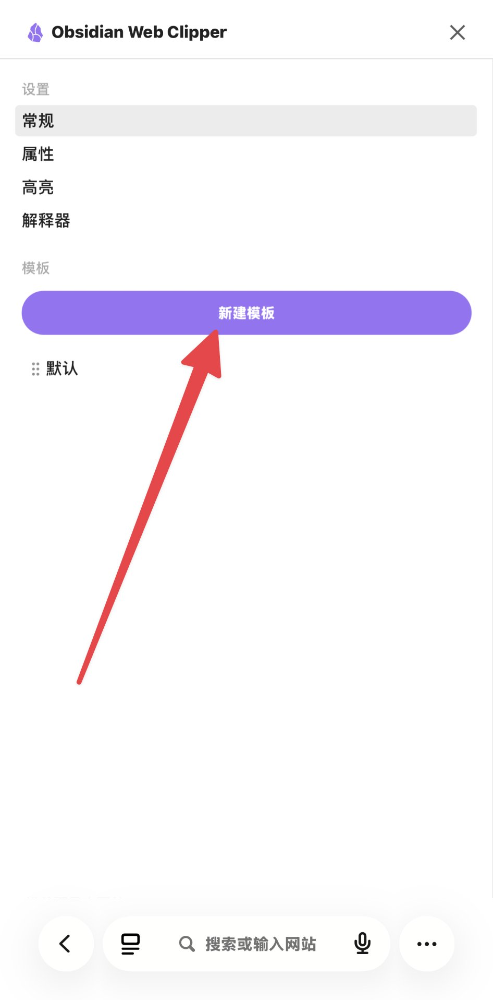

**推荐一键导入**现成配置，不用手动填：

点右上角「更多」→ 底部弹出菜单选「导入」：

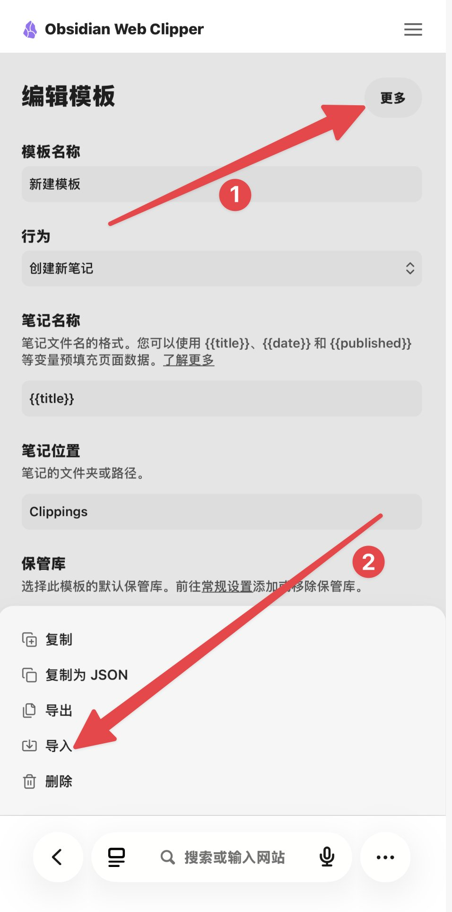

把下面这段 JSON 整段复制，粘贴到导入框里：

```JSON
{
  "schemaVersion": "0.1.0",
  "name": "OrbitOS 收件箱",
  "behavior": "create",
  "noteContentFormat": "{{content}}",
  "properties": [
    { "name": "type", "value": "inbox", "type": "text" },
    { "name": "status", "value": "pending", "type": "text" },
    { "name": "source", "value": "web-clipper", "type": "text" },
    { "name": "url", "value": "{{url}}", "type": "text" },
    { "name": "created", "value": "{{date}}", "type": "date" }
  ],
  "triggers": [],
  "noteNameFormat": "{{title}}",
  "path": "00_收件箱"
}

```

导入完就搞定了 — 模板名称、保存路径、属性全都自动配好，啥都不用改。

💡 **已经在电脑上配好属于自己的高级模板了？** 在电脑版 Web Clipper 里把现有模板导出成 JSON，再到手机上导入 — 效果一样，两边配置完全一致。

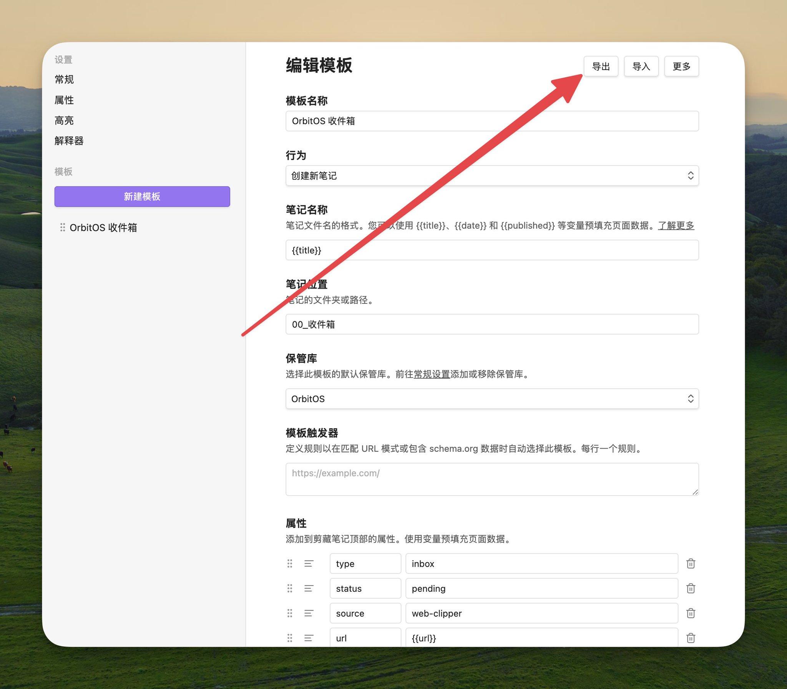

保存，搞定。

𝟯. 试一下

用 Safari 随便打开一篇文章。点底部拼图图标 🧩 → 选「Obsidian Web Clipper」→ 确认模板和预览内容没问题 → 点「添加到 Obsidian」。

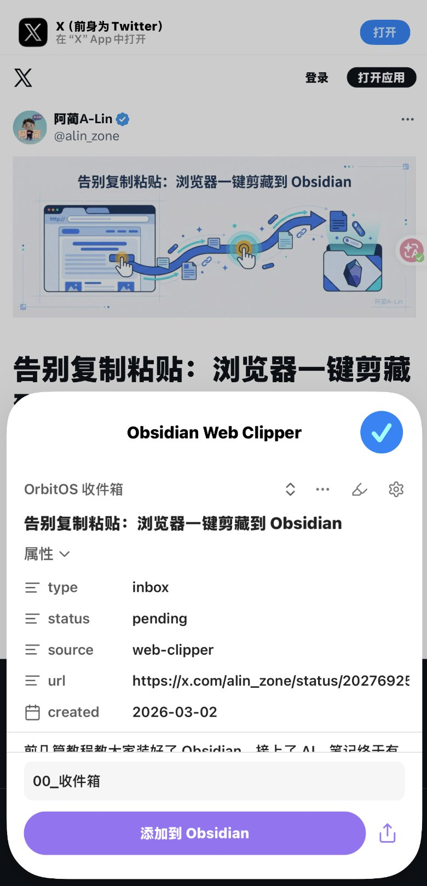

会自动跳转到 Obsidian App，收件箱里多了一篇笔记。标题、原文链接、正文全都有，属性也自动带上了：

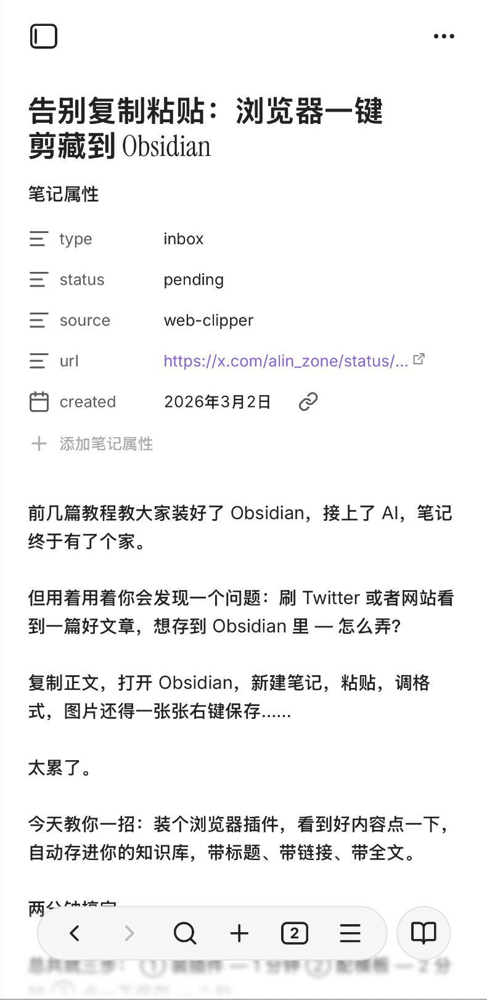

以后躺床上刷手机看到好文章，两下点完就存好了。

💡 **小技巧**：拼图图标里扩展太多？长按拼图图标可以调整顺序，把 Web Clipper 「钉」到最前面，下次一点就出来。

## 🤖 Android 用户

Android 的 Chrome 不支持装扩展，所以我们用 Firefox。

Firefox 支持装扩展，而且 Obsidian 官方的 Web Clipper 已经上架了 Firefox 扩展商店，装上就能用。

> 💬 我手上没有 Android 手机，所以这部分没有截图。但找朋友的手机实际走了一遍流程，确认可行。操作逻辑跟 iPhone 那边基本一样，跟着走就行。

𝟭. 装 Firefox

去 Google Play 搜 "Firefox"，下载安装 Mozilla 官方的 Firefox 浏览器。

⚠️ 国内手机如果没有 Google Play，可能需要去 Firefox 官网（[firefox.com](https://firefox.com/)）或其他可信渠道下载安装包。注意认准 Mozilla 官方出品，别装到山寨版。

如果你已经有 Firefox 了，确认更新到最新版就行。

𝟮. 装 Web Clipper 扩展

打开 Firefox，直接在地址栏输入这个网址：

[addons.mozilla.org/android/addon/web-clipper-obsidian/](https://addons.mozilla.org/android/addon/web-clipper-obsidian/)

打开后就是 Obsidian Web Clipper 的扩展页面，点「添加到 Firefox」→ 弹出权限提示点「添加」。

💡 **另一种找法**：点 Firefox 底部的三个点菜单 ⋯ →「附加组件」→ 浏览推荐列表，看看里面有没有 Obsidian Web Clipper。如果没有，还是走上面地址栏直达的方式最稳。

安装完成后会问你要不要在隐私浏览中使用，按需选就行。

𝟯. 配模板

点 Firefox 底部三个点菜单 ⋯ →「附加组件」→ 点已安装的 Obsidian Web Clipper，打开扩展界面。

跟 iPhone 那边一样，进设置先搞定三件事：

❶ **语言切成「简体中文」** — 点语言下拉框选。

❷ **设置库名** — 在「保管库」输入你的 Obsidian 库名，按回车确认。

不知道库名？打开手机上的 Obsidian App，左上角显示的就是库名。跟着系列走过来的朋友，库名是 OrbitOS-Second-Brain。

⚠️ 库名必须和 Obsidian 里的**完全一致**，大小写、横杠都不能差。

❸ **点右上角的汉堡菜单 ☰** — 进入模板设置页面，点「新建模板」。

**推荐一键导入**现成配置：点右上角「更多」→「导入」，把下面这段 JSON 复制粘贴进去：

```JSON
{
  "schemaVersion": "0.1.0",
  "name": "OrbitOS 收件箱",
  "behavior": "create",
  "noteContentFormat": "{{content}}",
  "properties": [
    { "name": "type", "value": "inbox", "type": "text" },
    { "name": "status", "value": "pending", "type": "text" },
    { "name": "source", "value": "web-clipper", "type": "text" },
    { "name": "url", "value": "{{url}}", "type": "text" },
    { "name": "created", "value": "{{date}}", "type": "date" }
  ],
  "triggers": [],
  "noteNameFormat": "{{title}}",
  "path": "00_收件箱"
}

```

导入后啥都不用改，跟 iPhone 那边用的是同一份配置。

💡 电脑上已经配好模板了？也可以在电脑版 Web Clipper 里把模板导出成 JSON，再到手机上导入，两边配置完全一致。

保存，搞定。

𝟰. 试一下

用 Firefox 打开一篇文章。点底部三个点菜单 ⋯ →「附加组件」→ Obsidian Web Clipper → 确认模板和预览内容 → 点「添加到 Obsidian」。

跳转到 Obsidian App，收件箱里就多了一篇新笔记。

就这样，手机上也搞定了：

① iPhone 用 Safari 扩展，App Store 装完开启就能用 ② Android 用 Firefox 扩展，装好后操作体验跟电脑端一样

加上之前的电脑版，你现在 **电脑 + 手机** 全覆盖了 — 随时随地看到好内容，点一下就进知识库。

---

> 来源：飞书 · AI Spark 知识库 ｜ 原文（最新版）：<https://lcnniolukk80.feishu.cn/wiki/ECVkwe9FniUy7akpoiicxIhun0g> ｜ 归档：2026-06-04
