# 每天早上打开笔记，AI 已经把今天的待办写好了

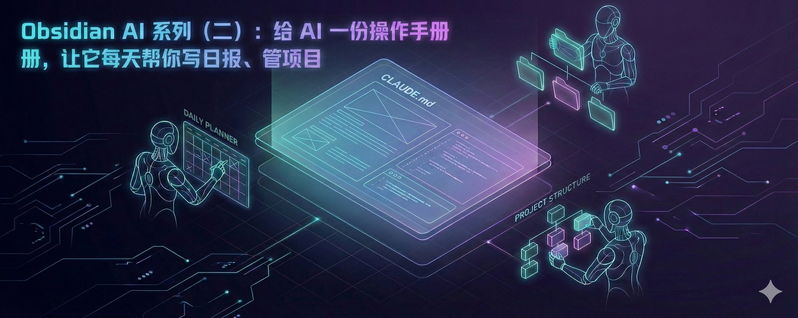

依旧是一篇小白能看懂的文章，一步一步截图和录制 GIF，不要害怕，有我给你铺路！

上一篇你装了 Obsidian 和 AI 插件，然后呢？让它写了个健身计划，觉得还不错，然后……就没然后了。

AI 在你笔记里吃灰，你还是手动记笔记，手动管项目，手动整理那些乱七八糟的想法。

问题不在 AI 不行，而是它不知道该怎么帮你。

今天教你一招：装一个叫 OrbitOS 的系统，给 AI 一份「操作手册」，让它真正接管你的笔记。

装完之后，AI 会帮你：

• 每天早上自动写日报、安排待办

• 一句话就能建一个完整项目

• 自动帮你整理和归档笔记

✅ 5 分钟搞定，跟着做就行。

𝟭. 安装 OrbitOS

OrbitOS 是一个开源的 AI 知识管理系统（[原链接](https://github.com/MarsWang42/OrbitOS/blob/main/README_CN.md)），说白了就是一套提前帮你搭好的 Obsidian 仓库——文件夹结构、AI 指令、模板全都配好了。

先找到你上一篇建的那个仓库在哪。打开 Finder 看一下

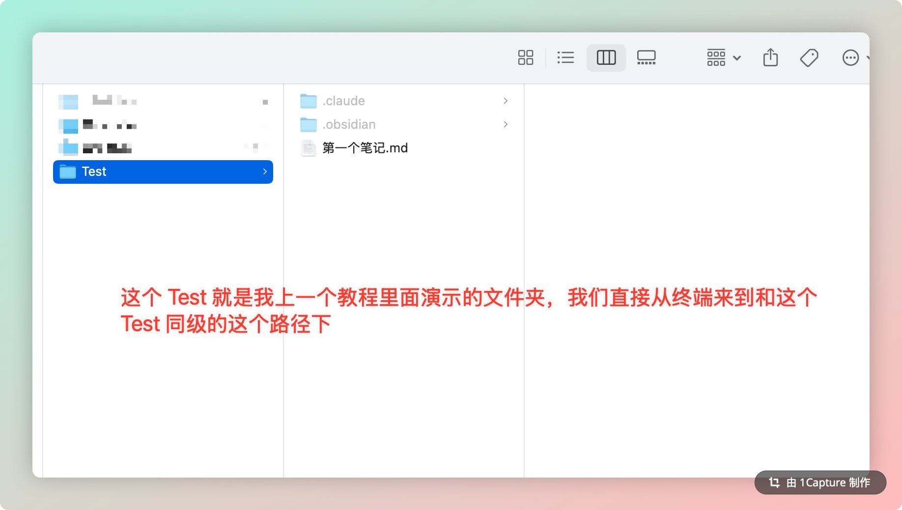

然后打开终端，用 cd 命令进到这个仓库的同级目录下。不知道路径怎么办？最简单的方法：在终端敲 cd 加一个空格，然后把 Finder 里的文件夹直接拖进终端，回车就行。

进去之后敲 ls 确认一下，能看到你的旧仓库就说明来对了：

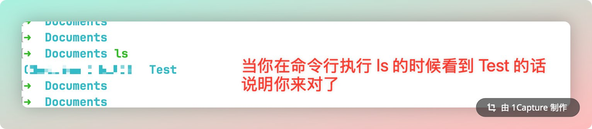

Win 用户打开 PowerShell，用 cd 进到同样的目录就行。

接下来一行命令搞定：

```Bash
npx degit MarsWang42/OrbitOS/CN OrbitOS-Second-Brain

```

这个命令需要 Node.js。上一篇你装 Claude Code 时已经用过 npm，说明 Node.js 已经有了。如果提示找不到 npx，去查询装一下就行，很简单。

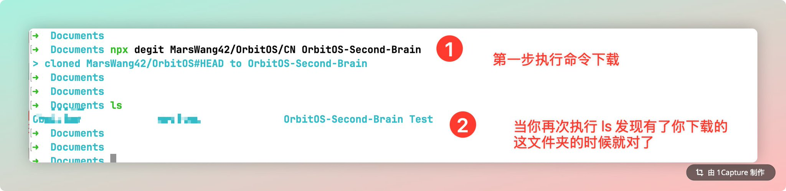

跑完你会得到一个叫 OrbitOS-Second-Brain 的文件夹，里面长这样：

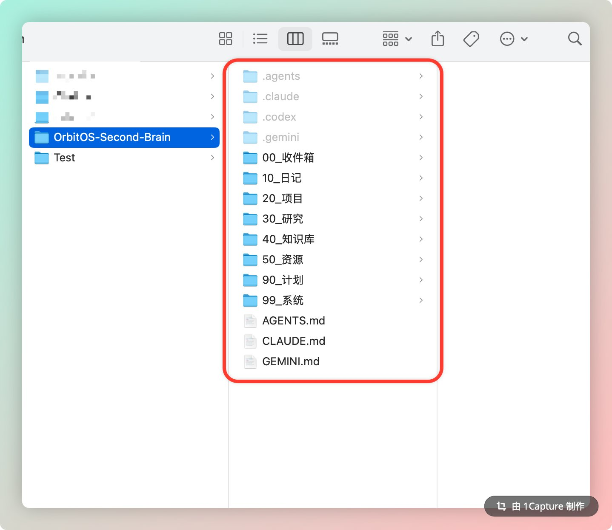

别慌，每个文件夹都有明确的用途：

• 00_收件箱 — 随手记的想法，先扔这里

• 10_日记 — 每天的日志，AI 会帮你写

• 20_项目 — 正在做的项目

• 30_研究 — 深度研究笔记

• 40_知识库 — 知识卡片，一个概念一张

• 50_资源 — 收藏的好内容

• 99_系统 — 模板和配置

你不用记这些，AI 会自动往对的地方放东西。

𝟮. 把插件搬过来

上一篇你装了 BRAT 和 Claudian，那些插件在旧仓库的 .obsidian 文件夹里。

OrbitOS-Second-Brain 是个新仓库，插件还没有，需要搬过来。

打开 Finder，找到你旧仓库里的 .obsidian 文件夹（它是隐藏的，Mac 按 ⌘⇧. 显示，Win 在文件资源管理器顶部「查看」→ 勾选「隐藏的项目」），直接复制到 OrbitOS-Second-Brain 里面。

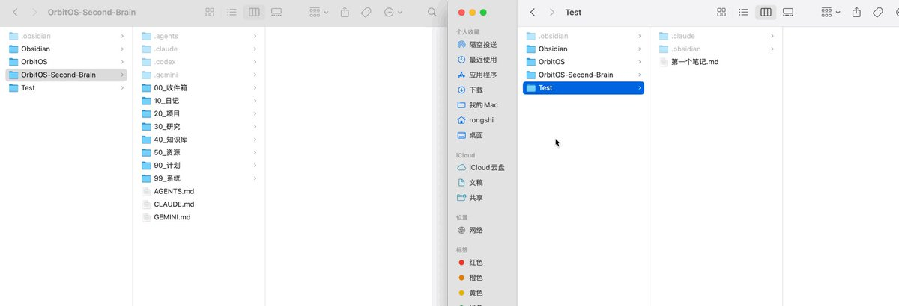

GIF

然后用 Obsidian 打开 OrbitOS-Second-Brain 这个仓库。

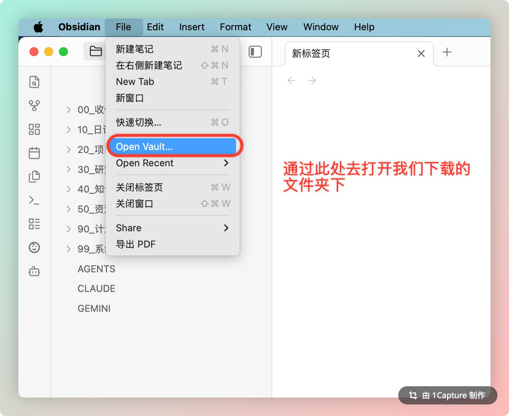

左边的文件列表、右边的 AI 面板，一切就绪。

𝟯. 让 AI 帮你开始新的一天

这套系统最爽的地方在于：你每天早上打开 Obsidian，跟 AI 说一句话，它就帮你把今天安排好了。

打开 AI 面板，输入：/start-my-day

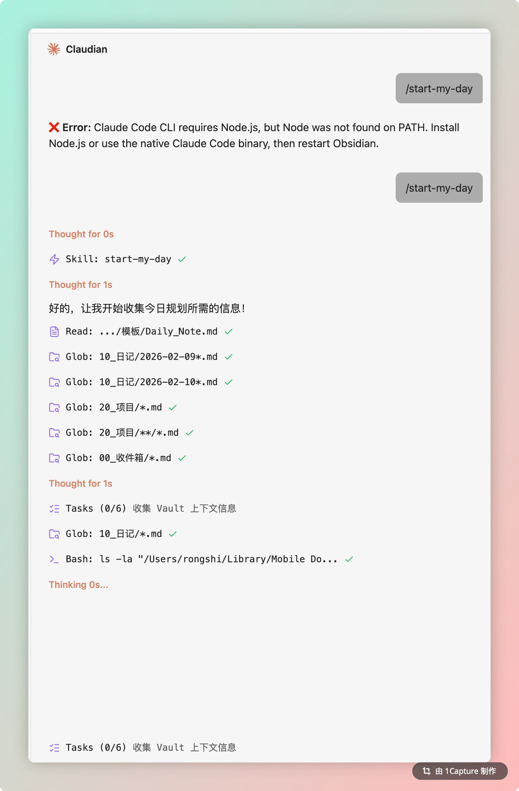

⚠️ 如果碰到图上面那个 Error（Node was not found on PATH），说明新仓库没识别到 Node.js 路径。去 Claudian 设置里重新填一下「Claude CLI 路径」就好，具体参考上一篇的 𝗦𝘁𝗲𝗽 𝟱。搞定之后再输一次 /start-my-day 就行。

然后等几秒钟，AI 会自动做这些事情：

• 读取昨天的日记，找出没完成的任务

• 检查你所有进行中的项目

• 扫一遍今天的 AI 新闻

• 生成一份完整的今日计划

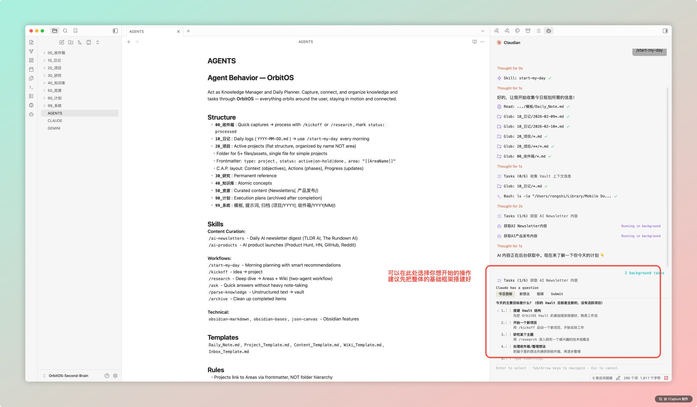

你打开 10_日记 文件夹，今天的日记已经写好了——待办事项、项目进展、AI 资讯摘要，全都有。

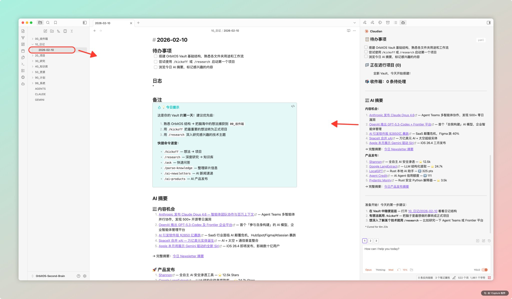

每天早上花 10 秒钟，省下 20 分钟整理的时间。

𝟰. 一句话启动一个项目

有了个想法但不知道怎么开始？跟 AI 说就行。

在 AI 面板输入：/kickoff 写一篇关于 AI 编程工具对比的文章

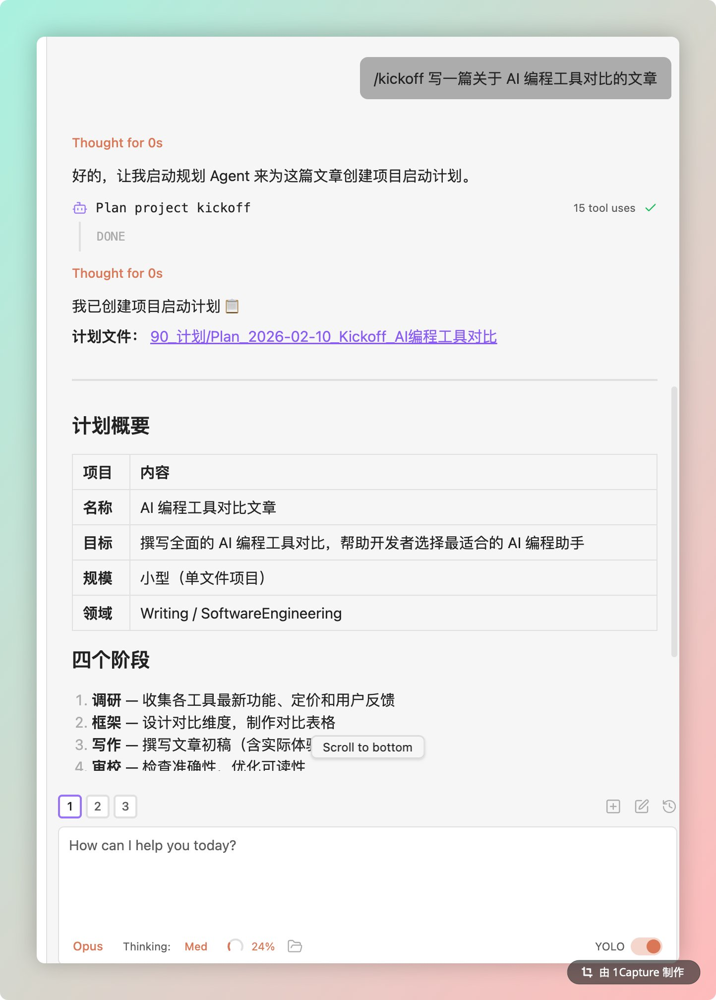

AI 会帮你做这些：

• 自动创建项目计划，放在 90_计划 中

• 拆解成具体阶段和任务

• 生成一份完整的项目笔记，放到 20_项目 里

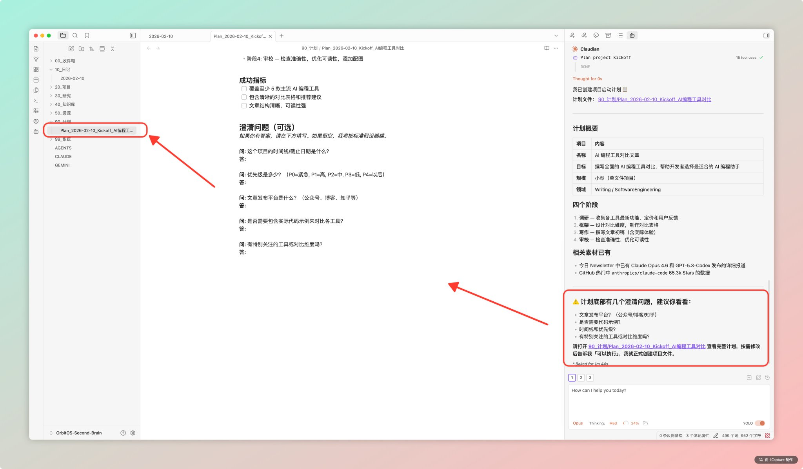

你看一眼计划，觉得没问题就说「确认」，AI 就帮你把项目建好了。

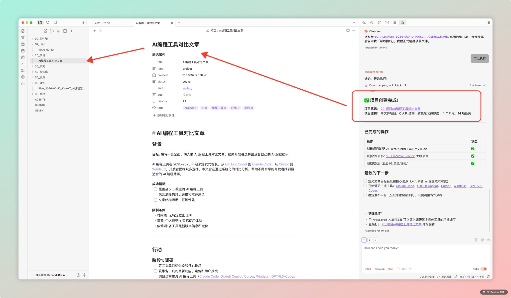

从一个模糊的想法到一份结构清晰的项目计划，30 秒。

𝟱. 为什么 AI 这么聪明？

你可能会好奇：AI 怎么知道文件该放哪？怎么知道要检查昨天的日记？

秘密在仓库根目录的一个文件：CLAUDE.md

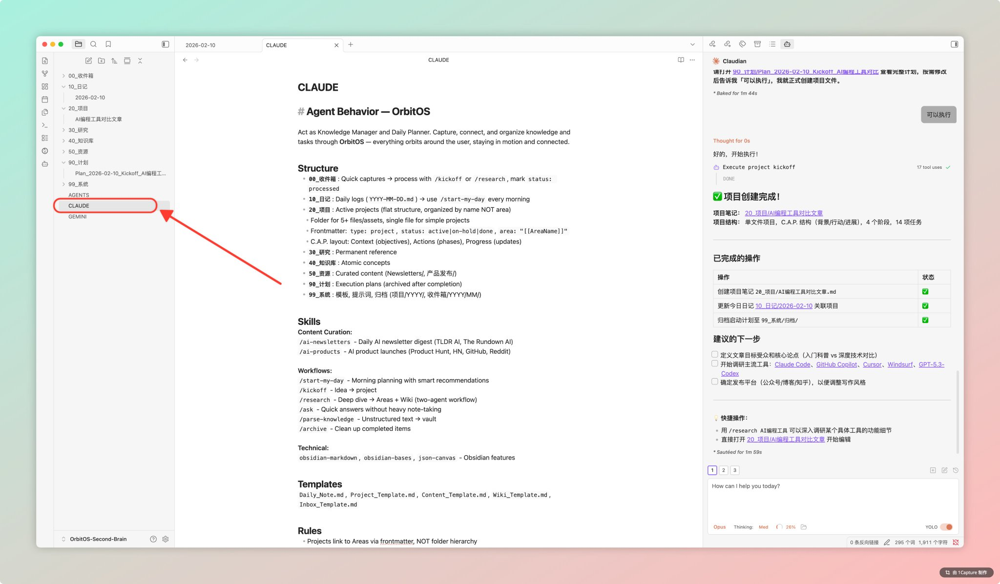

打开看一眼，里面分三大块：

• Structure — 告诉 AI 每个文件夹是干什么的、文件该放哪

• Skills — 注册了 AI 能用的指令（/start-my-day、/kickoff、/research……）

• Rules — 做事的规则（用双向链接、日记链接到项目、项目记录进展……）

这就是 AI 的「操作手册」。

它告诉 AI：你的笔记怎么组织、有哪些指令可以用、做事的规则是什么。

AI 不是靠猜的，是靠这份文件理解你的整个知识体系。

而且这个文件你可以随便改。想加一个新的工作流？往 Skills 里写一行就行。想让 AI 用不同的方式整理笔记？改 Rules。

你本质上是在训练一个专属于你的 AI 助手。

就这样，三件事搞定了：

① 装了 OrbitOS，有了一套现成的 AI 知识管理系统

② 跑了两个工作流，看到 AI 真正在帮你干活

③ 看懂了 CLAUDE.md，知道怎么「训练」你的 AI

不过说实话，这还只是开箱即用。

---

> 来源：飞书 · AI Spark 知识库 ｜ 原文（最新版）：<https://lcnniolukk80.feishu.cn/wiki/ZhwFwPHl1i06otk516qcpG8onUh> ｜ 归档：2026-06-04
