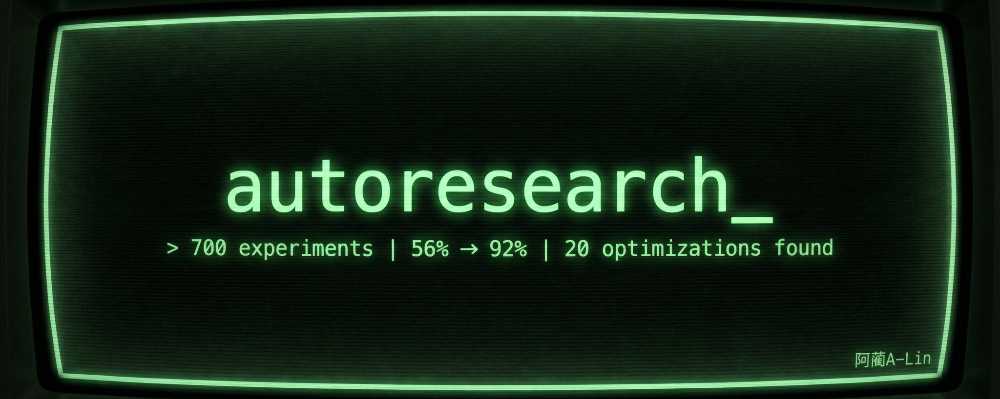
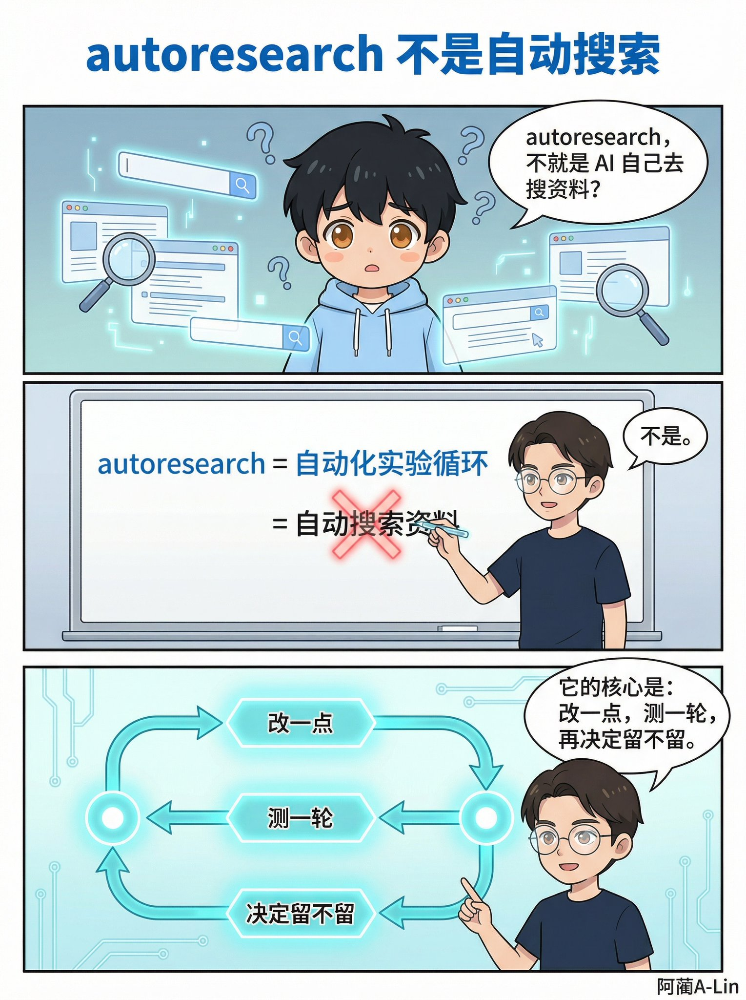
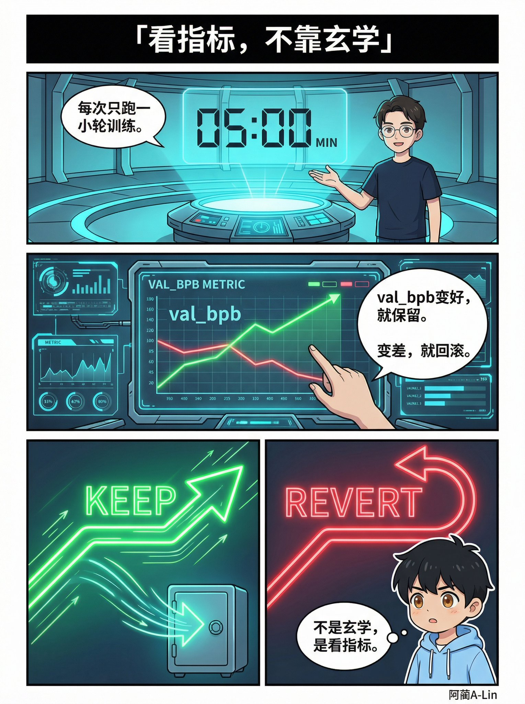
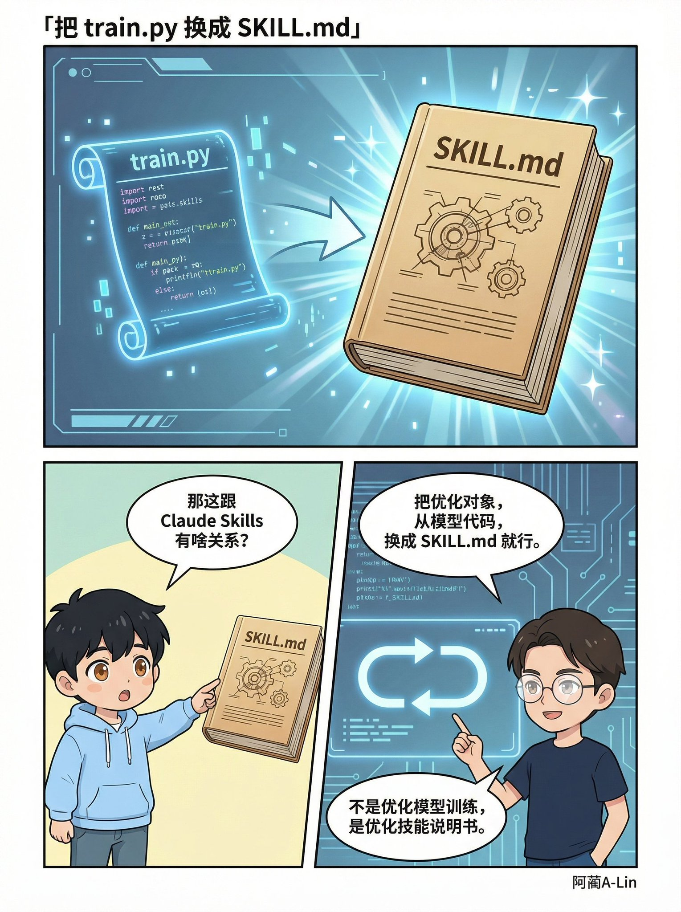
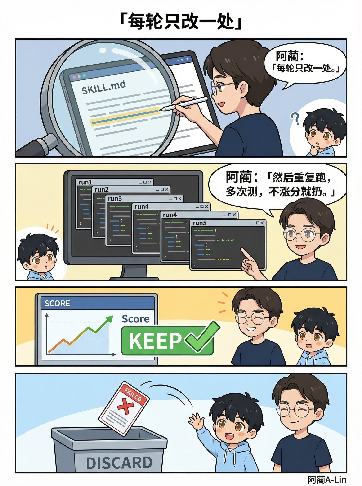
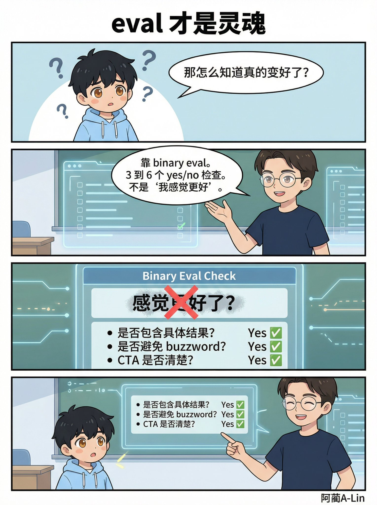
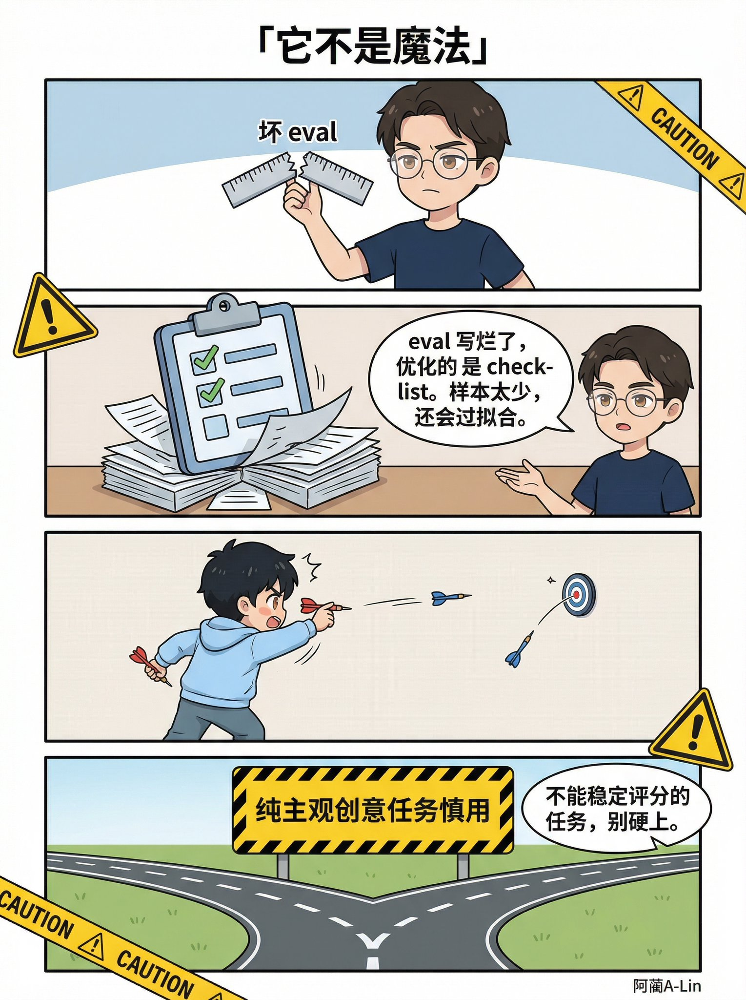
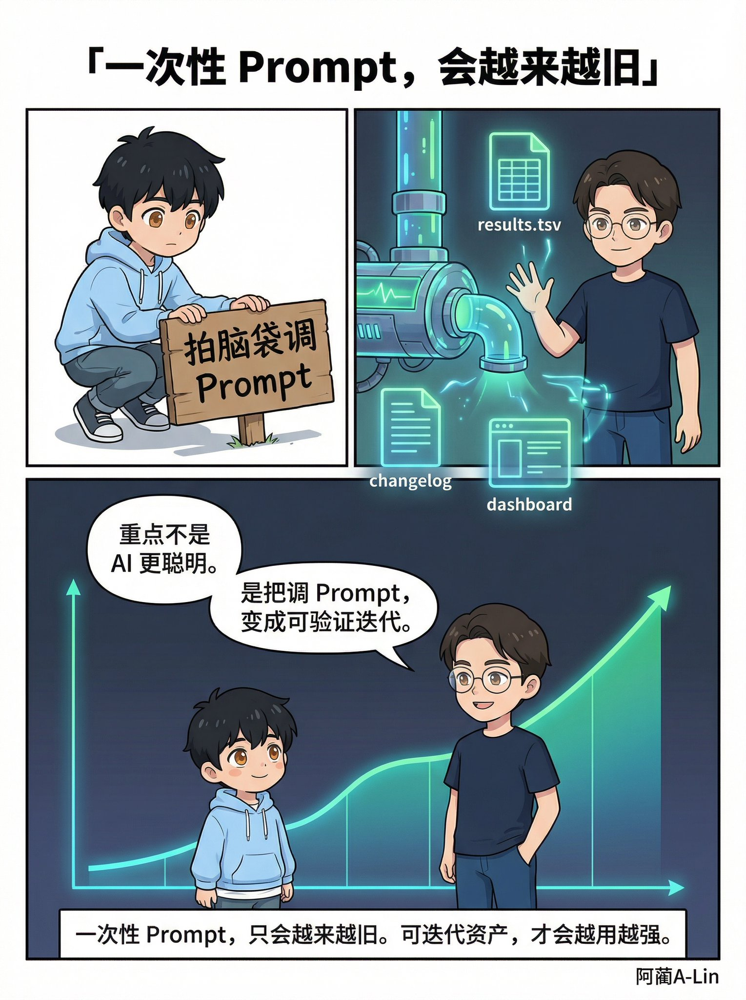

# Karpathy 开源了一个方法，2 天跑了 700 次实验

Karpathy 开源了一个方法，让 AI agent 自己做实验。

2 天跑了 700 次。自动发现了 20 个有效优化。

然后有人把它搬到了 Claude Skills 上——Skill 准确率从 56% 涨到 92%，全程自动。

这个方法叫 autoresearch。不是"自动搜资料"。今天用漫画讲清楚它到底在干什么。

## 一句话说清楚

autoresearch = **自动化实验循环**。

不是搜索。不是调研。是让 AI agent 自己做实验。

改一点 → 测一轮 → 看指标 → 好就留，差就撤。然后再来。

## 从哪来的

Andrej Karpathy，OpenAI 联合创始人，今年 3 月开源了这个项目。

原版是给模型训练用的：

• agent 只能改一个文件：[train.py](https://train.py/) • 每次训练跑固定 5 分钟 • 用 val_bpb（验证集 bits per byte）做指标 • 涨了就保留，跌了就回滚

就这么简单。没有魔法。

但效果不简单——自动发现了 20 个有效优化，没有任何人工干预。

Shopify CEO 拿同样的模式去优化 Liquid 模板引擎：93 次自动 commit，渲染快了 53%，内存省了 61%。

## 搬到 Claude Skills 上

有人把这套方法迁移了。

优化对象从 [train.py](https://train.py/) 换成 SKILL.md。

不改模型代码，改的是技能提示词。

loop 一样：

𝟭 先测原版（baseline） 𝟮 每轮只改一处 𝟯 跑多次测试 𝟰 用 yes/no 评分 𝟱 涨了保留，没涨丢掉

Ole Lehmann 的落地页文案 Skill：56% → 92%。4 轮改动，全程自动。

## 核心是 eval

整个系统里最关键的不是 agent。

是你怎么定义"好"。

autoresearch 要求 binary eval——每项只有 yes 或 no：

✅ 标题有没有具体数字？ ✅ 有没有用 buzzword？ ✅ CTA 清不清楚？

3-6 条最佳。

"我感觉更好了" 不算。那是幻觉。

## 边界在哪

• eval 写歪了 → agent 会迎合 checklist，不是真质量 • 测试样本太少 → 过拟合，换个输入就崩 • 纯主观创意任务 → 没有稳定的 binary eval，别硬上

## 所以它到底改变了什么

不是 AI 变聪明了。

是调 prompt 这件事，从拍脑袋变成了做实验。

**一次性 Prompt，只会越来越旧。可迭代资产，才会越用越强。**

---

> 来源：飞书 · AI Spark 知识库 ｜ 原文（最新版）：<https://lcnniolukk80.feishu.cn/wiki/O5rqw9LcwiuucDk0APwcrpj7nLe> ｜ 归档：2026-06-04
