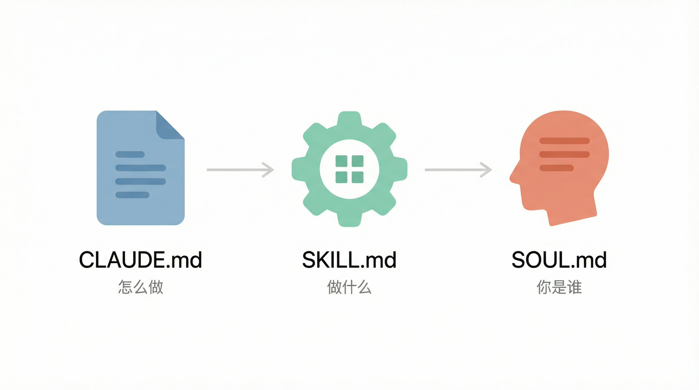
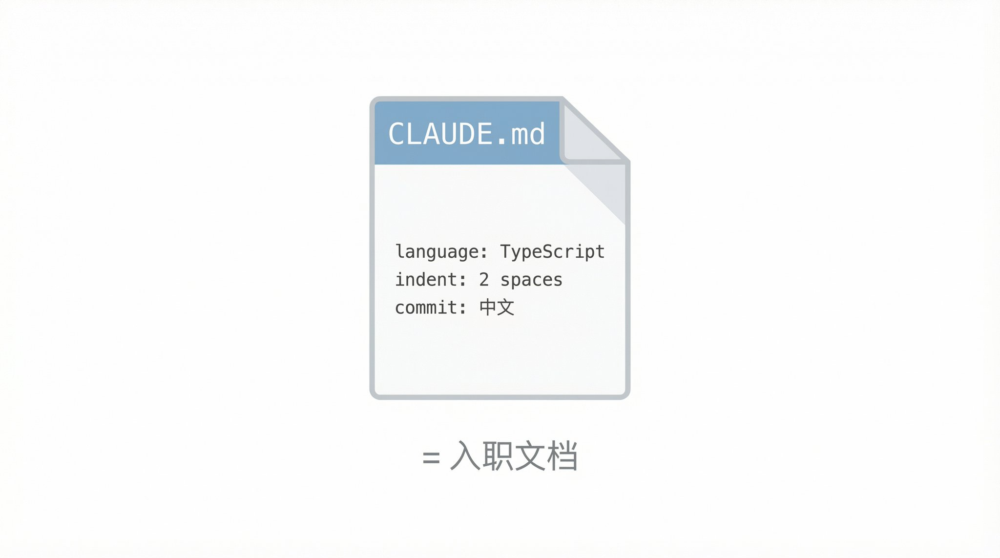
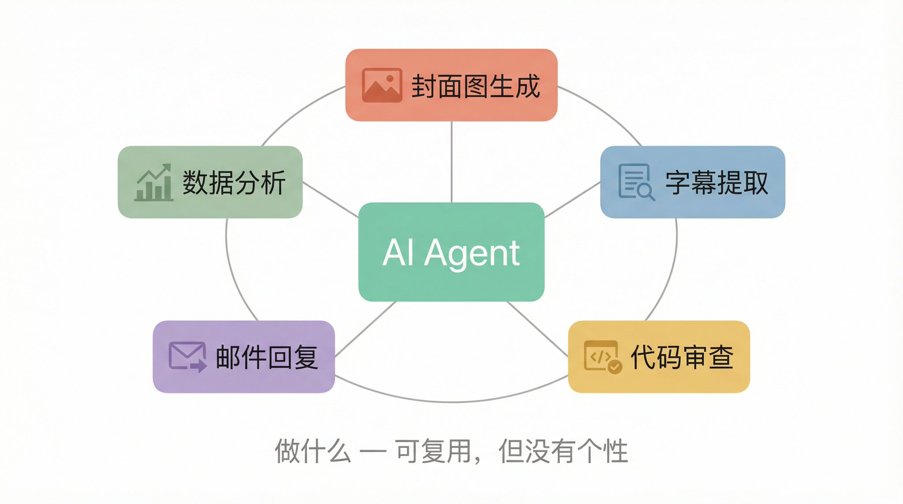
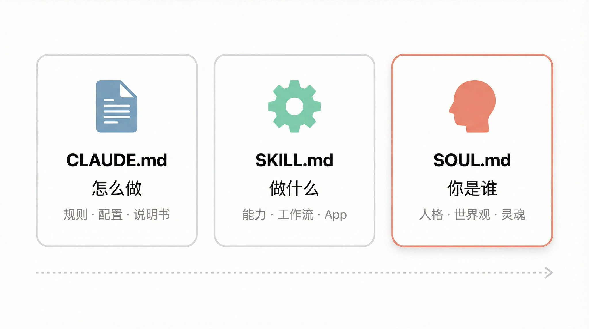
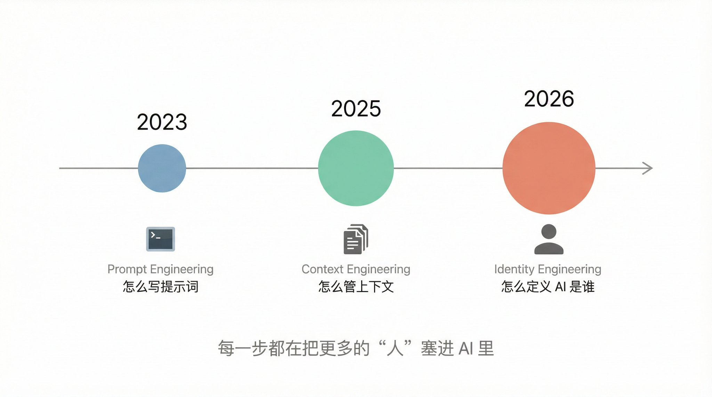

# 有人把同事蒸馏成了 AI —— 聊聊 Agent 人格化这件疯狂的事

有人把同事蒸馏成了 Agent Skill——以后开会再也不用等他回消息了。

听起来像段子，但这件事正在真实发生。

Zara Zhang 最近发了条推，说她看到一个新趋势：人们开始把同事、网红、甚至前任蒸馏成 Agent Skill。

> 4月4日

> New trend I'm seeing: people distilling colleagues, influencers, and even their exes into agent skills

怎么蒸馏？

把一个人的聊天记录、写过的代码、做过的方案、甚至开会时的发言全部喂给 AI，生成一份文件。

AI 加载之后，语气、思路、甚至吐槽方式，都像那个人。

这事背后藏着一条进化线：从教 AI 干活，到让 AI 会干活，再到让 AI "成为"某个人。

三个文件，三次跃迁。

**一、CLAUDE.md：教 AI 怎么干活**

最早的一层，CLAUDE.md。

就是一份配置文件。你在里面写：项目用什么语言、代码风格是什么、有哪些规则。AI 每次启动读一遍，就知道怎么做了。

说白了：给新来的实习生一份入职文档。

"我们用 TypeScript，缩进两个空格，commit message 用中文。"

够用。但也仅此而已。

CLAUDE.md 解决的是"这个项目怎么做"。

它不关心 AI 是谁。就是一份说明书。

**二、SKILL.md：让 AI 会干活**

接下来出现了 SKILL.md。

CLAUDE.md 管规则，SKILL.md 管能力。

它把一整套工作流打包成可复用的模块。

打个比方：AI 是裸机，Skill 是 App。

装一个"封面图生成"Skill，AI 帮你画封面；装一个"YouTube 字幕提取"Skill，AI 帮你抓视频内容。

Skill 让 AI 不再是"你说一句它做一句"，而是能独立跑完一整个流程。

但 Skill 有一个局限：**它没有个性。**

同一个 Skill，你装和我装，出来的东西一样。

它知道怎么做，但不知道"以谁的方式做"。

**三、SOUL.md：让 AI "成为"某个人**

SOUL.md 出现了。

目前最疯狂的一层。

做法很简单：把你发过的推文、写过的文章、聊天记录扔进一个文件夹。

AI 读完，提取你的世界观、语气、价值判断、口头禅，生成一份 SOUL.md。

Agent 加载这份文件之后，就不是通用助手了。

它用你的方式思考，用你的语气说话，面对新问题会给出"你会给的答案"。

soul.md 的创作者管这叫**"Level 1 意识上传"**——不是复制大脑，是你表达过的意识的功能性复制品。

注意这个区别：

• CLAUDE.md 告诉 AI "怎么做" • SKILL.md 告诉 AI "做什么" • SOUL.md 告诉 AI **"你是谁"**

SoulSpec 已经是一个开放标准。OpenClaw 社区里有 162 个现成的 Agent 人格模板，一键加载，也可以从零生成自己的。

不是 chatbot 在"谈论你"。

是 AI 在"作为你"思考和说话。

**四、为什么这件事现在发生了**

人格蒸馏不是新概念。

但 2026 年它突然变成现实，有几个原因。

**Agent 框架成熟了。**

OpenClaw 两个月从零到 12.5 万 GitHub star。它证明了一件事：用 Markdown 文件定义 AI 身份，完全可行。不用微调模型，不用写代码，一份 .md 文件就够。

**控制方式在迭代。**

2023 年我们琢磨怎么写提示词，2025 年开始管理 AI 看到的全部上下文，2026 年——我们在定义 AI 是谁。

从 prompt engineering 到 context engineering 到 identity engineering。

每一步都在把更多的"人"塞进 AI 里。

而现在，我们塞进去的不再是规则和流程，是人格本身。

**五、这意味着什么**

往好了说，每个 KOL、行业专家、创作者，都能把自己的认知和表达风格打包成 SOUL.md 卖。

你买的不是 AI 工具，是"这个人的思考方式"。

再想远一点，团队里最懂某个业务的同事要离职了？

让他把经验蒸馏成 Agent Skill，新人有问题问他的"数字遗产"就行。

你自己也可以蒸馏一个"自己"，让它替你回邮件、发推文、写周报。

不是 AI 代写——是"你的风格"在代写。

但往深了想，就没那么轻松了。

有人把你说过的每句话都喂给 AI，生成了一个"你"。这个数字分身属于谁？

蒸馏同事的专业知识，多数人觉得没问题。

蒸馏网红的表达风格，灰色地带。

蒸馏前任？Zara Zhang 确实看到有人在做。

这些问题没有现成答案。但它们已经不是假设——正在发生。

**从 CLAUDE.md 到 SOUL.md，我们用了不到一年。**

第一步是教 AI 遵守规则。 第二步是给 AI 打包能力。 第三步是让 AI 拥有灵魂。

下一步是什么？

也许是 AI 自己写自己的 SOUL.md。

---

> 来源：飞书 · AI Spark 知识库 ｜ 原文（最新版）：<https://lcnniolukk80.feishu.cn/wiki/QDn4w2wo4iYrc5km3h6cgva0nUh> ｜ 归档：2026-06-04
